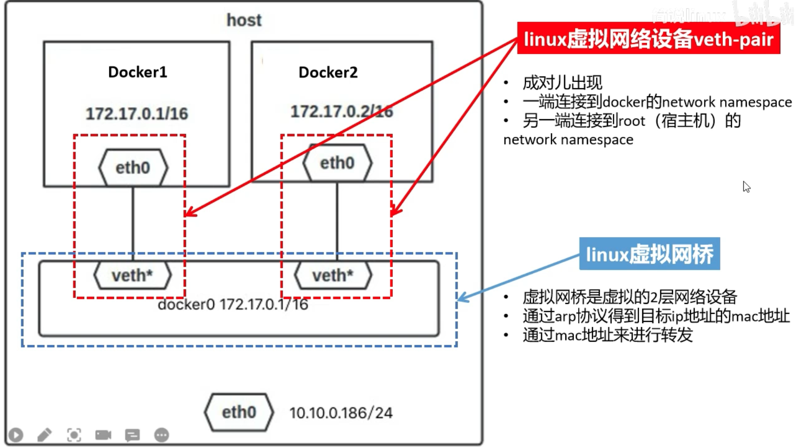

## docker 网络模式

### bridge（桥接模式，默认）

每个容器连接到一个虚拟网桥（如 docker0）。
容器之间可以互相通信，也可以通过端口映射与主机通信。
适合单机多容器场景。

### host（主机模式）

容器与宿主机共享网络命名空间。
容器直接使用宿主机的 IP 和端口。
性能较高，但端口可能冲突，隔离性较差。

### none（无网络）

容器没有网络接口，完全隔离。
适合需要极高安全性的场景。

### container:<name|id>（容器互联模式）

新容器与指定容器共享网络命名空间。
两个容器像在同一台主机上一样共享 IP、端口等。

### 自定义网络（User-defined networks）

可以通过 docker network create 创建自定义 bridge、overlay 等网络。
支持容器名称直接互通，适合微服务架构。

## 通信

1. 容器1向eth0写数据，对应的虚拟网卡veth会收到相同信息
2. 在虚拟网桥中arp得到容器2对应的地址
3. 转发包

