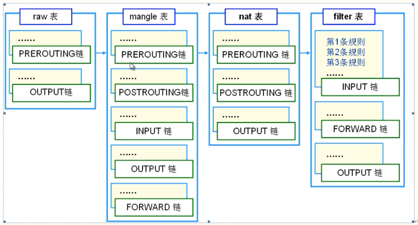
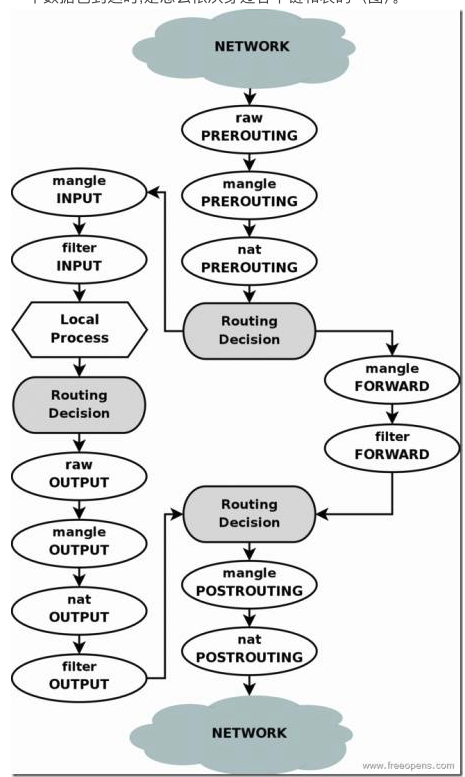

## iptables

netfilter/iptables 是 Linux 内核提供的一个网络过滤系统，它提供了一套完整的网络过滤规则，可以控制网络流量的进入和离开。

netfilter/iptables 是 Linux 内核提供的一个网络过滤系统，它提供了一套完整的网络过滤规则，
iptables 是一个命令行工具，用于管理 iptables 规则,它使变更过滤规则变得容易。配置完之后立即生效.

### 表

常用的三张表:

1. filter: 默认表，用于过滤网络流量。
2. nat: 用于转换网络地址。
3. mangle: 用于修改网络包。
4. raw:  iptables 中用于处理特殊类型的数据包的表，它可以决定是否对数据包进行连接跟踪（connection tracking），即是否记录数据包的状态信息。连接跟踪是一种消耗资源的操作。

表的优先级 raw > mangle > nat > filter

### 链

1. PREROUTING: 默认链，在路由前执行。
2. INPUT: 默认链，在路由前执行。
3. FORWARD: 默认链，在路由前执行。
4. OUTPUT: 默认链，在路由前执行。
5. POSTROUTING: 默认链，在路由后执行。

### 匹配规则

1. 自上向下按顺序依次进行检查，找到相匹配的规则即停止(LOG选项表示记录相关日志)
2. 若在该链内找不到相匹配的规则，则按该链的默认策略处理(未修改的状况下，默认策略为允许)

### 链与表

各个表中在具体某个链


流量走向图(不包含raw表)

1. 需要本机处理的数据包，即走下面,local即使本地的进程。
2. 本机转发的数据包，即走上面。

包含raw表


## 命令

语法格式

```shell
iptables [-t 表名] 管理选项 [链名] [匹配条件] [-j 目标动作]
# 不指定表名，默认为filter表
# 不指定链名称，默认为所有链
```

### 管理选项

-A	添加防火墙规则
-D	删除防火墙规则
-I	插入防火墙规则
-F	清空防火墙规则
-L	列出添加防火墙规则
-R	替换防火墙规则
-Z	清空防火墙数据表统计信息
-P	设置链默认规则

### 匹配条件

流入网卡(-i)流出网卡(-o)
来源地址(-s)目标地址(-d)
协议类型(-p)
来源端口(--sport)目标端口(--dport)

举例

```shell
# 匹配网卡
-i etho      # 匹配eth0网卡
# 匹配地址
-s 192.168.1.1  # 匹配源地址为192.168.1.1
-s 192.168.1.0/24 # 匹配192.168.1.0/24网络段的数据包
-d 192.168.1.1 # 匹配目标地址192.168.1.1
-d 192.168.1.0/24 # 匹配目标地址192.168.1.0/24网络段的数据包
# 匹配tcp
-p tcp
# 端口 -dport同 使用--dport --sport 的时候需要使用-p指定协议
--sport 80 # 匹配80端口
--sport 80:90 # 匹配80-90端口
--sport :80 # 匹配0-80端口
--sport 80: # 匹配80和以后的端口
```

### 目标动作

1. ACCEPT: 允许数据包通过。
2. DROP: 丢弃数据包,不给任何消息回应。
3. REJECT: 拒绝数据包，并返回拒绝信息。
4. SNAT: 源地址转换。
5. DNAT: 目标地址转换。
6. MASQUERADE: 伪装地址。

### 例子

```shell
# example
# 查看filter表
iptables -L
# filter表，INPUT链，DROP全部
iptables -t filter -A INPUT -j DROP
# 删除filter表，INPUT链第一条
iptables -D INPUT 1
# filter表，INPUT链,默认策略为DROP
iptables -P INPUT DROP
# 清楚filter表，INPUT链,清空不影响默认规则
iptables -F INPUT
# drop 192.168.80.39的数据包
iptables -t filter -A INPUT -s 192.168.80.39 -j DROP
# 将192.168.1.0/24来源的数据包转换为公网地址1.1.1.1
iptables -t nat -A POSTROUTING -s 192.168.1.0/24 -j SNAT --to 1.1.1.1
# 将eth0进来的访问tcp80端口的数据包的目标地址192.168.0.1
iptables -t nat -A PREROUTING  -i eth0 -p tcp --dport 80 -j DNAT --to 192.168.0.1
#  将eth0进来的访问tcp80端口的数据包的目标地址192.168.0.1-192.168.0.10
iptables -t nat -A PREROUTING  -i eth0 -p tcp --dport 80 -j DNAT --to 192.168.0.1-192.168.0.10
```
