## 文件系统

### 基本认识

Linux 文件系统会为每个文件分配两个数据结构：索引节点（index node）和目录项（directory entry）

- 索引节点：也就是 inode，用来记录文件的元信息，比如 inode 编号、文件大小、访问权限、创建时间、修改时间、数据在磁盘的位置等等。索引节点是文件的唯一标识，它们之间一一对应，也同样都会被存储在硬盘中，所以索引节点同样占用磁盘空间。
- 目录项：也就是 dentry，用来记录文件的名字、索引节点指针以及与其他目录项的层级关联关系。多个目录项关联起来，就会形成目录结构，但它与索引节点不同的是，目录项是由内核维护的一个数据结构，不存放于磁盘，而是缓存在内存。

#### inode

由于索引节点唯一标识一个文件，而目录项记录着文件的名，所以目录项和索引节点的关系是多对一，也就是说，一个文件可以有多个别字。比如，硬链接的实现就是多个目录项中的索引节点指向同一个文件。

### 虚拟文件系统

虚拟文件系统（Virtual File System，VFS）是 Linux 内核中的一个抽象层，它提供了一个统一的接口来访问不同类型的文件系统。VFS 使得内核能够以一种统一的方式处理不同类型的文件系统，而不需要关心具体的文件系统类型。

VFS 定义了一组所有文件系统都支持的数据结构和标准接口，这样程序员不需要了解文件系统的工作原理，只需要了解 VFS 提供的统一接口即可。

在 Linux 文件系统中，用户空间、系统调用、虚拟机文件系统、缓存、文件系统以及存储之间的关系如下图：

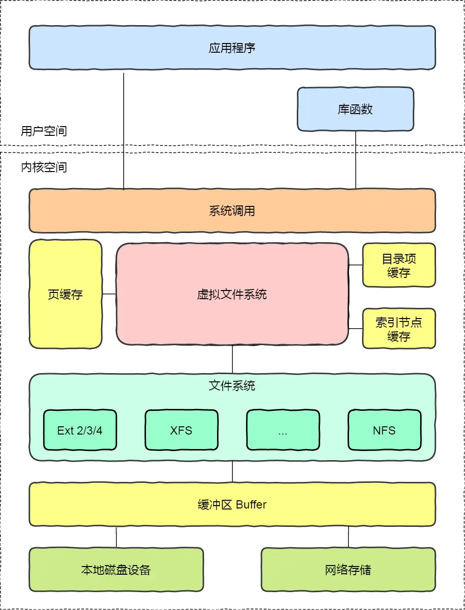

Linux 支持的文件系统也不少，根据存储位置的不同，可以把文件系统分为三类：

- 磁盘的文件系统，它是直接把数据存储在磁盘中，比如 Ext 2/3/4、XFS 等都是这类文件系统。
- 内存的文件系统，这类文件系统的数据不是存储在硬盘的，而是占用内存空间，我们经常用到的 /proc 和 /sys 文件系统都属于这一类，读写这类文件，实际上是读写内核中相关的数据。
- 网络的文件系统，用来访问其他计算机主机数据的文件系统，比如 NFS、SMB 等等。

文件系统首先要先挂载到某个目录才可以正常使用，比如 Linux 系统在启动时，会把文件系统挂载到根目录。

### 文件使用

上面简单的代码是读取一个文件的过程：

- 首先用 open 系统调用打开文件，open 的参数中包含文件的路径名和文件名。
- 使用 write 写数据，其中 write 使用 open 所返回的文件描述符，并不使用文件名作为参数。
- 使用完文件后，要用 close 系统调用关闭文件，避免资源的泄露。

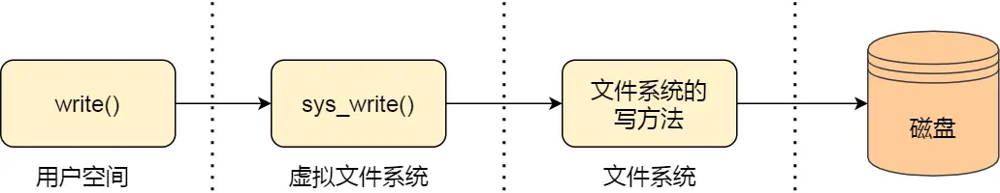

我们打开了一个文件后，操作系统会跟踪进程打开的所有文件，所谓的跟踪呢，就是操作系统为每个进程维护一个打开文件表，文件表里的每一项代表「文件描述符」，所以说文件描述符是打开文件的标识。

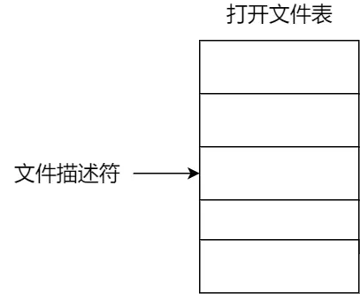

操作系统在打开文件表中维护着打开文件的状态和信息：

- 文件指针：系统跟踪上次读写位置作为当前文件位置指针，这种指针对打开文件的某个进程来说是唯一的；
- 文件打开计数器：文件关闭时，操作系统必须重用其打开文件表条目，否则表内空间不够用。因为多个进程可能打开同一个文件，所以系统在删除打开文件条目之前，必须等待最后一个进程关闭文件，该计数器跟踪打开和关闭的数量，当该计数为 0 时，系统关闭文件，删除该条目；
- 文件磁盘位置：绝大多数文件操作都要求系统修改文件数据，该信息保存在内存中，以免每个操作都从磁盘中读取；
- 访问权限：每个进程打开文件都需要有一个访问模式（创建、只读、读写、添加等），该信息保存在进程的打开文件表中，以便操作系统能允许或拒绝之后的 I/O 请求；

### 文件的存储

文件的数据是要存储在硬盘上面的，数据在磁盘上的存放方式，就像程序在内存中存放的方式那样，有以下两种：

- 连续空间存放方式
- 非连续空间存放方式

非连续空间存放方式又可以分为「链表方式」和「索引方式」。

#### 连续空间存放方式

连续空间存放方式顾名思义，文件存放在磁盘「连续的」物理空间中。这种模式下，文件的数据都是紧密相连，读写效率很高，因为一次磁盘寻道就可以读出整个文件。

使用连续存放的方式有一个前提，必须先知道一个文件的大小，这样文件系统才会根据文件的大小在磁盘上找到一块连续的空间分配给文件。

所以，文件头里需要指定「起始块的位置」和「长度」，有了这两个信息就可以很好的表示文件存放方式是一块连续的磁盘空间。

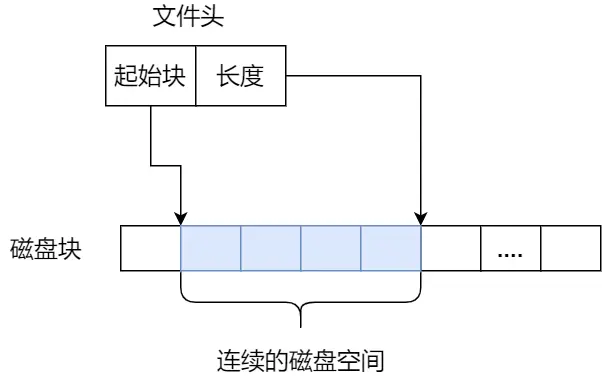

连续空间存放的方式虽然读写效率高，但是有「磁盘空间碎片」和「文件长度不易扩展」的缺陷。

如下图，如果文件 B 被删除，磁盘上就留下一块空缺，这时，如果新来的文件小于其中的一个空缺，我们就可以将其放在相应空缺里。但如果该文件的大小大于所有的空缺，但却小于空缺大小之和，则虽然磁盘上有足够的空缺，但该文件还是不能存放。当然了，我们可以通过将现有文件进行挪动来腾出空间以容纳新的文件，但是这个在磁盘挪动文件是非常耗时，所以这种方式不太现实。
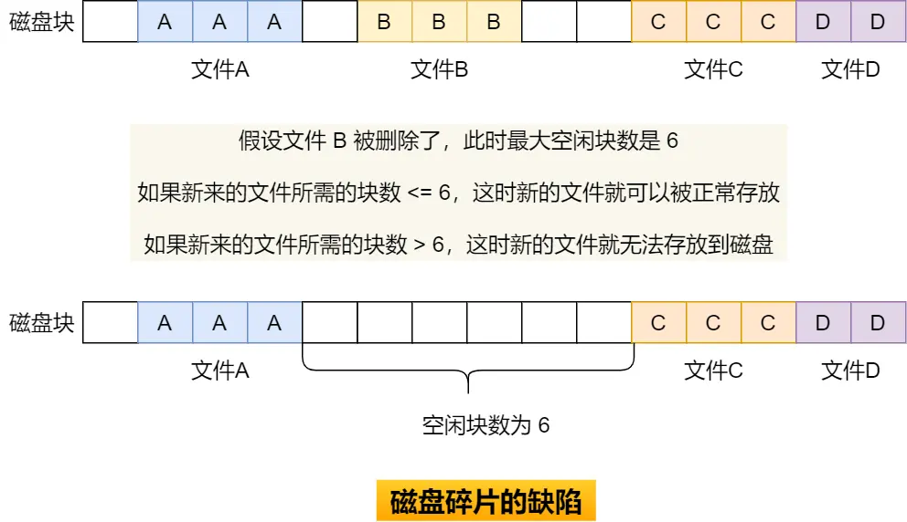

另外一个缺陷是文件长度扩展不方便，例如上图中的文件 A 要想扩大一下，需要更多的磁盘空间，唯一的办法就只能是挪动的方式，前面也说了，这种方式效率是非常低的

#### 非连续空间存放方式

非连续空间存放方式分为「链表方式」和「索引方式」。

##### 链表方式

链表的方式存放是离散的，不用连续的，于是就可以消除磁盘碎片，可大大提高磁盘空间的利用率，同时文件的长度可以动态扩展。根据实现的方式的不同，链表可分为「隐式链表」和「显式链接」两种形式。

###### 隐式链表

文件要以「隐式链表」的方式存放的话，实现的方式是文件头要包含「第一块」和「最后一块」的位置，并且每个数据块里面留出一个指针空间，用来存放下一个数据块的位置，这样一个数据块连着一个数据块，从链头开是就可以顺着指针找到所有的数据块，所以存放的方式可以是不连续的。

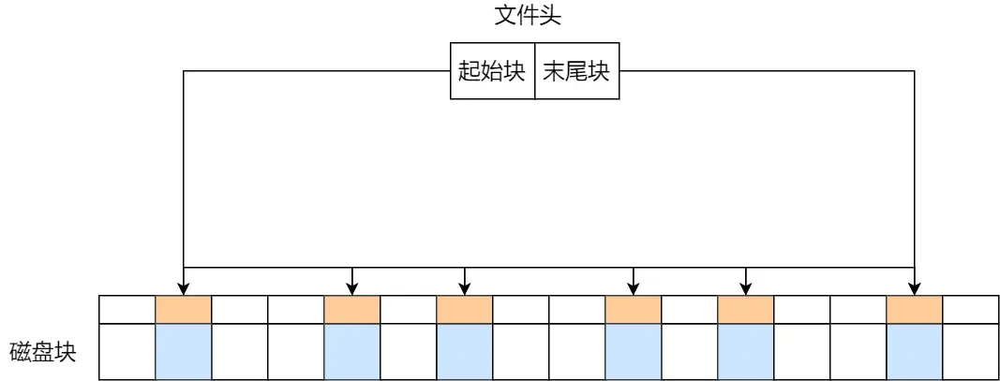

隐式链表的存放方式的缺点在于无法直接访问数据块，只能通过指针顺序访问文件，以及数据块指针消耗了一定的存储空间。隐式链接分配的稳定性较差，系统在运行过程中由于软件或者硬件错误导致链表中的指针丢失或损坏，会导致文件数据的丢失

###### 显式链接

如果取出每个磁盘块的指针，把它放在内存的一个表中，就可以解决上述隐式链表的两个不足。那么，这种实现方式是「显式链接」，它指把用于链接文件各数据块的指针，显式地存放在内存的一张链接表中，该表在整个磁盘仅设置一张，每个表项中存放链接指针，指向下一个数据块号。

对于显式链接的工作方式，我们举个例子，文件 A 依次使用了磁盘块 4、7、2、10 和 12 ，文件 B 依次使用了磁盘块 6、3、11 和 14 。利用下图中的表，可以从第 4 块开始，顺着链走到最后，找到文件 A 的全部磁盘块。同样，从第 6 块开始，顺着链走到最后，也能够找出文件 B 的全部磁盘块。最后，这两个链都以一个不属于有效磁盘编号的特殊标记（如 -1 ）结束。内存中的这样一个表格称为文件分配表（File Allocation Table，FAT）。

   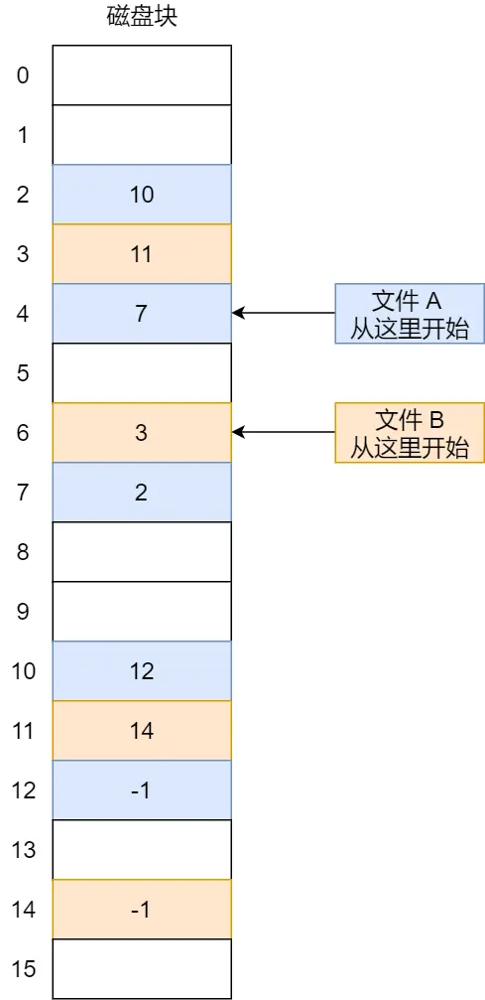

由于查找记录的过程是在内存中进行的，因而不仅显著地提高了检索速度，而且大大减少了访问磁盘的次数。但也正是整个表都存放在内存中的关系，它的主要的缺点是不适用于大磁盘。

比如，对于 200GB 的磁盘和 1KB 大小的块，这张表需要有 2 亿项，每一项对应于这 2 亿个磁盘块中的一个块，每项如果需要 4 个字节，那这张表要占用 800MB 内存，很显然 FAT 方案对于大磁盘而言不太合适。

#### 索引方式

链表的方式解决了连续分配的磁盘碎片和文件动态扩展的问题，但是不能有效支持直接访问（FAT除外），索引的方式可以解决这个问题

索引的实现是为每个文件创建一个「索引数据块」，里面存放的是指向文件数据块的指针列表，说白了就像书的目录一样，要找哪个章节的内容，看目录查就可以。

另外，文件头需要包含指向「索引数据块」的指针，这样就可以通过文件头知道索引数据块的位置，再通过索引数据块里的索引信息找到对应的数据块。

创建文件时，索引块的所有指针都设为空。当首次写入第 i 块时，先从空闲空间中取得一个块，再将其地址写到索引块的第 i 个条目。


索引的方式优点在于：

- 文件的创建、增大、缩小很方便；
- 不会有碎片的问题；
- 支持顺序读写和随机读写；

由于索引数据也是存放在磁盘块的，如果文件很小，明明只需一块就可以存放的下，但还是需要额外分配一块来存放索引数据，所以缺陷之一就是存储索引带来的开销。

如果文件很大，大到一个索引数据块放不下索引信息，这时又要如何处理大文件的存放呢？我们可以通过组合的方式，来处理大文件的存

先来看看链表 + 索引的组合，这种组合称为「链式索引块」，它的实现方式是在索引数据块留出一个存放下一个索引数据块的指针，于是当一个索引数据块的索引信息用完了，就可以通过指针的方式，找到下一个索引数据块的信息。那这种方式也会出现前面提到的链表方式的问题，万一某个指针损坏了，后面的数据也就会无法读取了。

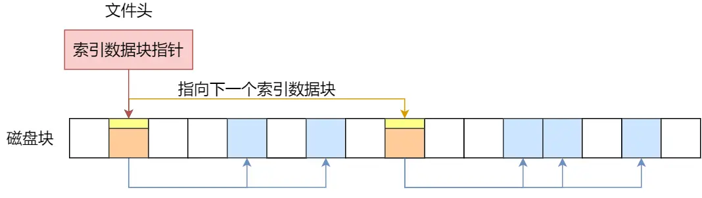

还有另外一种组合方式是索引 + 索引的方式，这种组合称为「多级索引块」，实现方式是通过一个索引块来存放多个索引数据块，一层套一层索引，像极了俄罗斯套娃是吧。

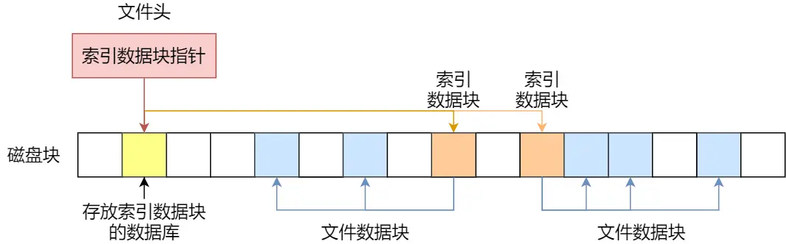

##### 总结

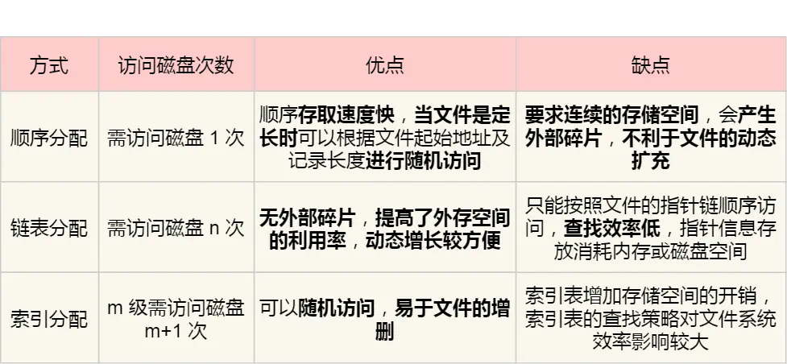

### 空闲空间管理

那这种方式效率就太低了，所以针对磁盘的空闲空间也是要引入管理的机制，接下来介绍几种常见的方法：

- 空闲表法
- 空闲链表法
- 位图法

#### 空闲表法

空闲表法就是为所有空闲空间建立一张表，表内容包括空闲区的第一个块号和该空闲区的块个数，注意，这个方式是连续分配的。如下图：

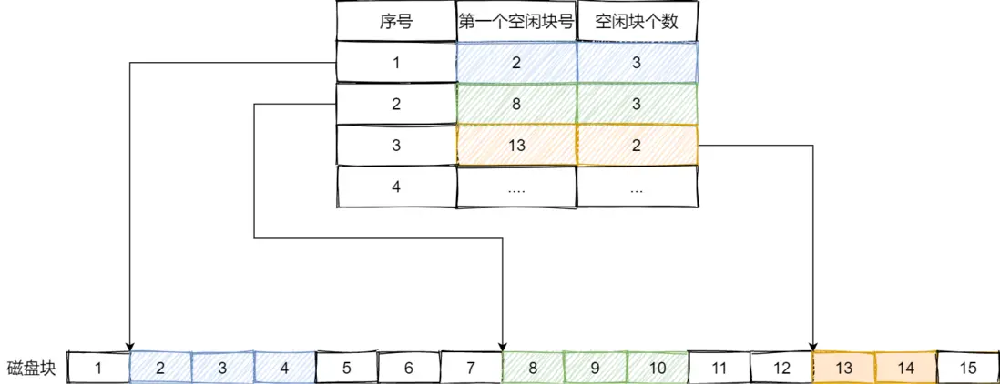

当请求分配磁盘空间时，系统依次扫描空闲表里的内容，直到找到一个合适的空闲区域为止。当用户撤销一个文件时，系统回收文件空间。这时，也需顺序扫描空闲表，寻找一个空闲表条目并将释放空间的第一个物理块号及它占用的块数填到这个条目中。

这种方法仅当有少量的空闲区时才有较好的效果。因为，如果存储空间中有着大量的小的空闲区，则空闲表变得很大，这样查询效率会很低。另外，这种分配技术适用于建立连续文件。

#### 空闲链表法

我们也可以使用「链表」的方式来管理空闲空间，每一个空闲块里有一个指针指向下一个空闲块，这样也能很方便的找到空闲块并管理起来。如下图：
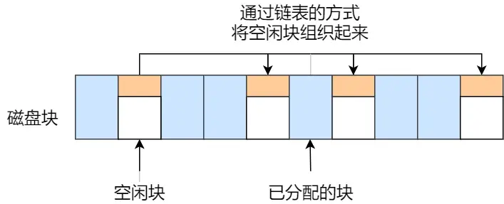

当创建文件需要一块或几块时，就从链头上依次取下一块或几块。反之，当回收空间时，把这些空闲块依次接到链头上。

这种技术只要在主存中保存一个指针，令它指向第一个空闲块。其特点是简单，但不能随机访问，工作效率低，因为每当在链上增加或移动空闲块时需要做很多 I/O 操作，同时数据块的指针消耗了一定的存储空间。

空闲表法和空闲链表法都不适合用于大型文件系统，因为这会使空闲表或空闲链表太大。

#### 位图法

位图是利用二进制的一位来表示磁盘中一个盘块的使用情况，磁盘上所有的盘块都有一个二进制位与之对应。

当值为 0 时，表示对应的盘块空闲，值为 1 时，表示对应的盘块已分配。它形式如下：

```text
1111110011111110001110110111111100111 ...
```

在 Linux 文件系统就采用了位图的方式来管理空闲空间，不仅用于数据空闲块的管理，还用于 inode 空闲块的管理，因为 inode 也是存储在磁盘的，自然也要有对其管理。

### 文件系统的结构

前面提到 Linux 是用位图的方式管理空闲空间，用户在创建一个新文件时，Linux 内核会通过 inode 的位图找到空闲可用的 inode，并进行分配。要存储数据时，会通过块的位图找到空闲的块，并分配，但仔细计算一下还是有问题的。

数据块的位图是放在磁盘块里的，假设是放在一个块里，一个块 4K，每位表示一个数据块，共可以表示 4 *1024* 8 = 2^15 个空闲块，由于 1 个数据块是 4K 大小，那么最大可以表示的空间为 2^15 *4* 1024 = 2^27 个 byte，也就是 128M。

也就是说按照上面的结构，如果采用「一个块的位图 + 一系列的块」，外加「一个块的 inode 的位图 + 一系列的 inode 的结构」能表示的最大空间也就 128M，这太少了，现在很多文件都比这个大。

TODO

### 软链接和硬链接

有时候我们希望给某个文件取个别名，那么在 Linux 中可以通过硬链接（Hard Link） 和软链接（Symbolic Link） 的方式来实现，它们都是比较特殊的文件，但是实现方式也是不相同的

#### 硬链接

硬链接是多个目录项中的「索引节点」指向一个文件，也就是指向同一个 inode，但是 inode 是不可能跨越文件系统的，每个文件系统都有各自的 inode 数据结构和列表，所以硬链接是不可用于跨文件系统的。由于多个目录项都是指向一个 inode，那么只有删除文件的所有硬链接以及源文件时，系统才会彻底删除该文件

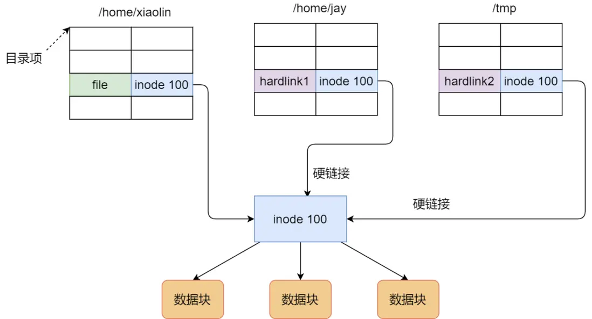

#### 软链接

软链接相当于重新创建一个文件，这个文件有独立的 inode，但是这个文件的内容是另外一个文件的路径，所以访问软链接的时候，实际上相当于访问到了另外一个文件，所以软链接是可以跨文件系统的，甚至目标文件被删除了，链接文件还是在的，只不过指向的文件找不到了而已。

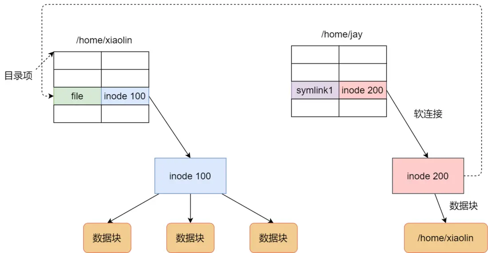

### 文件IO

- 缓冲与非缓冲 I/O
- 直接与非直接 I/O
- 阻塞与非阻塞 I/O VS 同步与异步 I/O

#### 缓冲与非缓冲 I/O

- 缓冲 I/O，利用的是标准库的缓存实现文件的加速访问，而标准库再通过系统调用访问文件。
- 非缓冲 I/O，直接通过系统调用访问文件，不经过标准库缓存。

这里所说的「缓冲」特指标准库内部实现的缓冲

#### 直接与非直接 I/O

我们都知道磁盘 I/O 是非常慢的，所以 Linux 内核为了减少磁盘 I/O 次数，在系统调用后，会把用户数据拷贝到内核中缓存起来，这个内核缓存空间也就是「页缓存」，只有当缓存满足某些条件的时候，才发起磁盘 I/O 的请求。

- 直接 I/O，不会发生内核缓存和用户程序之间数据复制，而是直接经过文件系统访问磁盘。
- 非直接 I/O，读操作时，数据从内核缓存中拷贝给用户程序，写操作时，数据从用户程序拷贝给内核缓存，再由内核决定什么时候写入数据到磁盘。

如果你在使用文件操作类的系统调用函数时，指定了 O_DIRECT 标志，则表示使用直接 I/O。如果没有设置过，默认使用的是非直接 I/O。

如果用了非直接 I/O 进行写数据操作，内核什么情况下才会把缓存数据写入到磁盘

以下几种场景会触发内核缓存的数据写入磁盘：

- 在调用 write 的最后，当发现内核缓存的数据太多的时候，内核会把数据写到磁盘上；
- 用户主动调用 sync，内核缓存会刷到磁盘上；
- 当内存十分紧张，无法再分配页面时，也会把内核缓存的数据刷到磁盘上；
- 内核缓存的数据的缓存时间超过某个时间时，也会把数据刷到磁盘上

#### 阻塞与非阻塞 I/O

阻塞 I/O，当用户程序执行 read ，线程会被阻塞，一直等到内核数据准备好，并把数据从内核缓冲区拷贝到应用程序的缓冲区中，当拷贝过程完成，read 才会返回

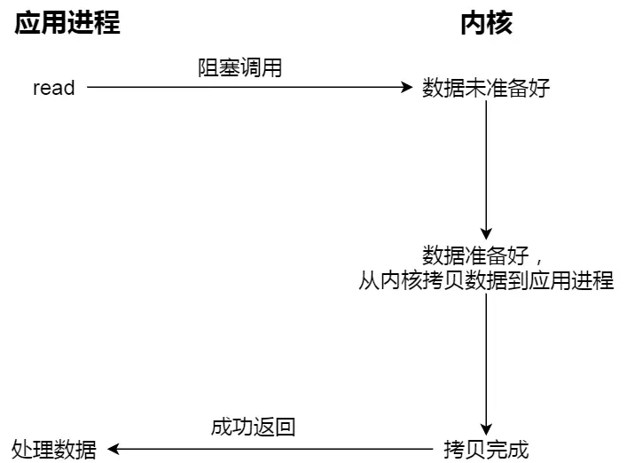

非阻塞 I/O，非阻塞的 read 请求在数据未准备好的情况下立即返回，可以继续往下执行，此时应用程序不断轮询内核，直到数据准备好，内核将数据拷贝到应用程序缓冲区，read 调用才可以获取到结果。过程如下图

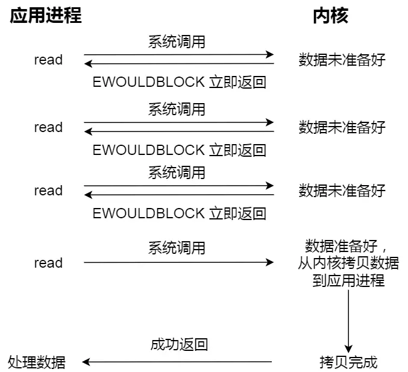

注意，这里最后一次 read 调用，获取数据的过程，是一个同步的过程，是需要等待的过程。这里的同步指的是内核态的数据拷贝到用户程序的缓存区这个过程。

阻塞IO-----> 我等着你读取全部文件
非阻塞IO-----> 在你读文件给我的过程中,我来催你

为了解决这种傻乎乎轮询方式，于是 I/O 多路复用技术就出来了，如 select、poll，它是通过 I/O 事件分发，当内核数据准备好时，再以事件通知应用程序进行操作。

select I/O 多路复用过程
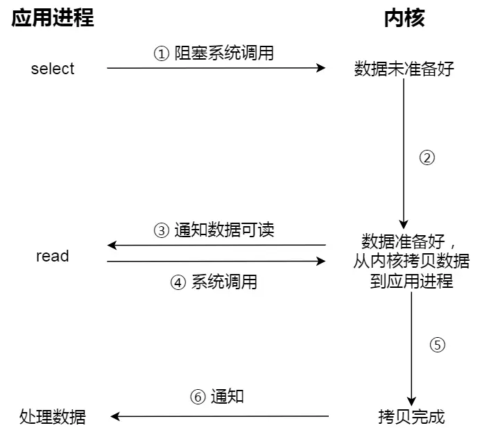

#### 异步 I/O


#### 总结

阻塞 I/O 好比，你去饭堂吃饭，但是饭堂的菜还没做好，然后你就一直在那里等啊等，等了好长一段时间终于等到饭堂阿姨把菜端了出来（数据准备的过程），但是你还得继续等阿姨把菜（内核空间）打到你的饭盒里（用户空间），经历完这两个过程，你才可以离开。

非阻塞 I/O 好比，你去了饭堂，问阿姨菜做好了没有，阿姨告诉你没，你就离开了，过几十分钟，你又来饭堂问阿姨，阿姨说做好了，于是阿姨帮你把菜打到你的饭盒里，这个过程你是得等待的。

基于非阻塞的 I/O 多路复用好比，你去饭堂吃饭，发现有一排窗口，饭堂阿姨告诉你这些窗口都还没做好菜，等做好了再通知你，于是等啊等（select 调用中），过了一会阿姨通知你菜做好了，但是不知道哪个窗口的菜做好了，你自己看吧。于是你只能一个一个窗口去确认，后面发现 5 号窗口菜做好了，于是你让 5 号窗口的阿姨帮你打菜到饭盒里，这个打菜的过程你是要等待的，虽然时间不长。打完菜后，你自然就可以离开了。
