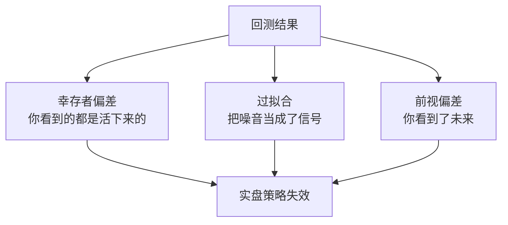

# 一、回测的致命诱惑：为什么90%的策略在实盘会失效？

说实话，我见过太多人栽在这个坑里。

我自己刚入行那会儿，也干过这种傻事——回测曲线漂亮得像教科书，一上实盘就亏得亲妈都不认识。后来我才明白，回测这东西，说白了就是个「温柔的陷阱」。它给你看你想看的，藏起你该看的。

这一章，咱们就来聊聊回测里最要命的三个陷阱：**幸存者偏差、过拟合、前视偏差**。搞懂它们，你至少能避开90%的坑。

> **核心观点：** 回测不是用来证明策略有效的，而是用来证明策略还没失效的。

## 1.1 幸存者偏差：你看到的都是活下来的

先讲个我自己的糗事。

几年前我开发一个A股选股策略，回测年化收益30%+，最大回撤不到10%。我当时觉得，稳了。结果实盘跑了三个月，亏了15%。

问题出在哪？

我用的股票池是「当前还在交易的股票」。你想想看，那些退市的、暴跌的、被ST的，早就被踢出池子了。我回测时只看到活下来的「幸存者」，自然觉得遍地是黄金。

这就是**幸存者偏差**。

> **避坑指南：** 我曾经犯过这个错，后来养成了一个习惯——回测时一定要包含「已退市」的股票。用全量历史数据，别用当前快照。

举个更直观的例子：

假设2010年有100只股票，到2020年只剩50只。你用这50只做回测，相当于自动排除了那50只失败的。策略表现当然好看，但那是假的。

怎么解决？

- 使用**全量历史数据**，包括已退市、已合并的标的
- 定期**重新构建股票池**，模拟真实交易环境
- 做**生存偏差调整**，把退市股票的收益算进去

## 1.2 过拟合：把噪音当成了信号

过拟合这词听起来高大上，其实说白了就一句话：**你让策略太「聪明」了**。

我见过一个策略，参数多达20多个，回测曲线完美得像一条直线。我当时就说，这玩意儿实盘必死。果不其然，上线两周就崩了。

为什么会这样？

你想想看，历史数据就那么一段。你拼命调整参数，让策略完美拟合过去的价格走势。但市场是活的，过去的噪音不会重复。你拟合得越完美，对未来就越不适应。

> **警告：** 回测曲线越漂亮，越要警惕。真正的策略，回测曲线应该是「有瑕疵的」。

我个人的经验是：

- **参数越少越好**。3-5个参数就够了，超过10个基本就是过拟合
- **做样本外测试**。留一段数据不参与优化，专门用来验证
- **做蒙特卡洛模拟**。随机打乱交易顺序，看看策略是否还稳定

这里给个简单的代码示例，展示如何做样本外测试：

```python
# 伪代码示例
train_data = data[:'2019']  # 训练集
test_data = data['2020':]   # 测试集

# 在训练集上优化参数
best_params = optimize(train_data)

# 在测试集上验证
performance = backtest(test_data, best_params)

# 如果训练集和测试集表现差异巨大
# 说明过拟合了
if abs(performance_train - performance_test) > 0.2:
    print("警告：可能存在过拟合")
```

## 1.3 前视偏差：你看到了未来

这个陷阱最隐蔽，也最致命。

前视偏差，就是你在回测时「不小心」用到了未来的数据。比如你用今天的收盘价去预测明天的涨跌，或者用季报发布后的数据去模拟季报发布前的交易。

我记得有一次，一个同事兴冲冲地跑过来说发现了一个稳赚的策略。我一看代码，好家伙，他用的是「未来函数」——在回测时提前知道了当天的最高价和最低价。

这就像打牌时偷看了对手的底牌，赢是必然的，但那是作弊。

> **避坑指南：** 我曾经在回测框架里加了一个「时间戳检查」功能，每次交易都验证数据是否在交易时间之前。这个习惯救了我好几次。

常见的几种前视偏差：

| 类型 | 描述 | 例子 |
| --- | --- | --- |
| 价格前视 | 用未来价格做决策 | 用当日收盘价判断当日买入点 |
| 信息前视 | 用未来信息做决策 | 用财报发布后的数据模拟发布前交易 |
| 重组前视 | 用重组后的数据模拟重组前 | 用复牌后的价格模拟停牌期间 |

## 1.4 三个陷阱的关系图

下面这张图，是我自己总结的。它展示了这三个陷阱如何相互影响，最终导致策略失效。

### 回测三大陷阱关系图



三个陷阱单独或共同作用，导致回测结果失真。

## 1.5 如何系统性地规避这些陷阱

光知道陷阱还不够，你得有应对方法。我这些年总结了一套流程，分享给你：

1. **数据清洗阶段**：检查数据是否包含幸存者偏差，补充退市数据
2. **策略设计阶段**：控制参数数量，做逻辑验证而非数据拟合
3. **回测执行阶段**：严格检查时间戳，避免前视偏差
4. **结果验证阶段**：做样本外测试、蒙特卡洛模拟、压力测试

> **记住一句话：** 回测的唯一价值，是帮你发现策略的弱点，而不是证明策略有多强。

嗯，这一章就到这里。内容不多，但都是实打实的经验。你如果能把这三点刻在脑子里，后面的章节学起来会轻松很多。

---

