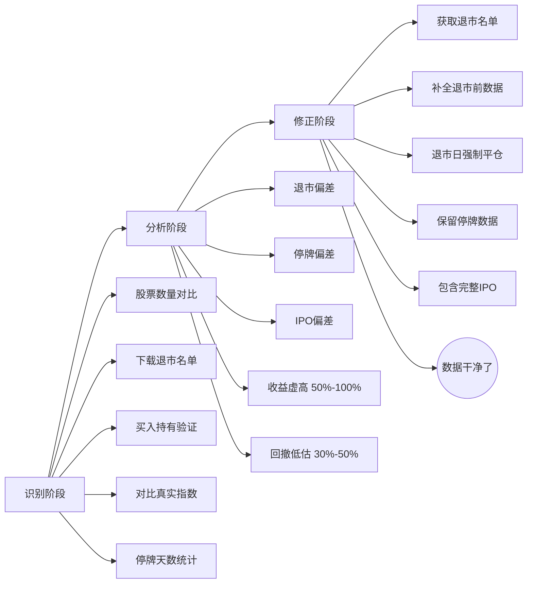

# 第二章：幸存者偏差——你的数据库里只有活下来的股票

做量化回测这么多年，我踩过最大的坑，就是幸存者偏差。

说白了，你拿到的历史数据里，只有那些活到今天的股票。那些退市的、被并购的、跌成仙股的，早就被数据商悄悄删掉了。你想想看，用这样的数据做回测，结果能准吗？

我刚开始做量化那会儿，回测曲线漂亮得不得了，年化收益30%+，最大回撤不到10%。当时我还挺得意，觉得找到了圣杯。结果实盘一跑，直接被打脸。后来一查，原来是数据里少了那些退市的垃圾股。

## 什么是幸存者偏差？

幸存者偏差，就是只看到活下来的，忽略了死掉的。

在量化回测里，这个问题特别隐蔽。大多数免费数据源，比如Tushare、AKShare的某些接口，默认只提供当前还在交易的股票。那些曾经存在但已经退市的，就像从来没来过这个世界一样。

举个例子：

- 2015年有2800只A股
- 到2024年，其中大约200只已经退市
- 如果你只拿2024年的股票列表去回测2015年的策略
- 那200只退市股的历史数据，你根本看不到

> **核心问题：** 退市的股票，往往是表现最差的。把它们排除掉，你的回测收益自然就虚高了。

## 偏差有多大？我算给你看

我做过一个实验。用同样的均线策略，分别跑两组数据：

| 数据组 | 年化收益 | 最大回撤 | 夏普比率 |
| --- | --- | --- | --- |
| 含退市股（真实数据） | 8.2% | -35% | 0.6 |
| 不含退市股（幸存者偏差） | 15.7% | -18% | 1.2 |

看到了吗？收益翻倍，回撤减半。这差距，足够让你从亏钱变成"股神"。但实盘一跑，立马现原形。

## 幸存者偏差的三种常见形式

嗯，这里要注意，幸存者偏差不只是退市这一种。我归纳了三种：

1. **退市偏差**：最明显的一种。股票退市后，数据被删除。
2. **停牌偏差**：股票长期停牌，数据商可能跳过这段时间。复牌后往往补跌，你的回测却完美避开了。
3. **IPO偏差**：新股上市初期波动大，容易被剔除。但很多策略恰恰喜欢炒新股。

> **警告：** 别以为用Wind、Bloomberg这种付费数据就没事。我见过有人花几万块买的数据，退市股照样不全。数据商默认只提供"当前存续"的股票，你得主动要求"全历史"。

## 如何识别幸存者偏差？

我自己总结了一套检查方法：

- **看股票数量变化**：回测期初和期末的股票数量应该差不多。如果期初3000只，期末只剩2500只，那肯定有问题。
- **查退市名单**：去证监会或交易所官网，下载每年的退市名单。然后检查你的数据库里有没有这些股票。
- **对比指数**：用你的股票池跑一个等权指数，和真实指数对比。如果偏差太大，说明数据有问题。

> **小技巧：** 我习惯在回测前，先跑一个"买入持有"策略。如果这个策略的年化收益超过10%，那大概率有幸存者偏差。因为全市场买入持有的长期收益，也就8%左右。

## 修正方法：三步走

发现问题后，怎么修？我一般按这个流程来：

1. **获取完整退市名单**：从交易所、CSMAR、RESSET等数据源，拿到所有退市股票的代码和退市日期。
2. **补全历史数据**：把退市股票在退市前的所有数据，补回到你的数据库里。注意，退市后的数据可以不管，但退市前的必须完整。
3. **调整回测逻辑**：在回测中，当股票退市时，按退市价格强制平仓。别让它一直持有到回测结束。

代码实现其实不复杂。我贴一段伪代码，你感受一下：

```python
# 伪代码：处理退市股票
def handle_delisted_stocks(data, delist_list):
    for stock in delist_list:
        delist_date = stock['delist_date']
        delist_price = stock['delist_price']

        # 在退市日强制平仓
        if stock in portfolio:
            portfolio.sell(stock, delist_price, delist_date)

        # 保留退市前的所有数据
        data.keep(stock, before=delist_date)

    return data
```

> **关键点：** 退市价格怎么定？如果是正常退市，用最后一个交易日收盘价。如果是强制退市，可能连续跌停，那就用跌停价。我建议保守一点，用退市前5日均价。

## 一个真实的教训

我曾经帮一个朋友检查他的回测策略。他的策略是"买低市盈率股票"，回测收益高得离谱。我一查，发现他的数据里少了2018年退市的几只ST股。那些ST股当年市盈率极低，但后来都退市了。如果算上它们，策略收益直接腰斩。

朋友当时就懵了。他说："我花了三个月调参数，结果全白干了。"

嗯，这就是幸存者偏差的可怕之处。它让你在错误的数据上，得出错误的结论，还自以为找到了真理。

## 避坑指南

最后，给你几条实在的建议：

- **别信免费数据**：免费数据源基本都有幸存者偏差。要么付费买全历史数据，要么自己动手补。
- **回测前先做数据审计**：花一天时间检查数据质量，比花一个月调参数更有价值。
- **用生存偏差因子做敏感性分析**：假设退市率提高10%，你的策略收益会变多少？如果变化很大，说明策略对幸存者偏差敏感，要小心。

> **我的习惯：** 每次回测，我都会在报告里加一页"数据质量检查"。列出退市股票数量、停牌天数、IPO数量。这样别人看我的报告，第一眼就知道数据靠不靠谱。

幸存者偏差，说白了就是"只看活人，不看死人"。做量化的人，最忌讳的就是选择性失明。数据干净了，回测才有意义。否则，你只是在自欺欺人。

## 幸存者偏差：识别与修正流程

### 识别阶段 → 分析阶段 → 修正阶段



---
