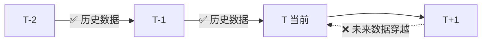

# 3、前视偏差：未来数据穿越回过去

说实话，前视偏差是我在量化回测中踩过最隐蔽的坑之一。

它不像参数过拟合那么明显，也不像幸存者偏差那样容易察觉。它就像个幽灵，悄悄钻进你的策略里，让你以为找到了圣杯，实则是未来数据在帮你作弊。

简单说，前视偏差就是——**你在回测时，不小心用到了未来才知道的信息**。

## 3.1 什么是前视偏差？

我习惯这么定义：**回测中使用了在策略执行时刻尚未知晓的数据**。

举个例子。你想用均线金叉策略：5日均线上穿20日均线时买入。听起来很合理对吧？但如果你在计算均线时，不小心把未来几天的收盘价也包含进去了……嗯，那这个金叉信号就提前知道了未来走势。

说白了，这就是**未来数据穿越回过去**。

> **核心问题：** 回测表现极好，实盘却一塌糊涂。因为回测时你偷偷看了答案。

## 3.2 常见的前视偏差场景

我在项目中遇到过好几种情况，这里列几个典型的：

- **指标计算中使用未来价格**——比如计算移动平均线时，用了包含未来K线的窗口
- **信号生成时引用未来数据**——比如用当天的收盘价判断当天开盘是否买入
- **止损止盈条件中隐含未来信息**——比如用当天最高价判断是否触发止损，但实际交易时你根本不知道当天最高价
- **数据预处理时泄露未来**——比如对整个数据集做归一化，用了未来的均值和标准差

你想想看，这些错误其实很常见。尤其是刚入门的朋友，很容易在写代码时不小心就引入了未来数据。

## 3.3 一个典型的错误示例

来看一段我早期犯过的错误代码：

```python
# ❌ 错误示例：前视偏差
import pandas as pd

def calculate_sma(data, window):
    # 这里用了整个序列计算，包括未来数据
    return data['close'].rolling(window=window).mean()

def generate_signals(data):
    data['sma5'] = calculate_sma(data, 5)
    data['sma20'] = calculate_sma(data, 20)

    # 问题：这里用当天的sma5和sma20判断当天是否金叉
    # 但实际上，当天的sma5已经包含了当天的收盘价
    data['signal'] = (data['sma5'] > data['sma20']) & \
                     (data['sma5'].shift(1) <= data['sma20'].shift(1))
    return data
```

这段代码的问题在哪？

`rolling(window=window)` 默认是包含当前行的。也就是说，计算第 t 天的5日均线时，用了第 t-4 到第 t 天的收盘价。但第 t 天的收盘价在当天交易结束前是未知的！

> **注意：** 如果你在回测中使用了当天的收盘价来计算当天的信号，那这个信号在实盘中根本不可能在当天开盘时得到。这就是典型的前视偏差。

## 3.4 如何检测前视偏差？

我个人习惯用这几个方法：

1. **时间戳检查法**——确保每个信号生成时，只用到该时间点之前的数据
2. **shift操作验证**——检查所有指标计算是否正确地shift了
3. **回测与实盘对比**——如果回测收益远高于实盘，先怀疑前视偏差
4. **逐笔检查关键信号**——随机抽取几个交易信号，手动验证数据是否可用

我曾经用第4个方法抓出过一个隐藏很深的前视偏差。当时一个策略回测年化收益40%，实盘只有5%。我逐笔检查了10个信号，发现其中3个都用了未来数据。嗯，从那以后我再也不敢偷懒了。

## 3.5 如何修复前视偏差？

修复方法其实很简单，核心就一句话：**确保每个时间点的计算只用到该时间点之前的数据**。

来看修复后的代码：

```python
# ✅ 正确示例：避免前视偏差
def generate_signals_correct(data):
    # 使用shift(1)确保只用历史数据
    data['sma5'] = data['close'].shift(1).rolling(window=5).mean()
    data['sma20'] = data['close'].shift(1).rolling(window=20).mean()

    # 现在sma5和sma20都只用了前一天及之前的数据
    data['signal'] = (data['sma5'] > data['sma20']) & \
                     (data['sma5'].shift(1) <= data['sma20'].shift(1))
    return data
```

关键改动：`.shift(1)`。这表示计算第 t 天的均线时，只用第 t-1 天及之前的数据。这样第 t 天的信号在当天开盘时就能计算出来。

> **小技巧：** 我建议在回测框架中统一使用一个数据切片函数，强制要求所有指标计算都基于历史窗口。这样可以从架构层面避免前视偏差。

## 3.6 前视偏差的流程图

下面这张图展示了前视偏差的核心逻辑：

### 时间轴：T-2 → T-1 → T（当前）→ T+1



#### 核心原则

- 计算 T 时刻的信号 → 只能用 T-1 及之前的数据
- 使用 `shift(1)` 确保数据滞后一期
- 回测表现异常好 → 先怀疑前视偏差
- 逐笔检查关键信号，手动验证数据可用性

## 3.7 其他常见的前视偏差场景

| 场景 | 错误做法 | 正确做法 |
| --- | --- | --- |
| 数据归一化 | 对整个数据集计算均值和标准差 | 只使用历史窗口的数据计算 |
| 止损判断 | 用当天最高价判断是否触发止损 | 用开盘价或前一日收盘价判断 |
| 信号回测 | 用当天收盘价生成当天信号 | 用前一天收盘价生成当天信号 |
| 特征工程 | 用未来数据计算技术指标 | 确保每个特征只用到历史数据 |

## 3.8 我的避坑指南

我曾经在一个CTA策略上栽过跟头。回测曲线漂亮得像教科书，年化夏普3.0。结果实盘跑了两个月，亏了15%。

后来逐行检查代码，发现是一个技术指标的计算窗口没做shift处理。修复后回测收益直接腰斩，但实盘反而开始盈利了。

所以我的建议是：

- **写代码时就把shift写进去**，不要等回测完再补
- **每个指标计算都问自己一句**：这个数据在交易时刻真的能拿到吗？
- **用随机抽样验证**：随机选10个交易日，手动检查信号生成逻辑

> **总结：** 前视偏差是量化回测中最隐蔽的陷阱之一。它让策略看起来完美无缺，实盘却一败涂地。记住核心原则——每个时间点的计算，只用到该时间点之前的数据。做到这一点，你就避开了80%的前视偏差问题。

---


