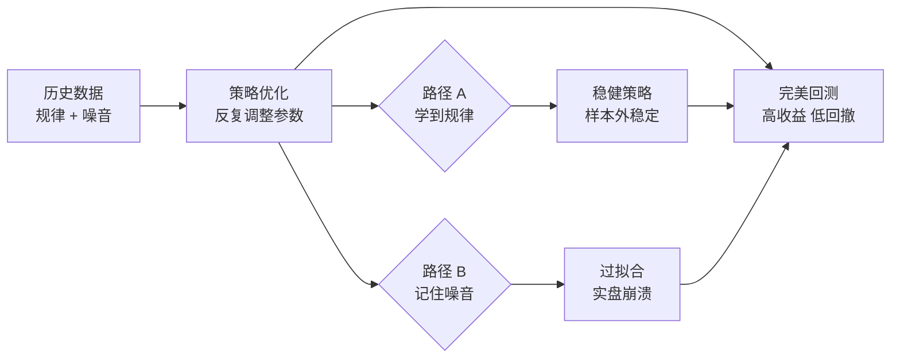

# 4、过拟合：策略完美拟合历史，却无法预测未来

说实话，过拟合是我在量化交易里踩过最深的坑。没有之一。

我刚入行那会儿，花了整整三个月，打磨出一个股指期货策略。回测曲线漂亮得像艺术品——年化收益40%，最大回撤不到5%，夏普比率3.2。我当时觉得，这玩意儿简直就是印钞机。

结果呢？实盘跑了不到两周，亏了15%。

为什么会这样？说白了，我的策略不是在学习市场的规律，而是在「背诵」历史数据里的噪音。这就是过拟合——你的模型把随机波动当成了规律，把偶然当成了必然。

> **核心定义：** 过拟合是指模型在训练数据（历史行情）上表现极好，但在未见过的数据（未来行情）上表现极差的现象。本质上，模型学到了数据中的噪声而非信号。

## 过拟合的典型症状

我总结了几个信号，你可以在自己的策略里对照检查一下：

- **回测曲线过于完美**——几乎没有任何回撤，或者回撤极小。真实市场哪有这么温柔？
- **参数稍微一改，收益就崩**——这说明策略对参数极其敏感，本质上是在「记住」特定参数下的历史路径
- **策略规则极其复杂**——几十个条件叠加，十几个指标组合。越复杂的模型，越容易过拟合
- **样本外测试惨不忍睹**——这是最直接的证据。回测好，实盘差，基本就是过拟合

> **⚠️ 我曾经犯过的错：** 有一次我为了提升回测收益，连续加了5个过滤条件。每个条件单独看都有道理，但组合起来就是在「画」一条完美的曲线。结果实盘时，这些条件互相打架，策略根本开不了仓。

## 如何识别过拟合？

识别过拟合，我习惯用三个方法。这三个方法配合使用，基本能筛掉90%的假策略。

### 方法一：参数敏感性分析

这个方法很简单：把你的策略参数稍微调一调，看看收益变化有多大。

举个例子，假设你的移动平均线策略用了20日均线。你把参数从20改成18、19、21、22，分别跑一遍回测。如果收益剧烈波动，那就要小心了。

```python
# 参数敏感性分析示例
import numpy as np
import pandas as pd

def sensitivity_analysis(strategy_func, param_range):
    """
    对策略参数进行敏感性分析
    param_range: 参数范围，如 range(15, 26)
    """
    results = []
    for param in param_range:
        sharpe = strategy_func(param)  # 计算夏普比率
        results.append({'param': param, 'sharpe': sharpe})

    df = pd.DataFrame(results)
    # 计算变异系数（CV），衡量稳定性
    cv = df['sharpe'].std() / df['sharpe'].mean()

    print(f"参数敏感性 CV 值: {cv:.2f}")
    if cv > 0.3:
        print("⚠️ 警告：策略对参数高度敏感，可能存在过拟合")
    else:
        print("✅ 策略参数相对稳健")

    return df
```

我个人习惯把CV值控制在0.2以内。超过0.3，基本就说明策略在「挑参数」了。

### 方法二：交叉验证

交叉验证是机器学习里的经典方法，用在量化策略上同样有效。

核心思路：把历史数据分成多段，轮流用其中一段做训练，另一段做测试。如果每段测试结果都差不多，说明策略学到了稳定的规律。

| 验证方式 | 做法 | 优点 | 缺点 |
| --- | --- | --- | --- |
| 简单回测 | 全部数据回测 | 简单直接 | 容易过拟合 |
| 样本内/样本外 | 前70%训练，后30%测试 | 有一定验证效果 | 只验证一次 |
| 滚动交叉验证 | 多次滚动划分训练/测试集 | 验证充分，稳定性高 | 计算量大 |
| K折交叉验证 | 数据分成K份，轮流做测试 | 最全面 | 时序数据需注意数据泄露 |

> **💡 我的经验：** 对于时序数据，我推荐用「滚动交叉验证」。因为金融数据有很强的时序依赖性，随机打乱会破坏这种结构，导致验证结果失真。

### 方法三：正则化

正则化是防止过拟合的「硬手段」。说白了，就是在优化目标里加一个惩罚项，让模型不敢把参数调得太极端。

在量化策略里，正则化可以这样理解：

- **L1正则化（Lasso）**：强制一些参数变成0，相当于自动做特征选择。适合你有一堆指标但不确定哪些有用的情况
- **L2正则化（Ridge）**：让所有参数都变小，但不强制为0。适合你觉得大部分指标都有用，但不想让某个指标权重过大

```python
# 在策略优化中加入正则化惩罚
def objective_function(params, returns, lambda_reg=0.1):
    """
    带正则化的目标函数
    params: 策略参数
    returns: 策略收益序列
    lambda_reg: 正则化强度
    """
    # 原始目标：夏普比率
    sharpe = calculate_sharpe(returns)

    # L2正则化惩罚项
    l2_penalty = lambda_reg * np.sum(np.square(params))

    # 最终目标：最大化调整后的夏普比率
    adjusted_sharpe = sharpe - l2_penalty

    return adjusted_sharpe
```

嗯，这里要注意：正则化强度λ不能太大，否则模型会「欠拟合」——连历史规律都学不到。我一般从0.01开始试，逐步增大，直到样本外表现开始下降为止。

## 过拟合的根源：一张图看懂

下面这张图，是我自己总结的过拟合形成机制。你看完就明白为什么策略会「记住」历史了。

### 过拟合形成机制



> 过拟合的本质：模型在路径B上走得太远，把噪音当成了信号。

## 如何避免过拟合？

说完了识别，咱们聊聊怎么防。我总结了四条铁律：

1. **保持策略简洁**——奥卡姆剃刀原则。能用3个参数解决的问题，别用10个。我见过最离谱的策略用了47个参数，那已经不是策略了，是行为艺术
2. **强制样本外测试**——永远留出至少20%的数据做最终验证。在样本外测试通过之前，不要碰实盘
3. **引入惩罚机制**——就像前面说的正则化，让模型不敢「太嚣张」。参数变化一点点，收益就剧烈波动？这种策略直接毙掉
4. **多市场验证**——如果你的策略只在某一只股票上有效，换个品种就失效，那大概率是过拟合。我习惯在至少3个不相关的品种上验证

> **⚠️ 避坑指南：** 我曾经有一个策略，在沪深300上回测收益惊人。我兴冲冲地换到中证500上跑，结果直接腰斩。后来仔细分析才发现，那个策略的入场条件里隐含了一个「伪规律」——只对沪深300的特定波动模式有效。这就是典型的过拟合。

## 一个实用的检查清单

每次开发完新策略，我都会过一遍这个清单。你也可以试试：

- ☐ 参数敏感性分析：CV值是否小于0.3？
- ☐ 交叉验证：不同时间段的表现是否一致？
- ☐ 样本外测试：未参与优化的数据上表现如何？
- ☐ 策略复杂度：参数数量是否合理？
- ☐ 多市场验证：在不同品种上是否有效？
- ☐ 逻辑合理性：策略的买卖逻辑是否经得起推敲？

如果以上任何一项不达标，我的建议是：别急着实盘。回头重新审视你的策略，看看是不是在「背诵历史」。

记住一句话：回测是用来发现问题的，不是用来证明策略有效的。一个真正好的策略，应该经得起各种「折腾」——换参数、换时间段、换品种，它都应该站得住。

嗯，过拟合这个话题就聊到这儿。下次你再看到一条完美得不像话的回测曲线，不妨多问自己一句：这到底是规律，还是噪音？

---
