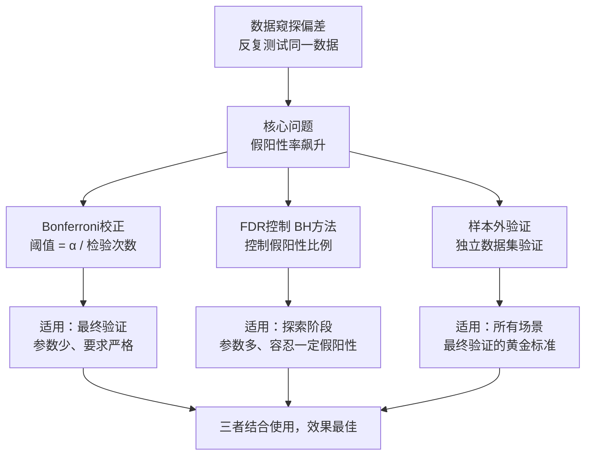

# 5、数据窥探偏差：用同一数据反复测试直到找到"最优"参数

做量化策略的朋友，或多或少都干过这种事：

拿到一段历史数据，跑一遍回测，收益不行。改个参数，再跑。还是不行。再改，再跑……直到某一天，你盯着屏幕上的年化收益率，笑了——终于找到一组"完美"的参数。

嗯，这时候我通常会泼一盆冷水：你找到的不是圣杯，是数据窥探偏差。

> **核心定义**：数据窥探偏差，是指你反复使用同一份历史数据去测试、调整、再测试，直到找到一组表现最好的参数。这组参数在历史数据上看起来完美，但一到实盘就原形毕露。

说白了，你是在"记住"历史，而不是在学习规律。就像考试前背答案，换一套题立马露馅。

## 为什么这是个陷阱？

我刚开始做量化的时候，也踩过这个坑。当时开发一个均线策略，用过去5年的数据反复调参，最后找到一组参数，回测夏普比率高达2.8。我兴奋得差点直接上实盘。

还好老同事拉了我一把，他说："你试试把这组参数放到另一段没看过的数据上跑跑？"

结果呢？夏普比率直接掉到0.6。嗯，那感觉就像被人浇了一盆冰水。

为什么会这样？因为每一次参数调整，你都在"偷看"答案。你调整了10次参数，实际上就相当于做了10次假设检验。按照统计学原理，你找到"假阳性"结果的概率会急剧上升。

## 多重假设检验校正：救命的统计学工具

既然问题出在"多次检验"，那解决方案也很直接——对检验次数进行校正。这里我重点讲两个最常用的方法：Bonferroni 校正和 FDR 控制。

### Bonferroni 校正：简单粗暴但有效

Bonferroni 校正的思路非常直白：你原本设定的显著性水平是α（比如0.05），如果你做了 m 次检验，那就把阈值降到 α/m。

举个例子：

- 你原本想找 p 值小于0.05的参数
- 但你实际上测试了20组参数
- Bonferroni 校正后的阈值 = 0.05 / 20 = 0.0025
- 只有 p 值小于0.0025的参数才算"显著"

> **我个人习惯**：在回测报告中，除了展示最优参数，还会列出 Bonferroni 校正后的显著性水平。这能帮你判断，这个"最优"到底是真的优秀，还是纯粹运气好。

### FDR 控制：更灵活的选择

Bonferroni 有个明显的缺点——太保守了。如果你测试了100组参数，阈值降到0.0005，很可能把真正有效的参数也过滤掉了。

这时候 FDR（False Discovery Rate，错误发现率）就派上用场了。它不控制"一个假阳性都不能有"，而是控制"假阳性在所有阳性结果中的比例"。

最常用的方法是 Benjamini-Hochberg 过程：

1. 把所有检验的p值从小到大排序：p₁ ≤ p₂ ≤ ... ≤ pₘ
2. 找到最大的 k，使得 pₖ ≤ (k/m) × α
3. 拒绝所有 p 值 ≤ pₖ 的假设

我举个例子你就明白了：

| 参数编号 | 原始p值 | 排序后p值 | BH阈值 (α=0.05) | 是否显著 |
| --- | --- | --- | --- | --- |
| 1 | 0.001 | 0.001 | 0.05 × 1/20 = 0.0025 | 是 |
| 2 | 0.003 | 0.003 | 0.05 × 2/20 = 0.005 | 是 |
| 3 | 0.008 | 0.008 | 0.05 × 3/20 = 0.0075 | 否 |
| ... | ... | ... | ... | ... |

你看，第3组参数虽然 p 值只有0.008，但超过了 BH 阈值0.0075，所以不能算显著。而 Bonferroni 的阈值是0.0025，连第2组参数都会被排除。FDR 明显更宽松一些。

> **我曾经踩过的坑**：有一回做因子筛选，测试了50多个因子，用 Bonferroni 校正后一个显著的都没找到。后来改用 FDR 控制，才发现了3个真正有效的因子。所以我的建议是：如果你在探索阶段，用 FDR；如果你在做最终验证，用 Bonferroni。

## 如何在回测中应用？

理论讲完了，咱们看看实际怎么操作。我一般会在回测框架里加一个校正模块：

```python
import numpy as np
from scipy import stats

def bonferroni_correction(p_values, alpha=0.05):
    """
    Bonferroni校正
    p_values: 所有参数组合的p值列表
    alpha: 原始显著性水平
    """
    m = len(p_values)
    corrected_threshold = alpha / m
    significant = [p < corrected_threshold for p in p_values]
    return significant, corrected_threshold

def fdr_bh_correction(p_values, alpha=0.05):
    """
    Benjamini-Hochberg FDR校正
    """
    m = len(p_values)
    sorted_idx = np.argsort(p_values)
    sorted_p = np.array(p_values)[sorted_idx]

    thresholds = [(i+1)/m * alpha for i in range(m)]

    # 找到最大的k使得 p_k <= threshold_k
    k = 0
    for i in range(m):
        if sorted_p[i] <= thresholds[i]:
            k = i + 1

    significant = [False] * m
    for i in range(k):
        significant[sorted_idx[i]] = True

    return significant, thresholds

# 使用示例
p_values = [0.001, 0.003, 0.008, 0.02, 0.05, 0.12]
sig_bonf, thresh_bonf = bonferroni_correction(p_values)
sig_fdr, thresh_fdr = fdr_bh_correction(p_values)

print(f"Bonferroni阈值: {thresh_bonf:.4f}")
print(f"Bonferroni显著参数: {sum(sig_bonf)}个")
print(f"FDR显著参数: {sum(sig_fdr)}个")
```

## 知识体系总览

下面这张图，是我自己整理的数据窥探偏差应对框架。你一看就明白：



## 避坑指南

最后，分享几个我这些年总结出来的实战经验：

- **记录所有测试**：别只记录最终结果。每次参数调整的p值、收益率、最大回撤，全部记下来。这样你才能知道到底做了多少次检验。
- **先定参数范围，再跑回测**：我习惯在回测前就把参数网格定死，绝不边跑边加参数。你想想看，如果跑完一轮发现结果不好，又加几组参数进去，这不就是变相的数据窥探吗？
- **样本外验证是底线**：不管 Bonferroni 还是 FDR，都只是统计校正。真正的终极验证，是把数据分成训练集和测试集。在训练集上调参，在测试集上只跑一次。

> **我的一个小习惯**：每次回测报告里，我都会加一列"校正后p值"。如果某个参数在 Bonferroni 校正后仍然显著，我会格外关注它。但如果只是原始p值好看，校正后就不行了，那我会直接放弃——不值得为它浪费实盘资金。

数据窥探偏差，说白了就是"过度拟合历史"。你越是想找到完美的参数，就越容易掉进这个陷阱。记住：市场不会奖励那些记住历史的人，它只奖励那些理解规律的人。

---

