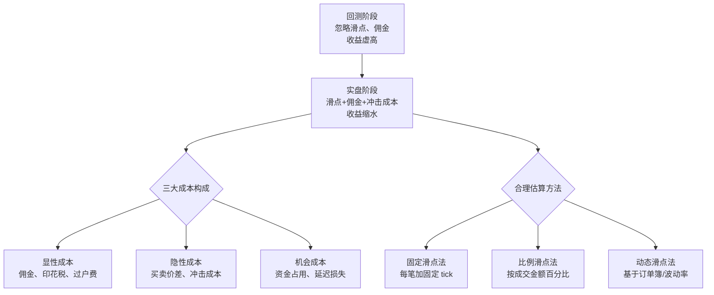

# 6、交易成本陷阱：忽略滑点和佣金，回测收益虚高——如何根据品种和频率合理估算交易成本

说实话，这个坑我踩过不止一次。

早些年做高频策略回测，收益曲线漂亮得不像话，年化百分之两百多。我当时还挺得意，觉得找到了圣杯。结果实盘一跑，直接亏到怀疑人生。问题出在哪？就是交易成本。

你想想看，回测里每笔交易只扣个万分之一的手续费，滑点压根没算。但实盘呢？买卖价差、冲击成本、佣金、印花税……七七八八加起来，利润全被吃掉了。今天我们就来好好聊聊，怎么把这个坑填上。

## 交易成本到底包含哪些东西？

很多人以为交易成本就是券商收的那点佣金。其实远不止这些。我习惯把交易成本拆成三块：

- **显性成本**：佣金、印花税、过户费、平台使用费。这些是明码标价的，算起来不难。
- **隐性成本**：买卖价差（bid-ask spread）、市场冲击成本。这些才是大头，也是最容易被忽略的。
- **机会成本**：资金占用、延迟成交导致的价差损失。这个比较隐蔽，但高频策略里特别要命。

说白了，你回测里每笔交易赚了1块钱，可能实盘里只能赚到6毛。那4毛去哪了？就是被这些成本吃掉了。

## 不同品种的交易成本差异有多大？

我在项目中遇到过最离谱的情况，是有人用股票的回测参数去跑期货策略。结果呢？期货的滑点比股票大得多，尤其是小品种，一滑就是好几个tick。我整理了一张表，大家可以直观感受一下：

| 品种 | 典型佣金（单边） | 典型买卖价差 | 冲击成本（中等流动性） | 综合成本估算 |
| --- | --- | --- | --- | --- |
| A股（散户） | 万2.5 | 0.01%~0.05% | 0.02%~0.1% | 0.05%~0.2% |
| 股指期货（IF） | 0.23%% | 0.2~0.5个tick | 0.5~2个tick | 0.01%~0.05% |
| 商品期货（螺纹） | 万分之1~3 | 1~2个tick | 2~5个tick | 0.02%~0.1% |
| 加密货币（BTC） | 0.1% maker / 0.1% taker | 0.01%~0.05% | 0.05%~0.3% | 0.15%~0.5% |
| 外汇（EUR/USD） | 0.5~2个点差 | 0.5~2个点差 | 1~5个点差 | 0.01%~0.05% |

嗯，这里要注意：上表只是参考值。实际成本跟你的资金量、交易频率、券商等级都有关系。我个人的习惯是，回测时至少取表中上限值的1.5倍来测试，给自己留点安全边际。

## 交易频率越高，成本越要命

为什么高频策略最容易死在交易成本上？因为成本是累加的。你想想看，一笔交易成本0.1%，一天做100笔，那就是10%的成本。一个月下来，本金都快被吃光了。

我给大家算笔账：

- 日频策略（每天1笔）：年化交易成本约 0.1% × 250 = 25%
- 小时频策略（每天4笔）：年化成本约 0.1% × 1000 = 100%
- 分钟频策略（每天50笔）：年化成本约 0.1% × 12500 = 1250%

看到了吧？分钟频策略如果每笔只赚0.2%，那扣掉成本后基本是白忙活。我曾经见过一个朋友，回测里分钟频策略年化80%，实盘跑了三个月亏了30%。后来一查，光滑点就吃掉了60%的利润。

## 如何合理估算滑点？

滑点是最难估算的，因为它跟市场状态强相关。我一般用三种方法：

1. **固定滑点法**：最简单，直接每笔交易加固定数量的tick。比如股票加1个tick（0.01元），期货加2个tick。适合快速测试。
2. **比例滑点法**：按成交金额的百分比算。比如0.05%。适合流动性较好的品种。
3. **动态滑点法**：根据订单簿深度、成交量、波动率动态计算。这个最准，但也最复杂。我一般只在做高频策略时用。

我个人习惯是先用固定滑点法跑一遍，再用比例滑点法跑一遍。如果两个结果差异很大，说明策略对滑点敏感，需要进一步优化。

> **核心原则**：回测时滑点设置要偏保守。宁可低估收益，不要高估。实盘跑出来比回测差是常态，比回测好才是意外。

## 代码示例：在回测中加入交易成本

下面是一个简单的Python示例，展示如何在回测中计算交易成本。我用的是backtrader框架，但思路通用：

```python
import backtrader as bt

class CostAwareStrategy(bt.Strategy):
    params = (
        ('commission_pct', 0.0005),  # 佣金比例 0.05%
        ('slippage_pct', 0.001),     # 滑点比例 0.1%
        ('slippage_fixed', 0.01),    # 固定滑点 0.01元（股票用）
    )

    def notify_order(self, order):
        if order.status in [order.Completed]:
            # 计算实际成交价（含滑点）
            if order.isbuy():
                actual_price = order.executed.price * (1 + self.params.slippage_pct)
            else:
                actual_price = order.executed.price * (1 - self.params.slippage_pct)

            # 计算佣金
            commission = order.executed.value * self.params.commission_pct

            # 计算实际盈亏
            pnl = order.executed.size * (actual_price - order.executed.price) - commission

            # 记录到日志
            self.log(f'订单完成: 名义价={order.executed.price:.2f}, '
                     f'实际价={actual_price:.2f}, 佣金={commission:.2f}, '
                     f'滑点成本={pnl:.2f}')
```

这段代码里，我同时考虑了比例滑点和固定滑点。实际使用时，你可以根据品种选择一种。比如股票用固定滑点（0.01元），期货用比例滑点（0.05%）。

> **小技巧**：回测完成后，单独统计一下「交易成本占总收益的比例」。如果这个比例超过30%，说明你的策略对成本太敏感了。要么降低频率，要么找成本更低的品种。

## 避坑指南：我曾经犯过的错

我曾经做过一个股指期货的日内策略，回测时只算了万分之0.23的佣金，滑点设了1个tick。结果实盘发现，每次开仓平仓实际滑点都在3~5个tick。为什么？因为我的策略信号集中在开盘和收盘时段，那时候流动性差，滑点特别大。

后来我学乖了，回测时做了三件事：

- 按不同时段分别测试滑点（开盘、盘中、收盘）
- 用历史tick数据回放，模拟真实成交
- 在回测结果上再打8折，作为预期收益

嗯，虽然保守了点，但至少实盘不会太难看。

## 不同频率策略的成本估算建议

我根据经验总结了一个速查表，大家可以参考：

| 策略类型 | 典型持仓时间 | 建议成本估算方法 | 安全系数 |
| --- | --- | --- | --- |
| 高频（秒级） | 几秒~几分钟 | 动态滑点 + 完整佣金 | 1.5~2倍 |
| 日内（分钟级） | 几分钟~几小时 | 比例滑点 + 完整佣金 | 1.3~1.5倍 |
| 波段（日级） | 几天~几周 | 固定滑点 + 标准佣金 | 1.1~1.3倍 |
| 趋势（周级） | 几周~几个月 | 固定滑点 + 标准佣金 | 1.0~1.1倍 |

说白了，频率越高，成本估算就要越精细。低频策略稍微粗糙点问题不大，高频策略差一个tick可能就是盈亏的分水岭。

## 核心逻辑：一张图看懂交易成本陷阱

下面我用一张图，把交易成本陷阱的核心逻辑梳理清楚：

### 交易成本陷阱：从回测到实盘的核心逻辑



> 核心建议：回测成本取上限值 × 1.5倍安全系数。

这张图把整个逻辑串起来了。从回测到实盘，中间差的就是交易成本。而成本又分显性、隐性、机会三类。我们需要根据品种和频率，选择合适的估算方法，最后再乘个安全系数。

> **警告**：千万不要在回测里用「理想化」的成本参数。我见过有人把滑点设成0，佣金设成万分之一，回测收益翻倍。这种策略实盘必死。记住：回测是用来发现问题的，不是用来证明自己牛逼的。

好了，关于交易成本陷阱就聊这么多。核心就一句话：**回测时把成本算足，实盘时才能睡得安稳**。

---

