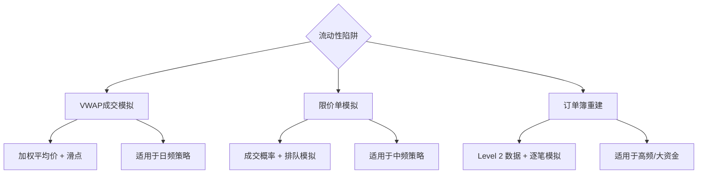

# 第七节：流动性陷阱——你的订单无法在回测价格成交

做量化回测的朋友，十有八九都遇到过这种情况：策略在历史数据上跑得风生水起，年化收益高得吓人，回撤控制得也漂亮。结果一上实盘，直接被打回原形。

为什么会这样？

原因有很多，但「流动性陷阱」绝对是头号杀手。说白了，就是你在回测里假设自己能以某个价格成交，但现实中根本没人接你的单子。

## 7.1 什么是流动性陷阱？

先讲个我自己的经历。几年前我做了一个小市值策略，回测表现特别好。我兴冲冲地开了实盘，结果第一笔交易就挂了半小时没成交。后来一查，那支股票全天成交量才几十万，我的单子占了将近十分之一。

这就是典型的流动性陷阱——回测时你用的是收盘价，但实际交易中，你的订单量已经大到足以影响价格了。

> **核心问题：** 回测假设「无限流动性」，即任何数量的订单都能以当前价格成交。但现实中，市场深度是有限的。

你想想看，如果你要买入10万股，而卖一档只有1000股，那你的成交价必然会被推高。回测里可不会考虑这个。

## 7.2 传统回测的缺陷

大多数回测框架是怎么处理成交的？

- **直接使用收盘价**——最简单粗暴，但最不真实
- **使用开盘价**——稍微好一点，但依然忽略流动性
- **使用VWAP**——这个已经进步了，但仍有问题

我见过不少量化新手，直接用收盘价来回测高频策略。结果可想而知，实盘收益直接腰斩。嗯，这里要注意：**回测精度和策略频率是成正比的**。策略越高频，对成交模拟的要求就越高。

| 回测方式 | 流动性考虑 | 实盘偏差 | 适用场景 |
| --- | --- | --- | --- |
| 收盘价成交 | 无 | 极大 | 仅用于粗略估算 |
| 开盘价成交 | 无 | 较大 | 日频策略 |
| VWAP成交 | 部分 | 中等 | 中低频策略 |
| 限价单模拟 | 完整 | 较小 | 高频/中频策略 |

## 7.3 改进方法一：基于VWAP的成交模拟

VWAP，全称是 Volume Weighted Average Price，成交量加权平均价。它把价格按成交量做了加权，比单纯用收盘价靠谱得多。

我个人习惯用VWAP来做日频策略的回测。具体做法是：

```python
# 计算VWAP
def calculate_vwap(df):
    """
    df需包含：high, low, close, volume
    """
    typical_price = (df['high'] + df['low'] + df['close']) / 3
    vwap = (typical_price * df['volume']).cumsum() / df['volume'].cumsum()
    return vwap

# 模拟成交
def simulate_trade_vwap(df, order_size, side='buy'):
    vwap = calculate_vwap(df)
    # 假设订单在VWAP附近成交，加入滑点
    slippage = 0.001  # 0.1%滑点
    if side == 'buy':
        fill_price = vwap * (1 + slippage)
    else:
        fill_price = vwap * (1 - slippage)
    return fill_price
```

> **小技巧：** VWAP模拟虽然简单，但已经能过滤掉大部分流动性幻觉了。我建议至少用VWAP替代收盘价，尤其是做日频以上的策略。

## 7.4 改进方法二：限价单模拟

VWAP虽然好，但它假设你能在整个时间段内均匀成交。现实中，我们往往用的是限价单——挂一个价格等着。

限价单模拟要复杂一些，需要用到订单簿数据。但如果你没有Level 2数据，也可以用简化版：

```python
# 简化版限价单模拟
def simulate_limit_order(df, limit_price, order_size, side='buy'):
    """
    模拟限价单成交
    df需包含：high, low, close, volume
    """
    # 假设价格在limit_price附近波动
    # 计算成交概率
    if side == 'buy':
        # 买入限价单：价格低于或等于limit_price时可能成交
        prob_fill = len(df[df['low'] <= limit_price]) / len(df)
    else:
        # 卖出限价单：价格高于或等于limit_price时可能成交
        prob_fill = len(df[df['high'] >= limit_price]) / len(df)

    # 根据概率决定是否成交
    if prob_fill > 0.5:  # 阈值可调
        # 假设在limit_price成交
        return limit_price, order_size
    else:
        # 未成交
        return None, 0
```

> **注意：** 这个简化版只是入门用的。真正做高频策略，建议用逐笔成交数据来模拟。我曾经因为用了简化版，回测和实盘差了将近30%。

## 7.5 更进阶的方法：订单簿重建

如果你真的想做到高精度回测，那就得重建订单簿。这需要Level 2数据，也就是逐笔委托数据。

基本思路是：

1. 获取每个时间点的买卖盘口数据
2. 模拟你的订单进入订单簿后的排队情况
3. 根据后续成交数据判断你的订单是否成交
4. 计算实际成交价格和数量

这个方法计算量很大，但精度最高。我一般只在做高频策略或者大资金策略时才用。

## 7.6 避坑指南

最后，分享几个我踩过的坑：

- **不要忽略滑点**——我曾经以为0.1%的滑点就够了，结果实盘滑点到了0.5%。建议至少用0.2%-0.5%的滑点做压力测试。
- **注意成交率**——限价单不是100%能成交的。回测里如果假设全部成交，实盘会很难看。
- **大单要拆单**——如果你的订单量超过日均成交量的1%，建议拆成小单模拟。
- **考虑市场冲击**——大单买入会推高价格，卖出会压低价格。这个在回测里一定要模拟。

> **核心建议：** 做回测时，先用VWAP+滑点做第一轮筛选。策略通过后，再用限价单模拟做第二轮验证。两轮都过了，再考虑上实盘。

记住，回测是帮你发现问题的，不是帮你证明策略牛逼的。流动性陷阱只是其中一个坑，后面还有更多等着你。

### 流动性陷阱改进方法体系



> 精度越高，计算量越大，选择适合策略频率的方法。

---

