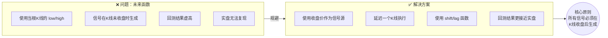

# 第8章：时间偏差——使用未来信息进行止损或止盈

做量化回测这么多年，我见过最隐蔽、也最坑人的错误，就是时间偏差。说白了，就是你的策略在回测时"偷看"了未来数据。这听起来像作弊，对吧？但很多时候，开发者自己都没意识到。

今天咱们重点聊一个具体场景：**止损止盈信号生成的时间点问题**。很多人在回测里用盘中价格触发止损，结果实盘一跑，完全对不上。嗯，这里要注意，问题就出在"未来函数"上。

## 什么是未来函数？

未来函数，指的是策略在计算信号时，用到了当前时刻之后才能知道的数据。比如，你在K线还没收盘时，就用当根K线的最高价或最低价来触发止损。

我举个例子你就明白了：

- 你在1分钟K线图上做交易
- 策略设定：如果价格跌破开盘价-2%，就止损
- 回测时，你直接用当根K线的 `low` 来判断是否触发
- 但实盘中，这根K线还没走完，你根本不知道最低点在哪

这就是典型的"未来函数"。回测看起来很美，实盘一塌糊涂。

> **⚠️ 核心原则：** 所有交易信号，必须在K线收盘后生成。盘中数据不可用于决策。

## 我踩过的坑

我曾经做过一个日内突破策略，回测年化收益40%，最大回撤不到10%。当时我那个兴奋啊，觉得找到了圣杯。结果实盘跑了三天，亏了8%。

复盘时我发现，我的止损逻辑用的是当根K线的 `low`。回测时，系统认为我在最低点精准止损了。但实盘呢？价格先跌到止损位，然后反弹，我根本没在最低点成交。回测的止损价和实盘的成交价，差了十万八千里。

为什么会这样？因为回测假设你能在最低点卖出，但现实中，你只能在K线收盘后才知道最低点在哪。这就是时间偏差的典型表现。

## 如何规避？

我个人习惯的做法是：**所有信号都基于已完成的K线**。具体来说，有以下几个要点：

### 1. 使用收盘价作为信号触发点

止损和止盈信号，都应该在K线收盘后判断。比如，你可以在1小时K线收盘后，检查收盘价是否跌破止损线。如果跌破，下一根K线开盘时执行。

```python
# 错误做法：使用当根K线的low
if current_low < stop_loss_price:
    exit_position()

# 正确做法：使用上一根K线的收盘价
if previous_close < stop_loss_price:
    exit_position_at_next_open()
```

### 2. 延迟一个K线执行

我建议所有信号都延迟一个K线执行。也就是说，信号在K线 n 收盘时生成，在K线 n+1 的开盘时执行。这样完全避免了未来函数。

| 信号类型 | 错误做法 | 正确做法 |
| --- | --- | --- |
| 止损 | 用当根K线最低价触发 | 用上一根K线收盘价判断，下一根开盘执行 |
| 止盈 | 用当根K线最高价触发 | 用上一根K线收盘价判断，下一根开盘执行 |
| 开仓 | 用盘中突破信号 | 用收盘价突破信号，下一根开盘执行 |

### 3. 使用 Bar Shift 技术

在代码层面，你可以用 `shift` 或 `lag` 函数，确保只用历史数据。比如在Pandas里：

```python
# 使用shift确保只用过去数据
df['signal'] = (df['close'].shift(1) < stop_loss_price)
df['position'] = df['signal'].shift(1)  # 再延迟一根K线执行
```

这样写，你永远只用已经收盘的K线数据，不会偷看未来。

## 一个完整的例子

咱们来看一个简单的移动止损策略。假设你持有多头仓位，止损线是入场价的95%。

```python
# 错误版本：存在未来函数
for i in range(len(df)):
    if df['low'][i] < entry_price * 0.95:
        exit_at_price = df['low'][i]  # 用了当根K线的数据
        # 执行止损

# 正确版本：无未来函数
for i in range(1, len(df)):
    # 用上一根K线的收盘价判断
    if df['close'][i-1] < entry_price * 0.95:
        exit_at_price = df['open'][i]  # 在当前K线开盘时执行
        # 执行止损
```

你想想看，第二个版本虽然看起来"笨"了一点，但它是真实的。实盘时，你只能在开盘时看到上一根K线的收盘价，然后决定是否止损。

## 时间偏差框架图

下面这张图，展示了时间偏差的核心逻辑和规避方法：



```python
# 正确做法：用上一根K线收盘价判断
if df['close'].shift(1) < stop_loss:  # 无未来函数
    exit_at_next_open()
```

## 避坑指南

我曾经见过一个团队，他们的回测系统用了Tick级数据做止损。回测时，他们假设能在每个Tick的精确价格成交。结果实盘时，滑点加上延迟，策略直接崩了。嗯，这就是典型的"过度优化"。

我的建议是：

- **用日线做策略**：日线级别的信号，未来函数问题相对少一些
- **用开盘价执行**：所有信号都在下一根K线的开盘价执行，这是最保守也最真实的做法
- **加入滑点模型**：即使你规避了未来函数，也要考虑滑点。我一般加0.1%的滑点成本

> **💡 小技巧：** 你可以做一个"延迟测试"。把你的策略信号全部延迟1根、2根、3根K线执行，看看收益变化。如果延迟后收益大幅下降，说明你的策略可能过度依赖时间精度，实盘风险很大。

最后说一句，时间偏差是量化回测里最容易被忽视的问题之一。你想想看，一个策略回测年化50%，实盘年化5%，问题很可能就出在这里。我个人习惯是，每次写完回测代码，先检查一遍所有信号的时间点，确保没有偷看未来。这个习惯，救了我很多次。

---
