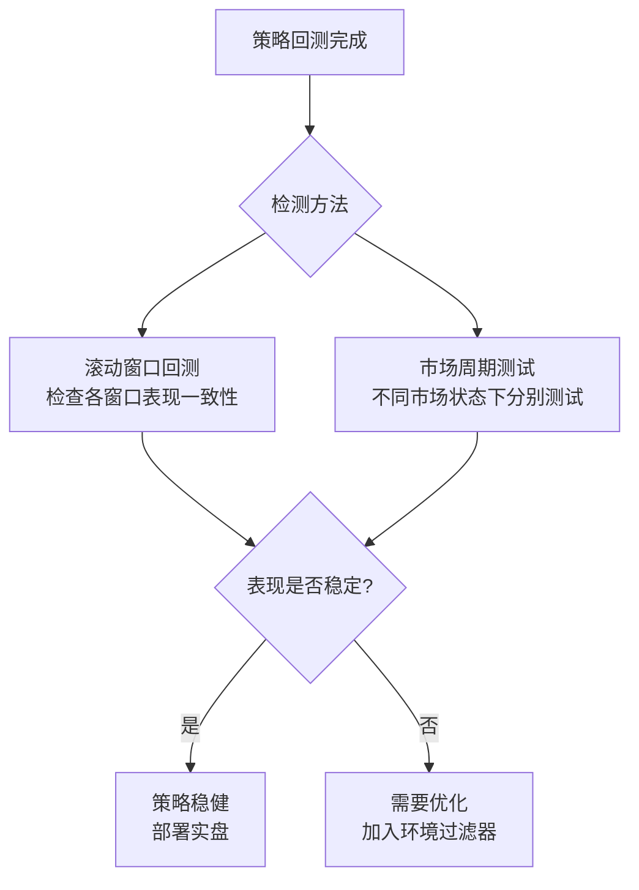

# 第9章 路径依赖陷阱：策略表现高度依赖特定市场环境

做量化策略最怕什么？

我个人最怕一种情况：回测曲线漂亮得像艺术品，一上实盘就崩。崩得你怀疑人生。

为什么会这样？

说白了，你的策略可能掉进了**路径依赖陷阱**。它只会在特定的市场环境下赚钱，换个环境就歇菜。

## 什么是路径依赖陷阱？

路径依赖，听起来很学术。我换个说法：**你的策略被市场惯坏了**。

比如你开发了一个趋势跟踪策略。它在2017年的单边牛市中赚得盆满钵满。但到了2018年的震荡市，它反复被左右打脸。这就是典型的路径依赖——策略表现高度依赖特定的市场环境。

> **核心定义：** 策略的盈利模式与特定市场状态（趋势、波动率、流动性等）深度绑定，一旦环境切换，策略失效。

我在项目中遇到过不少这样的案例。有个朋友开发了一个套利策略，在低波动率环境下年化收益30%。他信心满满地上了大资金。结果市场波动率突然飙升，策略一天亏掉三个月的利润。嗯，这就是路径依赖的代价。

## 为什么路径依赖如此危险？

你想想看，回测数据是历史的切片。它只展示了市场的一种可能性。而未来是无数种可能性的组合。

路径依赖策略有几个典型特征：

- **回测曲线过于完美**——最大回撤小，夏普比率高得离谱
- **参数敏感度极高**——参数稍微一调，收益就大变
- **样本外表现断崖式下跌**——换个时间段测试，直接变负收益

> **警告：** 如果你发现策略在某个特定年份（比如2015年股灾或2020年疫情）表现异常突出，而其他年份表现平平，那就要高度警惕了。这往往是路径依赖的信号。

## 如何检测路径依赖？

检测方法其实不复杂。我个人习惯用两种方式：**滚动窗口回测**和**不同市场周期测试**。

### 方法一：滚动窗口回测

滚动窗口回测，说白了就是不断移动时间窗口，看策略在每个窗口的表现是否稳定。

具体做法：

1. 设定一个固定长度的窗口（比如2年）
2. 从数据起点开始，用这个窗口训练/优化策略
3. 在窗口后的测试期（比如3个月）评估表现
4. 窗口向前滚动，重复步骤2-3

代码实现其实很简单：

```python
import pandas as pd
import numpy as np

def rolling_window_backtest(data, window_size=504, test_size=63):
    """
    滚动窗口回测
    window_size: 训练窗口长度（交易日）
    test_size: 测试窗口长度（交易日）
    """
    results = []

    for start in range(0, len(data) - window_size - test_size, test_size):
        train_data = data[start:start + window_size]
        test_data = data[start + window_size:start + window_size + test_size]

        # 在训练数据上优化参数
        params = optimize_params(train_data)

        # 在测试数据上回测
        perf = backtest(test_data, params)
        results.append(perf)

    return pd.DataFrame(results)

# 使用示例
results = rolling_window_backtest(price_data)
print(f'平均年化收益: {results["annual_return"].mean():.2%}')
print(f'收益标准差: {results["annual_return"].std():.2%}')
print(f'正收益窗口占比: {(results["annual_return"] > 0).mean():.2%}')
```

关键看什么？看各个窗口的表现是否一致。如果有的窗口收益20%，有的窗口亏15%，那这个策略的稳健性就值得怀疑。

> **个人经验：** 我一般要求滚动窗口回测中，至少70%的窗口是正收益。低于这个比例，我会重新审视策略逻辑。

### 方法二：不同市场周期测试

市场周期可以大致分为几种状态：

| 市场状态 | 特征 | 典型时间段 |
| --- | --- | --- |
| 单边上涨 | 趋势明显，波动率中等 | 2017年、2020年下半年 |
| 单边下跌 | 趋势明显，波动率高 | 2018年、2022年 |
| 震荡市 | 无趋势，波动率低 | 2019年上半年、2023年 |
| 高波动 | 大幅波动，方向不明 | 2020年3月、2024年8月 |

测试方法：

1. 手动划分不同市场周期的时间段
2. 在每个时间段上单独回测策略
3. 对比各周期的收益、回撤、胜率等指标

我曾经用这个方法测试过一个均值回归策略。结果发现它在震荡市表现极好，但在趋势市中连续亏损。后来我给它加了一个趋势过滤器，才解决了这个问题。

## 如何规避路径依赖？

检测出问题只是第一步。怎么解决才是关键。

> **规避路径依赖的三大原则：**
>
> - **原则一：** 策略逻辑要基于市场微观结构，而非宏观形态
> - **原则二：** 多策略组合，分散环境依赖
> - **原则三：** 加入环境识别模块，动态调整策略权重

### 具体做法一：多市场环境测试

不要只在一个市场或一个品种上测试。把策略放到不同国家的市场、不同资产类别上试试。

比如你开发了一个A股策略，可以试试在港股、美股上跑跑看。如果逻辑是通用的，表现应该不会差太多。

### 具体做法二：加入环境过滤器

给策略加一个"开关"。当市场环境不适合时，自动关闭策略。

```python
def market_environment_filter(data):
    """
    市场环境过滤器
    返回当前市场状态：'trend', 'range', 'volatile'
    """
    # 计算趋势强度
    adx = calculate_adx(data, period=14)

    # 计算波动率
    volatility = data['close'].pct_change().rolling(20).std()

    if adx > 25:
        return 'trend'
    elif volatility > volatility.rolling(60).mean() * 1.5:
        return 'volatile'
    else:
        return 'range'

def adaptive_strategy(data):
    env = market_environment_filter(data)

    if env == 'trend':
        return trend_following_strategy(data)
    elif env == 'range':
        return mean_reversion_strategy(data)
    else:
        # 高波动环境，降低仓位或空仓
        return cash_position(data)
```

### 具体做法三：压力测试

模拟极端市场情况。比如：

- 突然的流动性枯竭
- 连续涨停/跌停
- 波动率瞬间飙升

我曾经给一个高频策略做过压力测试。模拟了2015年股灾时的流动性环境。结果发现策略的滑点成本比预期高了10倍。嗯，从那以后我再也不敢忽略流动性风险了。

## 一张图看懂路径依赖

下面这张图展示了路径依赖检测的核心流程：

### 路径依赖检测与规避流程图



## 避坑指南

最后，分享几个我踩过的坑：

> **我曾经** 开发过一个基于均线交叉的策略。回测时用了2015-2019年的数据，表现很好。结果2020年一上线就亏。后来一查，原来策略在2015年的牛市和2018年的熊市中表现好，但在2016-2017年的震荡市中其实一直在亏。滚动窗口回测一跑，原形毕露。

还有一次，我测试一个统计套利策略。在不同市场周期测试时，发现它在低波动率环境下收益稳定，但高波动率环境下回撤巨大。后来我加了一个波动率过滤器，当波动率超过阈值时自动降低仓位。效果立竿见影。

记住一句话：**没有坏策略，只有用错环境的策略**。路径依赖不可怕，可怕的是你根本不知道自己的策略依赖什么环境。

嗯，今天就聊到这里。下次你开发新策略时，记得先做滚动窗口回测和市场周期测试。这能帮你省下不少真金白银。

---
