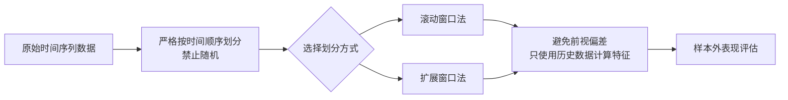

# 10、样本内与样本外测试：如何正确划分训练集和测试集——时间序列交叉验证与随机交叉验证的区别

## 为什么这个问题让我头疼过

说实话，我刚入行那会儿，在这上面栽过一个大跟头。

当时我写了一个看起来很漂亮的策略，回测曲线那叫一个完美，年化收益30%+，最大回撤不到5%。我兴奋得差点直接上实盘。还好老前辈拦住了我，让我先做样本外测试。

结果呢？样本外一跑，直接亏成狗。

后来我才明白——**回测过拟合**，是量化交易里最隐蔽、最致命的陷阱之一。而正确划分样本内和样本外，就是对抗过拟合的第一道防线。

## 核心概念：样本内 vs 样本外

简单说：

- **样本内（In-Sample）**：用来训练模型、优化参数的数据
- **样本外（Out-of-Sample）**：用来验证模型真实表现的数据

你想想看，如果你用同一份数据既训练又验证，那跟考试前先看答案有什么区别？

> **核心原则：** 样本外数据在训练过程中绝对不能碰，一眼都不能看。

## 时间序列的特殊性

金融数据不是独立同分布的。今天的价格跟昨天的价格高度相关。这就带来了一个关键问题：**我们不能像做图像识别那样，随机打乱数据再划分。**

我在项目中遇到过有人直接用 sklearn 的 `train_test_split`，设置 `random_state` 就完事了。结果呢？用未来的数据去预测过去，策略在样本外表现一塌糊涂。

为什么会这样？因为金融数据有**时间依赖性**。你拿2023年的数据训练，用2022年的数据验证——这在时间序列里是荒谬的，但在随机划分里完全可能发生。

## 两种划分方式的对比

| 对比维度 | 时间序列交叉验证 | 随机交叉验证 |
| --- | --- | --- |
| 数据顺序 | 严格按时间顺序 | 随机打乱 |
| 适用场景 | 金融、气象、信号等时序数据 | 图像、文本等独立数据 |
| 信息泄露风险 | 低（只要不向前看） | 高（未来信息可能泄露到训练集） |
| 实现复杂度 | 稍高 | 简单 |
| 评估稳定性 | 可能因市场状态不同而波动 | 相对稳定 |

> **警告：** 在量化策略中，永远不要使用随机交叉验证。这不是选项，是红线。

## 时间序列交叉验证的正确做法

我个人习惯用**滚动窗口法**或**扩展窗口法**。

### 滚动窗口法

固定训练集长度，每次向前滑动一个固定步长。

```python
# 伪代码示例
train_window = 252  # 一年交易日
test_window = 63    # 一个季度

for i in range(0, len(data) - train_window - test_window, test_window):
    train = data[i : i + train_window]
    test = data[i + train_window : i + train_window + test_window]
    # 训练模型，在test上验证
```

### 扩展窗口法

训练集不断累积，越往后数据越多。

```python
# 伪代码示例
min_train = 504  # 最少两年数据
test_window = 63

for i in range(min_train, len(data) - test_window, test_window):
    train = data[0 : i]  # 从最开始到当前
    test = data[i : i + test_window]
    # 训练模型，在test上验证
```

我个人更倾向扩展窗口法。为什么？因为实盘中我们也是不断积累历史数据，扩展窗口更贴近真实场景。

## 一个常见的坑：前视偏差

嗯，这里要注意。即使你用了时间序列划分，也可能掉进**前视偏差（Look-Ahead Bias）**的坑。

我曾经犯过一个低级错误：在计算技术指标时，用了整个序列的均值和标准差来归一化。结果训练集里混进了未来的统计信息。

正确的做法是：**每次只使用到当前时间点为止的数据**来计算指标。

> **小技巧：** 写一个自定义的滚动计算函数，确保每个时间点的特征只依赖历史数据。我一般会在代码里加个断言，检查是否有未来信息泄露。

## 知识体系核心逻辑

下面这张图，是我自己总结的样本内外测试的核心流程：

### 样本内与样本外测试核心流程



## 实战建议：如何正确划分

1. **留出法（Hold-Out）**：最简单，把最后20%-30%的数据作为样本外。适合快速验证。
2. **时间序列交叉验证**：上面提到的滚动或扩展窗口，适合参数调优。
3. **组合划分**：先用留出法确定最终验证集，再用交叉验证做参数选择。

> **我的经验：** 永远保留一段"绝对不可见"的数据作为最终验证。这段数据在参数优化、模型选择阶段都不能碰。只有当你觉得策略已经定稿了，才拿出来跑一次。

## 避坑指南

**我曾经**犯过一个错误：在样本外测试表现不好，就回去调整参数，然后再用同一段样本外验证。来回几次，样本外实际上变成了样本内。

这叫**数据泄露**，是量化交易中最常见的自我欺骗行为。

正确的做法是：**样本外测试只有一次机会**。跑完不满意，那就重新设计策略，用新的样本外数据验证。

## 总结

说白了，样本内样本外划分就三句话：

- 金融数据必须按时间顺序划分
- 永远不要用未来信息训练模型
- 样本外测试只有一次机会

记住这三点，你就能避开80%的回测陷阱。

> **最后一个小建议：** 每次做回测前，先问问自己——"如果我现在穿越回过去，我能拿到这些数据吗？"如果答案是否定的，那你的划分就有问题。

---

> 公众号：蓝海资料掘金营，微信deep3321
