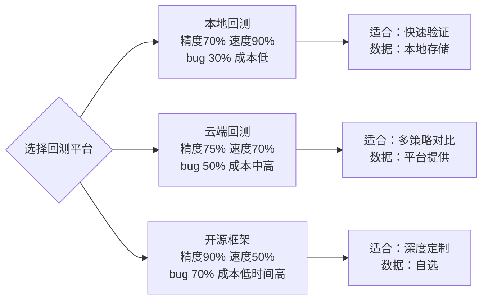

# 一、回测平台的选择与陷阱：本地回测 vs 云端回测 vs 开源框架

做量化这几年，我见过太多人在回测平台的选择上栽跟头。有人本地跑得飞起，一上实盘就崩；有人迷信云端，结果被数据延迟坑惨了。说白了，每个平台都有自己的脾气，选错了，你的策略再牛也是白搭。

今天我就把这三个主流方案——本地回测、云端回测、开源框架——掰开揉碎了讲。哪些坑我踩过，哪些坑你可能会踩，咱们一次性说清楚。

## 1.1 本地回测：自由但孤独

我个人习惯用本地回测做策略的快速验证。为什么？因为快。你写个策略，本地跑一遍，几秒钟就知道结果。但这里有个大坑——精度问题。

> **⚠️ 注意：** 本地回测的数据源通常是日线或分钟线，但交易所的实际撮合是毫秒级的。你用分钟线回测，等于默认了价格在一分钟内是均匀变化的——这根本不现实。

举个例子。我去年做一个高频策略，本地回测年化收益30%，回撤不到5%。我当时觉得稳了。结果实盘第一天就亏了2%。为什么？因为本地回测用的是收盘价，而实盘交易时，价格波动剧烈，滑点直接把利润吃掉了。

所以，本地回测适合做两件事：

- **策略逻辑验证**——看看你的买卖逻辑是否成立
- **参数快速调优**——跑几百组参数，找找感觉

但千万别拿本地回测的结果当实盘依据。那叫自欺欺人。

## 1.2 云端回测：省心但贵

云端回测这几年很火。你不用管服务器，不用管数据，上传策略就能跑。听起来很美好，对吧？

但我在项目中遇到过一个问题：某知名云平台的回测结果，和我的本地结果差了5%。我查了三天，最后发现是他们的撮合引擎有bug——对市价单的处理方式跟交易所不一样。

云端回测的陷阱主要有三个：

| 陷阱 | 说明 | 我的建议 |
| --- | --- | --- |
| 数据精度 | 很多云平台用1分钟K线，但实盘是逐笔成交 | 选支持tick级数据的平台 |
| 撮合逻辑 | 部分平台简化了撮合，导致结果偏乐观 | 先跑小资金验证 |
| 费用隐藏 | 手续费、滑点可能被低估 | 手动加上0.1%的滑点成本 |

嗯，这里要注意：云端平台为了吸引用户，往往会美化回测结果。你看到的高收益，可能只是数据上的幻觉。

## 1.3 开源框架：灵活但需要动手

说到开源框架，我第一个想到的是Backtrader和vn.py。这两个我都深度用过。说实话，开源框架是真正懂量化的人的选择——前提是你愿意花时间。

开源框架的好处很明显：

- **完全可控**——代码在你手里，想怎么改都行
- **数据自由**——你可以接入任何数据源
- **成本低**——除了服务器，基本不花钱

但坑也不少。我记得有一次用Backtrader跑一个多因子策略，结果发现它的订单管理模块有个bug——当多个信号同时触发时，它会漏掉部分订单。我花了整整一个周末才定位到问题。

> **💡 我的经验：** 用开源框架前，先跑一个最简单的策略（比如金叉死叉），验证框架的撮合逻辑是否正确。这一步能帮你省下大量排查时间。

## 1.4 三个平台的对比

为了让你看得更清楚，我画了一张对比图。这张图展示了三个平台在精度、速度和隐藏bug上的差异。

### 回测平台对比：精度 vs 速度 vs 隐藏bug

| 平台 | 精度 | 速度 | 隐藏 bug | 适合 | 数据 | 成本 |
| --- | --- | --- | --- | --- | --- | --- |
| 本地回测 | 中（70%） | 快（90%） | 少（30%） | 快速验证 | 本地存储 | 低 |
| 云端回测 | 中高（75%） | 中（70%） | 中（50%） | 多策略对比 | 平台提供 | 中高 |
| 开源框架 | 高（90%） | 慢（50%） | 多（70%） | 深度定制 | 自选 | 低（时间高） |

你看，没有完美的平台。本地回测速度快但精度一般，云端回测省心但贵，开源框架灵活但需要自己排查bug。怎么选？看你的需求。

## 1.5 我的选择策略

做了这么多年量化，我总结了一套选择方法：

1. **策略开发阶段**——用本地回测。快速迭代，别在数据上花太多时间。
2. **策略验证阶段**——用开源框架。跑一遍完整的回测，包括滑点、手续费、市场冲击。
3. **策略上线前**——用云端平台做一次独立验证。相当于第三方审计，看看结果是否一致。

> **核心原则：** 永远不要只依赖一个平台的结果。至少用两个不同的平台交叉验证，如果结果差异超过5%，说明你的策略逻辑或者数据源有问题。

我曾经吃过这个亏。一个策略在本地跑得漂亮，云端也差不多，我就直接上了。结果实盘亏了。后来发现，两个平台用的数据源是同一家——数据本身就有偏差。所以，数据源也要交叉验证。

## 1.6 避坑指南

最后，给你几个我踩过的坑，记住了能省不少钱：

- **数据源要独立**——别用同一个数据源做所有回测
- **滑点别设太低**——我一般设0.1%，高频策略设0.2%
- **手续费要算对**——很多平台默认万三，但实际可能是万五
- **撮合逻辑要懂**——市价单和限价单的处理方式完全不同

嗯，回测平台的选择，说白了就是一场权衡。你要精度，就得牺牲速度；你要省心，就得接受隐藏bug。没有标准答案，只有最适合你的方案。

---

