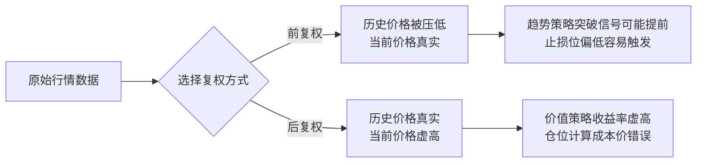

# 12、数据清洗陷阱：复权方式对策略的影响——错误复权导致虚假信号

## 复权这件事，比你想象的更致命

做量化回测的朋友，十有八九都在复权上栽过跟头。我自己也不例外。

记得刚入行那会儿，我拿了一套日线数据跑策略，回测曲线漂亮得不像话——年化收益40%，最大回撤不到5%。当时我兴奋得差点直接上实盘。还好老同事看了一眼，问了一句：「你用的什么复权方式？」

我愣住了。嗯，那时候我根本不知道复权还有这么多讲究。

结果一查，用的是后复权数据。策略里却按前复权的逻辑去算买入成本。说白了，信号全是假的。

## 复权到底在干什么？

股票分红送转之后，价格会跳空。比如一只100块的股票，10送10之后变成50块。你的持仓市值没变，但K线上多了一个大缺口。

复权，就是把这个缺口补上，让价格连续。

但补法不同，结果天差地别。

| 复权方式 | 原理 | 特点 |
| --- | --- | --- |
| 前复权 | 调整历史价格，让当前价格不变 | 历史价格会变，当前价格是真实的 |
| 后复权 | 调整当前价格，让历史价格不变 | 当前价格会变，历史价格是真实的 |
| 不复权 | 保持原始价格 | 有缺口，无法直接计算收益率 |

你想想看，如果你用后复权数据，当前价格可能是500块，但实际交易价格只有50块。这时候你算出来的买入信号、止损位、仓位管理，全都不对。

## 错误复权会带来什么虚假信号？

我总结了几种最常见的坑：

- **突破信号失真**：前复权会把历史价格压低，导致看起来「突破了前期高点」，实际上根本没突破。
- **收益率计算错误**：后复权的价格包含了分红再投资的收益，你算出来的收益率会虚高。
- **止损位错位**：用后复权数据设止损，实际止损价格可能差了几十块。
- **回测曲线过度平滑**：复权方式选错，回测曲线看起来很美，实盘一跑就崩。

> **⚠️ 特别注意：** 千万不要在同一个策略里混用不同复权方式的数据。我见过有人用前复权数据算信号，用后复权数据算收益——结果回测收益翻倍，实盘亏掉底裤。

## 我的个人习惯：怎么选复权方式？

做了这么多年量化，我自己的经验是这样的：

- **做趋势跟踪策略**：用前复权。因为你需要看当前价格是否突破历史位置。
- **做价值投资策略**：用后复权。因为你需要看真实的历史价格和分红收益。
- **做高频或日内策略**：用不复权。因为日内交易不受分红影响。

但说实话，最稳妥的做法是——**自己手动复权**。别依赖第三方数据源给的复权数据，你不知道他们用的什么算法。

## 代码示例：自己动手做前复权

下面是我常用的一个复权函数，你可以直接拿去用：

```python
import pandas as pd
import numpy as np

def adjust_price_forward(df):
    """
    前复权处理
    df 必须包含：close, adj_factor 列
    """
    df = df.copy()
    # 复权因子归一化
    base_factor = df['adj_factor'].iloc[-1]
    df['adj_close'] = df['close'] * df['adj_factor'] / base_factor

    # 调整开盘价、最高价、最低价
    for col in ['open', 'high', 'low']:
        df[col + '_adj'] = df[col] * df['adj_factor'] / base_factor

    return df
```

> **💡 小技巧：** 如果你拿不到复权因子，可以用「后复权价格 / 当前价格」来反推。但这个方法有误差，只适合快速验证。

## 我曾经踩过的一个大坑

几年前我做了一个A股的多因子策略，回测数据用的是某数据商提供的「后复权」数据。回测结果年化25%，我觉得稳了。

结果实盘跑了三个月，收益只有5%。我查了整整两天，最后发现——数据商的后复权数据，在分红日之后会把价格直接跳上去，导致我的买入信号提前了一天。

你想想看，信号提前一天，买入成本就差了好几个点。策略的胜率直接从60%掉到40%。

从那以后，我所有策略都只用自己复权的数据。数据商的数据只用来做参考，绝不直接用于回测。

## 核心逻辑图：复权方式对策略的影响路径

下面这张图，是我自己总结的复权影响路径。你看一遍就能明白：

### 复权方式对策略的影响路径



## 避坑指南：我的三条铁律

1. **永远不要相信第三方数据源的「默认复权」**。我习惯自己拉数据，自己算复权因子。
2. **回测和实盘必须用同一套复权逻辑**。回测用前复权，实盘也要用前复权算信号。
3. **每次分红送转之后，重新检查数据**。有些数据源在除权日会漏掉调整，导致数据断层。

> **核心一句话：** 复权方式选错了，你的回测就是一场自欺欺人的游戏。数据清洗这一步，省不了。

好了，这一章就聊到这儿。下一章我们聊聊另一个常见陷阱——幸存者偏差。那个坑，比复权还隐蔽。

---
