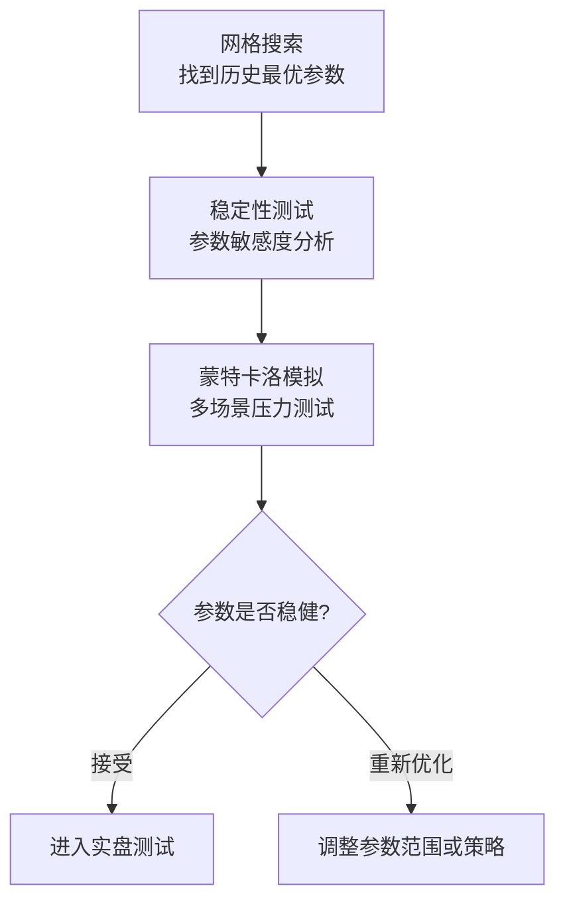

# 13、参数优化陷阱：网格搜索找到的"黄金参数"为何无效

做量化策略的朋友，十有八九都干过这事：写个循环，把参数从1试到100，找到收益最高的那个组合，然后兴冲冲地实盘。结果呢？大概率是亏得亲妈都不认识。

为什么会这样？

网格搜索找到的所谓"黄金参数"，说白了，很可能只是历史数据里的一个巧合。你找到的不是规律，是噪声。我当年刚入行时也踩过这个坑，花了三个月优化的参数组合，实盘两周就崩了。从那以后，我养成了一个习惯——任何参数都必须通过稳定性测试。

## 网格搜索的本质：你在拟合历史，不是预测未来

网格搜索的逻辑很简单：遍历所有参数组合，选历史回测收益最高的那个。但这里有个致命问题——你是在用历史数据做"后视镜优化"。

你想想看，如果某个参数组合在历史数据上表现特别好，很可能是因为它恰好捕捉到了某段特定行情下的噪声。换个时间段，这些噪声就消失了，你的"黄金参数"也就变成了"废铁参数"。

> **核心认知：** 网格搜索找到的最优参数，大概率是过拟合的产物。真正的有效参数，应该是在不同市场环境下都能稳定表现的那一个。

## 参数稳定性测试：让参数自己"说话"

怎么判断一个参数是金子还是沙子？我的做法是：做参数稳定性测试。

具体来说，就是看参数在最优值附近小幅变动时，策略表现是否剧烈波动。如果参数从10变成11，收益就从20%掉到5%，那这个参数就是"脆弱的"。真正的稳健参数，应该像一条平缓的曲线——小幅变动不会引起剧烈反应。

### 稳定性测试的实操步骤

1. **确定参数范围**：比如移动平均线周期，从5到60
2. **网格搜索**：找到最优参数（假设是20）
3. **绘制参数-收益曲线**：看20附近的收益变化
4. **计算稳定性指标**：比如收益的波动率、最大回撤的变化
5. **判断**：如果曲线平滑，参数可用；如果曲线陡峭，参数不可用

```python
# 参数稳定性测试示例代码
import numpy as np
import matplotlib.pyplot as plt

def parameter_stability_test(strategy_func, param_range):
    """
    参数稳定性测试
    strategy_func: 策略函数，接收参数值，返回收益率
    param_range: 参数范围列表
    """
    returns = []
    for param in param_range:
        ret = strategy_func(param)
        returns.append(ret)

    # 计算稳定性指标
    returns = np.array(returns)
    stability_score = np.std(returns) / np.mean(returns)

    # 绘制参数-收益曲线
    plt.plot(param_range, returns)
    plt.xlabel('参数值')
    plt.ylabel('收益率')
    plt.title(f'参数稳定性测试 (稳定性得分: {stability_score:.2f})')
    plt.show()

    return stability_score

# 使用示例
# score = parameter_stability_test(my_strategy, range(5, 61))
```

> **我的经验：** 稳定性得分小于0.3，说明参数比较稳健。大于0.5就要警惕了，这个参数很可能是在拟合噪声。

## 蒙特卡洛模拟：给参数加点"随机性"

参数稳定性测试只能看参数变动的敏感度，但还有一个问题没解决——市场环境是变化的。历史数据只有一条路径，但未来有无数种可能。怎么办？

蒙特卡洛模拟就是干这个的。它通过随机生成不同的市场路径，来测试你的参数在各种"平行宇宙"里是否还能赚钱。

### 蒙特卡洛模拟的核心思路

- **随机抽样**：从历史数据中随机抽取样本，生成新的价格序列
- **多次模拟**：重复1000次、10000次，得到参数在不同场景下的表现分布
- **统计评估**：看参数在大多数场景下是否稳定盈利

```python
# 蒙特卡洛模拟示例代码
import numpy as np

def monte_carlo_simulation(strategy_func, param, n_simulations=1000):
    """
    蒙特卡洛模拟测试参数稳定性
    strategy_func: 策略函数，接收参数和价格序列，返回收益率
    param: 待测试的参数
    n_simulations: 模拟次数
    """
    results = []

    for _ in range(n_simulations):
        # 生成随机价格序列（这里用简单随机游走示例）
        price_series = np.random.randn(252)  # 252个交易日
        price_series = np.cumsum(price_series) + 100

        # 运行策略
        ret = strategy_func(param, price_series)
        results.append(ret)

    # 统计结果
    results = np.array(results)
    mean_ret = np.mean(results)
    std_ret = np.std(results)
    win_rate = np.sum(results > 0) / n_simulations

    return {
        '平均收益率': mean_ret,
        '收益率标准差': std_ret,
        '胜率': win_rate,
        '夏普比率': mean_ret / std_ret if std_ret > 0 else 0
    }

# 使用示例
# result = monte_carlo_simulation(my_strategy, param=20, n_simulations=1000)
```

> **我曾经踩过的坑：** 有一次我用蒙特卡洛模拟测试一个参数，发现它在80%的场景下都能盈利，但剩下20%的场景里亏损巨大。我忽略了那20%的极端情况，结果实盘时正好碰上了。从那以后，我不仅看平均收益，还看最差情况下的亏损——也就是尾部风险。

## 知识体系：参数优化的完整流程

下面这张图是我自己总结的参数优化流程，你可以参考一下：

### 参数优化完整流程



> 核心原则：宁可错过一个"完美参数"，也不要用一个"脆弱参数"。
>
> 我个人习惯：先做稳定性测试，再做蒙特卡洛模拟，最后才决定是否实盘。

## 实战中的常见误区

| 误区 | 表现 | 后果 | 解决方法 |
| --- | --- | --- | --- |
| 只看最优参数 | 只关注收益最高的参数组合 | 过拟合，实盘失效 | 看参数-收益曲线，找平滑区域 |
| 忽略参数边界 | 参数取极端值时策略表现异常 | 实盘时参数漂移导致亏损 | 测试参数边界处的表现 |
| 不做多场景测试 | 只在历史数据上测试一次 | 无法应对未来变化 | 用蒙特卡洛模拟生成多种场景 |
| 过度优化 | 参数太多，组合爆炸 | 找到的"黄金参数"纯属巧合 | 限制参数数量，优先选稳健参数 |

> **总结一下：** 网格搜索找到的"黄金参数"大概率是过拟合的产物。真正有效的参数，必须通过稳定性测试和蒙特卡洛模拟的双重检验。我个人的经验是——宁愿用一个收益稍低但稳健的参数，也不要用一个收益高但脆弱的参数。因为实盘市场不会按照你的历史数据来走。

> **一个小技巧：** 如果你实在找不到稳健的参数，不妨试试"参数集成"——把多个参数的结果做加权平均。虽然单看每个参数都不完美，但组合起来往往能平滑收益曲线。我在做CTA策略时经常用这招，效果还不错。

---
