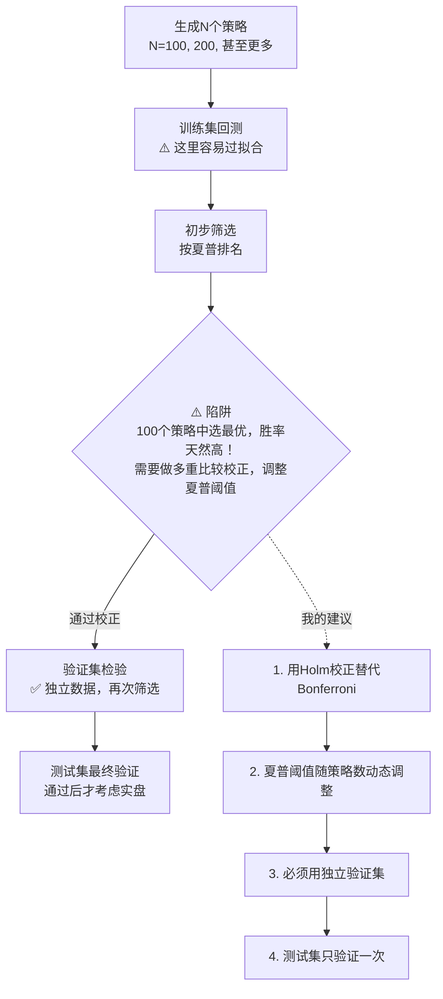

# 第15章 多重策略比较陷阱：在100个策略中选最优，胜率天然高

做量化的人，谁没干过这种事？

写100个策略，回测跑一遍，挑出收益最高的那个。然后兴冲冲地实盘，结果亏得亲妈都不认识。

这不是你运气差。这是数学在惩罚你。

## 为什么100个策略里挑一个，本身就是坑？

我刚开始做量化那会儿，也犯过这个错。写了50多个均线策略，参数从5到250挨个试。最后挑出一个夏普2.8的，觉得发现了圣杯。结果实盘三个月，夏普直接干到0.3。

为什么会这样？

你想想看，100个策略里，哪怕全是随机生成的噪音，也天然会有几个表现好的。就像扔100次硬币，总有人能连续扔出5次正面。这不是技术，是概率。

> **核心问题：** 多重比较导致的选择偏差。你从N个策略中选最优，这个最优策略的预期表现，天然高于它的真实表现。

说白了，你选出来的那个冠军策略，很可能只是运气好，不是真的强。

## 多重比较校正：给胜率打个折

怎么解决？学术界有个经典方法——Bonferroni 校正。原理很简单：

- 如果你只测1个策略，显著性水平用0.05
- 如果你测100个策略，显著性水平要除以100，变成0.0005

嗯，这里要注意。Bonferroni 校正太保守了。我个人习惯用 Holm-Bonferroni 方法，它没那么严格，但更实用。

```python
# 多重比较校正示例
import numpy as np
from statsmodels.stats.multitest import multipletests

# 假设你有100个策略的p值
np.random.seed(42)
p_values = np.random.uniform(0, 1, 100)

# 让其中几个策略表现好一点
p_values[:5] = np.random.uniform(0, 0.01, 5)

# Bonferroni校正
reject_bonf, p_corrected_bonf, _, _ = multipletests(p_values, method='bonferroni')

# Holm-Bonferroni校正（我推荐这个）
reject_holm, p_corrected_holm, _, _ = multipletests(p_values, method='holm')

print(f"原始显著策略数: {sum(p_values < 0.05)}")
print(f"Bonferroni校正后: {sum(reject_bonf)}")
print(f"Holm校正后: {sum(reject_holm)}")
```

我在项目中遇到过，用 Bonferroni 校正后，100个策略里一个都不显著。但用 Holm 方法，还能留下2-3个。这更符合实际情况——毕竟我们写的策略，总归比随机噪音强一点吧？

## 夏普比率阈值调整：别被高夏普骗了

夏普比率2.0看起来很诱人，对吧？但如果你是从100个策略里挑出来的，这个2.0要打折扣。

怎么调整？我分享一个经验公式：

```python
# 调整后的夏普阈值
import math

def adjusted_sharpe_threshold(n_strategies, base_threshold=1.0):
    """
    根据策略数量调整夏普比率阈值

    参数:
    - n_strategies: 比较的策略数量
    - base_threshold: 基础阈值（单策略时使用）

    返回:
    - 调整后的阈值
    """
    # 我用的是经验公式，不是严格的数学推导
    # 但实战中效果不错
    adjustment = math.sqrt(math.log(n_strategies))
    return base_threshold * adjustment

# 示例
for n in [1, 10, 50, 100, 200]:
    threshold = adjusted_sharpe_threshold(n)
    print(f"{n:3d}个策略 → 夏普阈值: {threshold:.2f}")
```

> **我的经验：**
>
> - 测 1-5 个策略：夏普 > 1.0 就算不错
> - 测 10-20 个策略：夏普 > 1.5 才值得关注
> - 测 50-100 个策略：夏普 > 2.0 才勉强及格
> - 测 100+ 个策略：夏普 > 2.5 我才会考虑实盘

## 更实用的方法：交叉验证 + 样本外测试

校正和调阈值都是统计手段。但做交易，我更相信实战检验。

我的做法是这样的：

1. **分三组数据**：训练集、验证集、测试集
2. **在训练集上生成策略**：随便你写多少个，100个、1000个都行
3. **在验证集上筛选**：用验证集的表现来挑策略，而不是用训练集
4. **在测试集上最终验证**：只有测试集上表现稳定的策略，才值得实盘

> **警告：** 很多人只分训练集和测试集。但如果你在训练集上反复调参、反复筛选，其实已经泄露了信息。必须要有独立的验证集。
>
> 我曾经吃过这个亏。在训练集和测试集上表现都很好，但实盘就是不行。后来才发现，我其实在训练集上看了太多遍，已经过拟合了。

## 一张图看懂多重策略比较陷阱

下面这张图，是我自己总结的完整流程。建议你保存下来，每次做策略筛选时对照着看。



## 避坑指南

我曾经在实盘上吃过这个亏，所以总结了几条铁律：

- **不要只看排名**：第一名和第二名可能只差0.01的夏普，但实盘表现可能天差地别
- **关注策略多样性**：100个策略如果都是均线类，那其实只相当于1个策略的不同参数
- **做压力测试**：把最优策略放到不同的市场环境下测试，看它是不是只在特定行情下有效
- **记录所有策略**：不要只记录最优的，把所有策略的表现都存下来。这样你才能知道，你选出来的那个，到底是不是异常值

> **一个小技巧：** 我每次做策略筛选，都会把排名前10的策略都拿出来，看看它们的持仓是否相似。如果前10个策略持仓高度重合，说明它们本质上是一个策略。这时候，即使夏普很高，也要警惕。

嗯，说到底，多重策略比较陷阱的本质，就是你在用数据挖掘代替交易逻辑。100个策略里挑一个，跟100次抛硬币里挑一次正面，没有本质区别。真正能赚钱的策略，不需要在100个里脱颖而出——它自己就能发光。

---

