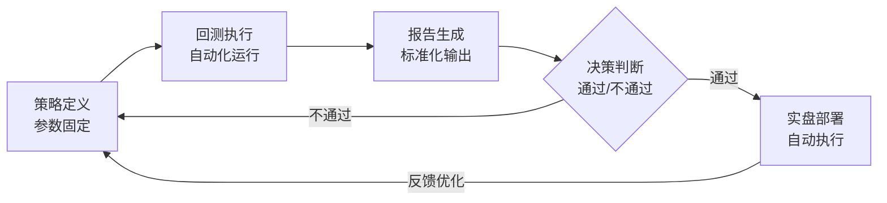

# 第十五章：心理偏差在回测中的体现

做量化交易的朋友，或多或少都经历过这样的场景：回测曲线漂亮得不像话，实盘却亏得怀疑人生。问题出在哪？很多时候不是策略本身不行，而是我们的大脑在回测过程中悄悄动了手脚。

我做了这么多年量化，踩过的坑比吃过的饭还多。今天咱们就聊聊回测中最常见的三种心理偏差——过度自信、确认偏误、损失厌恶。说白了，就是你的大脑在跟你玩把戏。

## 16.1 过度自信：回测曲线越漂亮，越要警惕

过度自信，是量化新手最容易犯的毛病。回测跑出一个年化50%的策略，心里就开始盘算着财务自由了。嗯，我当年也这样。

为什么会这样？因为回测给了你一个完美的历史数据。你看到的是所有信号都精准捕捉，所有止损都刚好避开。但现实世界不会这么配合。

> **过度自信的典型表现：**
> - 回测参数优化后，觉得找到了"圣杯"
> - 忽略样本外测试，直接上实盘
> - 把运气当能力，把偶然当必然

我在项目中遇到过一位朋友，他开发了一个趋势跟踪策略，回测三年年化80%。他兴奋地跟我说这次稳了。我问他做过蒙特卡洛模拟吗？他说没有。结果实盘三个月亏了30%。

过度自信的本质，是我们把回测中的"历史拟合"当成了"预测能力"。你想想看，如果回测能保证未来收益，那量化交易也太简单了。

> **我的建议：** 每次回测跑出好结果，先问自己三个问题：
> 1. 这个策略在样本外表现如何？
> 2. 参数稍微偏移一点，结果还稳定吗？
> 3. 如果未来市场风格变了，策略还能赚钱吗？

## 16.2 确认偏误：你只看到你想看到的

确认偏误，说白了就是选择性失明。你心里已经认定某个策略有效，就会不自觉地寻找支持它的证据，忽略反对它的信号。

我有个习惯，每次回测前会先写下策略的潜在缺陷。这样做的好处是，能强迫自己客观看待结果。但大多数人不会这么做。

**确认偏误在回测中的表现：**

- 只关注盈利的交易，忽略亏损的交易
- 对回测中的异常收益视而不见（比如某次极端行情带来的暴利）
- 不断调整参数，直到回测结果符合预期

我曾经犯过一个错误：开发一个均值回归策略，回测结果很好。但仔细一看，大部分收益来自一次黑天鹅事件。我当时想，这正好说明策略能抓住极端行情啊！后来才意识到，这就是典型的确认偏误——我在为策略找理由，而不是让数据说话。

> **避坑指南：** 我曾经用自动化回测流程解决了这个问题。具体做法是：
> - 回测前固定参数，不允许手动调整
> - 设置严格的样本内外测试规则
> - 用程序自动生成回测报告，避免人工解读

## 16.3 损失厌恶：亏一笔钱比赚一笔钱更难受

行为金融学告诉我们，损失带来的痛苦大约是同等收益带来快乐的两倍。这在回测中会怎么体现？你会不自觉地修改策略，试图避免那些"看起来很难受"的亏损。

举个例子：回测中有一笔连续亏损5次的记录。你看着这个回撤曲线，心里很不舒服。于是你加了一个过滤条件，把这5次亏损过滤掉了。结果呢？策略的胜率提高了，但整体收益反而下降了。

**损失厌恶导致的常见问题：**

- 过度优化止损参数，导致频繁止损
- 加入太多过滤条件，错过真正的趋势
- 因为害怕回撤，放弃高收益策略

我个人的经验是，回测中的亏损是策略的一部分。你不能因为看着不舒服就去改它。真正重要的是理解亏损的原因：是策略逻辑有问题，还是市场环境变化了？

> **如何用自动化流程减少人为干预：**
> 我开发了一套自动化回测流程，核心思想就是"减少人的参与"。具体包括：
> 1. **参数固定化：** 回测参数在开始前就确定，不允许中途修改
> 2. **报告自动化：** 回测结果由程序生成，不给人解读的空间
> 3. **决策流程化：** 只有通过所有测试的策略才能进入实盘

## 16.4 自动化回测流程的设计思路

说了这么多问题，那怎么解决呢？我的答案是：用流程对抗人性。

### 自动化回测流程



这个流程的核心，就是把人的角色从"决策者"变成"监督者"。你不需要在回测过程中做任何判断，只需要在流程结束后检查结果。

> **具体实现步骤：**
> 1. **编写策略代码：** 把策略逻辑写成函数，参数作为输入
> 2. **设置参数范围：** 在回测开始前确定参数组合
> 3. **批量回测：** 用循环或并行计算跑所有参数组合
> 4. **自动筛选：** 根据预设指标（夏普比率、最大回撤等）筛选最优参数
> 5. **样本外测试：** 用未参与优化的数据验证策略

## 16.5 代码示例：自动化回测框架

下面是一个简单的自动化回测框架示例。我习惯用Python写，因为生态比较完善。

```python
import pandas as pd
import numpy as np
from backtesting import Backtest, Strategy

class MyStrategy(Strategy):
    # 参数固定，不可在回测中修改
    fast_ma = 10
    slow_ma = 30

    def init(self):
        self.fast = self.I(lambda x: pd.Series(x).rolling(self.fast_ma).mean(), self.data.Close)
        self.slow = self.I(lambda x: pd.Series(x).rolling(self.slow_ma).mean(), self.data.Close)

    def next(self):
        if self.fast[-1] > self.slow[-1] and self.fast[-2] <= self.slow[-2]:
            self.buy()
        elif self.fast[-1] < self.slow[-1] and self.fast[-2] >= self.slow[-2]:
            self.sell()

# 自动化回测流程
def auto_backtest(data, strategy_class, param_grid):
    results = []
    for params in param_grid:
        bt = Backtest(data, strategy_class, cash=10000, commission=.002)
        stats = bt.run(**params)
        results.append({
            'params': params,
            'return': stats['Return [%]'],
            'sharpe': stats['Sharpe Ratio'],
            'max_drawdown': stats['Max. Drawdown [%]']
        })
    return pd.DataFrame(results)

# 使用示例
param_grid = [
    {'fast_ma': 10, 'slow_ma': 30},
    {'fast_ma': 20, 'slow_ma': 50},
    {'fast_ma': 5, 'slow_ma': 20}
]
results = auto_backtest(data, MyStrategy, param_grid)
print(results.sort_values('sharpe', ascending=False))
```

这段代码的核心思想是：参数在回测开始前就固定好了，你不需要在过程中做任何调整。回测结果由程序自动生成，你只需要看最终的排名。

## 16.6 总结：用流程对抗人性

心理偏差是人性的一部分，你不可能完全消除它。但你可以通过设计合理的流程，减少它对你决策的影响。

| 心理偏差 | 表现 | 自动化解决方案 |
| --- | --- | --- |
| 过度自信 | 高估策略的预测能力 | 强制样本外测试，蒙特卡洛模拟 |
| 确认偏误 | 选择性关注有利证据 | 自动化报告，标准化评估指标 |
| 损失厌恶 | 过度优化避免亏损 | 固定参数，禁止中途修改 |

我个人的经验是，自动化回测流程最大的好处不是提高收益，而是让你更客观地看待策略。当你不再被情绪左右，你才能做出更理性的决策。

> **最后说一句：** 量化交易的本质是用规则代替直觉。如果你在回测过程中频繁地"我觉得"、"我认为"，那说明你的流程还不够自动化。把决策权交给程序，把监督权留给自己——这才是量化交易的正确打开方式。

---

