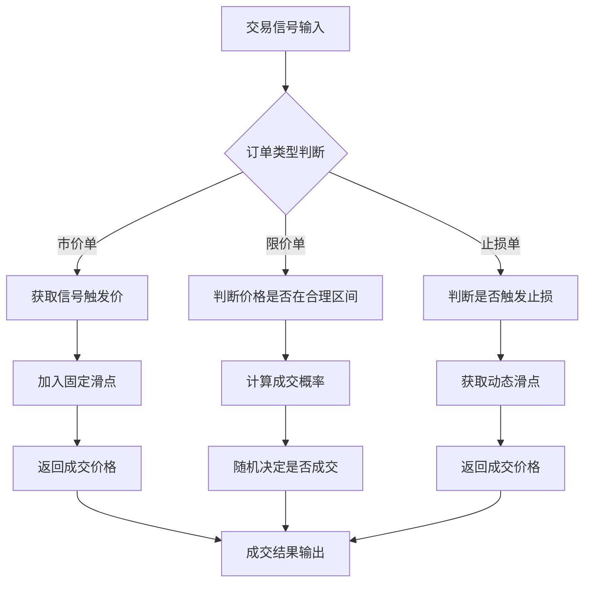

# 交易规则实现陷阱：市价单、限价单、止损单在回测中的模拟差异

做量化回测这么多年，我踩过最大的坑之一，就是订单类型的模拟。说实话，很多人觉得回测不就是算算收益率吗？订单类型有什么好纠结的？嗯，等你真正跑起来就明白了——同样的策略，订单类型实现方式不同，结果能差出一倍去。

今天咱们就聊聊市价单、限价单、止损单在回测里到底该怎么模拟。我把自己这些年踩过的坑、总结的经验，一次性倒出来。

## 为什么订单类型在回测里是个大问题？

先想一个问题：你在回测里下一笔市价单，系统应该用什么价格成交？

很多人直接拿下一根K线的开盘价或者收盘价。这其实是个巨大的简化。真实交易中，市价单的成交价会受到流动性、订单簿深度、市场冲击等因素影响。回测里我们看不到这些细节，所以必须找到合理的近似方法。

我个人习惯把订单类型模拟分成三个层次：

- **理想化模拟**：假设总能以指定价格成交，不考虑滑点和流动性
- **近似模拟**：加入固定滑点或百分比滑点
- **精细模拟**：基于历史Tick数据或订单簿重建

大部分情况下，我们做的是近似模拟。但这里面的陷阱，一个比一个深。

## 市价单的模拟陷阱

市价单，说白了就是「不管什么价格，我就要成交」。回测里最常见的做法是：用下一根K线的开盘价成交。

这样做有什么问题？我举个例子你就明白了。

> **真实场景**：某股票在14:59突然拉升，你策略检测到突破，发出买入信号。下一根K线是15:00的收盘K线，开盘价已经涨了2%。你用这个价格成交，等于白白多付了2%的成本。

为什么会这样？因为你的信号和实际成交之间存在时间差。在真实交易中，市价单几乎是瞬间成交的，价格不会偏离信号触发点太远。但在回测里，这个时间差被放大了。

**我建议的做法**：

```python
# 市价单模拟 - 加入时间戳对齐
def simulate_market_order(signal_time, current_price, slippage_bps=5):
    """
    signal_time: 信号触发时间
    current_price: 信号触发时的最新价格
    slippage_bps: 滑点基点，默认5个基点（0.05%）
    """
    # 获取信号触发后第一个可用的成交价格
    next_price = get_next_available_price(signal_time)

    # 加入滑点
    if is_buy:
        fill_price = next_price * (1 + slippage_bps / 10000)
    else:
        fill_price = next_price * (1 - slippage_bps / 10000)

    return fill_price
```

这里的关键是：**不要直接用下一根K线的开盘价**。你应该用信号触发时刻的最新价，然后加上合理的滑点。滑点大小取决于你的交易品种和流动性。我在做期货回测时，通常设5-10个基点；做小市值股票时，可能要到20-30个基点。

## 限价单的模拟陷阱

限价单比市价单复杂得多。因为你不仅要考虑成交价格，还要考虑**是否成交**。

回测里最常见的错误是：只要价格触及限价，就认为成交了。这太理想化了。

我曾经做过一个统计：在A股市场，限价单的成交概率大概只有60%-70%。即使价格到了你的限价，也可能因为排队、流动性不足等原因无法成交。

> **注意**：限价单的成交概率与以下因素相关：
>
> - 订单簿深度：买一卖一的挂单量
> - 价格变动速度：快速变动的市场更难成交
> - 订单大小：大订单更难全部成交

**我建议的做法**：引入成交概率模型

```python
# 限价单成交概率模拟
def limit_order_fill_probability(limit_price, current_bid, current_ask, order_size):
    """
    计算限价单的成交概率
    """
    # 买入限价单：价格在买一和卖一之间
    if limit_price >= current_ask:
        # 价格高于卖一，基本能成交
        base_prob = 0.95
    elif limit_price <= current_bid:
        # 价格低于买一，很难成交
        base_prob = 0.10
    else:
        # 价格在买卖价差之间
        spread = current_ask - current_bid
        position = (limit_price - current_bid) / spread
        base_prob = 0.3 + 0.5 * position

    # 订单大小调整
    avg_order_size = get_average_order_size()
    size_factor = min(1.0, avg_order_size / max(order_size, 1))

    return base_prob * size_factor
```

嗯，这个模型当然不完美，但比「100%成交」要靠谱得多。你可以根据自己交易的市场和品种调整参数。

## 止损单的模拟陷阱

止损单是最容易出问题的。很多人觉得止损单不就是价格跌破某个位置就卖出吗？其实不然。

真实交易中，止损单触发后，会变成市价单去成交。这意味着：**止损单的成交价可能远低于你的止损价**。

我记得有一次做股指期货回测，设了2%的止损。回测结果显示最大回撤只有3%，但实盘跑起来，一次急跌直接打到了5%的止损。为什么？因为回测里止损单是按止损价成交的，但实盘里是滑点成交的。

> **避坑指南**：我曾经在回测中忽略止损单的滑点，结果实盘亏损比预期大了50%。从那以后，我强制自己在止损单模拟中加入「滑点放大」机制。

**我建议的做法**：

```python
# 止损单模拟 - 考虑滑点放大
def simulate_stop_order(stop_price, current_price, is_long):
    """
    止损单模拟
    stop_price: 止损触发价
    current_price: 当前价格
    """
    # 判断是否触发
    if is_long and current_price <= stop_price:
        # 多头止损触发，按市价卖出
        # 滑点通常比普通市价单大
        slippage = get_dynamic_slippage('stop', market_volatility())
        fill_price = current_price * (1 - slippage)
        return True, fill_price

    elif not is_long and current_price >= stop_price:
        # 空头止损触发，按市价买入
        slippage = get_dynamic_slippage('stop', market_volatility())
        fill_price = current_price * (1 + slippage)
        return True, fill_price

    return False, None
```

这里我用了 `get_dynamic_slippage` 函数，它会根据市场波动率动态调整滑点。市场越波动，止损单的滑点越大。这个逻辑在实盘中是成立的。

## 三种订单类型的对比总结

| 订单类型 | 常见陷阱 | 我的建议 | 滑点处理 |
| --- | --- | --- | --- |
| 市价单 | 直接用下一根K线开盘价 | 用信号触发价+固定滑点 | 5-10个基点（流动性好） |
| 限价单 | 价格触及即成交 | 引入成交概率模型 | 根据订单簿深度调整 |
| 止损单 | 按止损价成交 | 加入动态滑点放大 | 波动率越高滑点越大 |

## 一个完整的订单模拟框架

说了这么多，我把自己常用的订单模拟框架画出来。这个框架我用了好几年，虽然不完美，但至少能避免80%的常见陷阱。

### 订单模拟框架



这个框架的核心思想是：**不同类型的订单，用不同的逻辑去模拟**。不要试图用一个函数搞定所有订单类型。我见过太多人把市价单、限价单、止损单混在一起处理，结果哪个都没做好。

## 最后说几句

订单类型模拟这件事，说难不难，说简单也不简单。关键在于你要理解真实市场的运作机制，然后在回测里找到合理的近似方法。

我个人经验是：**宁可回测结果保守一点，也不要过于乐观**。因为实盘只会比回测更残酷，不会更美好。你把滑点设大一点、成交概率设低一点，虽然回测曲线没那么好看，但至少实盘的时候不会太意外。

嗯，今天就聊到这里。订单类型这块内容其实还有很多细节，比如不同交易所的规则差异、不同品种的流动性特征等等。这些咱们后面有机会再细说。

---

