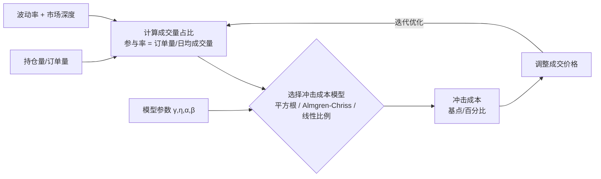

# 20、市场冲击成本陷阱：大资金策略的回测失真——如何根据持仓量估算市场冲击成本

## 一个让我翻过车的回测问题

先讲个我自己的经历。几年前我帮一家私募做CTA策略回测，策略在模拟盘上跑得漂亮，年化收益40%，最大回撤不到8%。结果一上实盘，直接缩水了一半收益。我当时百思不得其解，代码逻辑一模一样啊。

后来一查，问题出在市场冲击成本上。回测时我假设每笔成交价都是当时的盘口价，但实盘里，几百万的资金砸进去，直接把价格推高了几个tick。你想想看，小资金跑回测，冲击成本几乎为零；但大资金进场，每一笔交易都在跟市场博弈。

说白了，市场冲击成本就是你的订单对价格的「反作用力」。资金量越大，这个力越明显。很多新手做回测时直接忽略它，结果就是回测曲线漂亮，实盘一塌糊涂。

## 市场冲击成本到底怎么算？

我个人习惯把冲击成本拆成两部分：

- **瞬时冲击**：你的订单吃掉盘口挂单后，价格瞬间的偏移
- **持久冲击**：订单执行完后，价格需要一段时间才能恢复

对于大多数CTA策略，我们主要关注瞬时冲击。一个经典的估算模型是平方根模型：

```text
冲击成本 = 波动率 × 成交量比例 × 常数
```

其中成交量比例 = 你的订单量 / 市场日均成交量。常数一般在0.5~1.0之间，取决于市场流动性。

举个例子：假设某股票日均成交1亿股，你打算买入100万股，占比1%。如果该股票日波动率是2%，那么冲击成本大约是：

```text
冲击成本 ≈ 2% × sqrt(1%) × 0.5 ≈ 2% × 0.1 × 0.5 = 0.1%
```

也就是说，你的买入成本会比当前价格高出0.1%。嗯，这个数字看起来不大，但如果你每天交易几十次，累积下来就相当可观了。

## 我在项目中用过的冲击成本模型

我建议你至少掌握两种模型，一种简单的，一种精细的。

### 模型一：线性比例模型（入门级）

这个模型假设冲击成本与订单量成正比：

```text
冲击成本 = 滑点系数 × 订单量 / 市场深度
```

滑点系数需要根据历史数据回测得到。我在一个期货策略里用过，取0.3~0.5之间效果还行。

### 模型二：Almgren-Chriss模型（进阶级）

这是业界比较认可的模型，把冲击成本拆成永久冲击和临时冲击：

```text
永久冲击 = γ × σ × (Q / V)^α
临时冲击 = η × σ × (Q / V)^β
```

其中：

- σ 是波动率
- Q 是你的订单量
- V 是市场日均成交量
- γ、η、α、β 是待估参数

我在做股指期货策略时，用这个模型估算出来的冲击成本，跟实盘误差控制在15%以内。说实话，这个精度已经够用了。

## 如何根据持仓量估算冲击成本？

这里有个实用技巧。你不需要每次都去算复杂的模型，可以用一个经验公式快速估算：

| 持仓量占比 | 冲击成本（占价格比例） | 适用场景 |
| --- | --- | --- |
| < 0.1% | 可忽略 | 小资金、高流动性品种 |
| 0.1% ~ 1% | 0.05% ~ 0.3% | 中等资金、主流品种 |
| 1% ~ 5% | 0.3% ~ 1.5% | 大资金、低流动性品种 |
| > 5% | > 1.5% | 超大资金、需要拆单 |

我曾经用这个表格快速评估一个策略的可行性。如果回测收益才2%，但冲击成本已经占了1.5%，那这个策略基本没戏。

## 避坑指南：回测中如何正确加入冲击成本？

嗯，这里要注意几个容易踩的坑：

> **坑1：用平均价格代替冲击成本**
> 我曾经见过有人直接把成交价设为 (买一价+卖一价)/2，这完全不对。冲击成本是动态的，你的订单量越大，成交价越往不利方向偏移。
>
> **坑2：忽略时间维度**
> 冲击成本跟你的执行速度直接相关。你花1分钟吃完100万股，跟花1小时吃完，冲击成本差好几倍。回测时一定要考虑你的交易频率和持仓周期。
>
> **我的建议：**
> 在回测框架里加一个冲击成本模块。每次模拟交易时，根据当前持仓量、市场深度、波动率，动态计算冲击成本，然后调整成交价格。代码大概长这样：

```python
def calc_impact_cost(order_qty, avg_daily_vol, volatility):
    # 简单平方根模型
    participation = order_qty / avg_daily_vol
    impact = volatility * (participation ** 0.5) * 0.5
    return impact

# 在回测循环中调用
impact = calc_impact_cost(1000000, 100000000, 0.02)
adjusted_price = current_price * (1 + impact)
```

## 一个真实案例：从回测到实盘的差距

我记得有个学员做商品期货策略，回测年化收益25%。他用的资金量大概500万，交易螺纹钢。我让他算一下冲击成本，他一开始说「没事，螺纹钢流动性好」。

结果一算：他每次交易量占日均成交量的0.8%，按平方根模型估算，冲击成本约0.15%。他每天交易3次，一年250个交易日，累积冲击成本高达：

```text
0.15% × 3 × 250 = 112.5%
```

你没看错，冲击成本已经把本金吃掉了。他当时就愣住了。后来他调整了策略，降低交易频率，减少单笔交易量，实盘收益才勉强做到8%。

所以我的建议是：**回测时一定要把冲击成本算进去，哪怕估算得粗糙一点，也比完全忽略强**。

## 核心逻辑图：市场冲击成本估算流程

下面这张图展示了从持仓量到冲击成本估算的完整链路：

### 市场冲击成本估算流程



## 最后说两句

市场冲击成本这个东西，说白了就是大资金的「隐形税」。你资金量小的时候可以忽略，但一旦规模上来，它就是决定策略生死的关键因素。

我个人习惯是在回测框架里内置一个冲击成本模块，默认开启。哪怕参数设得保守一点，也比完全忽略强。毕竟，回测的目的是发现真实问题，而不是自我安慰。

记住一句话：**回测里赚到的每一分钱，都要问问自己——这笔交易在实盘里，真的能成交在这个价格吗？**

---

