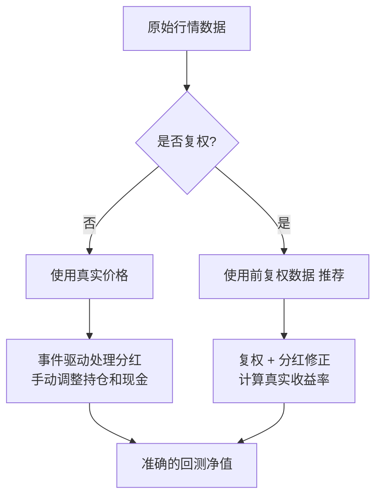

# 第21章 分红配股陷阱：除权除息对策略净值的影响

做量化回测的朋友，十有八九都踩过这个坑。

你辛辛苦苦写了个策略，回测曲线漂亮得不行。年化收益30%，最大回撤不到10%。你心里美滋滋，准备实盘干一票。结果呢？实盘跑起来，收益曲线跟回测差了十万八千里。

为什么会这样？

我告诉你，八成是分红配股没处理好。说白了，就是除权除息这个机制，把你的回测给骗了。

## 除权除息到底是个啥？

先简单回顾一下。股票分红有两种方式：

- **现金分红**：公司赚钱了，给你发点现金。比如每10股派5元。
- **股票分红**：公司给你送股票。比如每10股送3股。

不管是哪种，分红之后股价都要做调整。这个调整就叫除权除息。

举个例子：某股票收盘价10元，明天每10股派5元现金。那明天开盘价就是9.5元。你账户里多了现金，但股票市值少了。总资产不变。

听起来很公平对吧？

嗯，对散户来说确实公平。但对量化策略来说，问题就来了。

## 回测中的陷阱

我刚开始做量化那会儿，用的都是后复权数据。觉得这样省事，价格连续，回测曲线也好看。后来发现，这玩意儿坑死人不偿命。

陷阱主要有三个：

1. **收益率计算失真**：后复权价格把分红算进去了，但你的策略并不知道这笔钱是分红来的。它以为是你交易赚的。
2. **买卖信号错位**：除权后股价跳空，你的技术指标可能触发假信号。
3. **资金管理混乱**：分红来的现金，你的策略可能又拿去买了股票。但实际账户里，这笔钱可能已经被你花掉了。

> **⚠️ 注意：** 用后复权数据做回测，年化收益虚高20%-30%是很常见的事。我见过最夸张的一个案例，回测年化50%，实盘只有15%。查了半天，就是复权数据惹的祸。

## 正确的处理方式

那怎么办？我个人的习惯是：

### 方案一：用前复权数据 + 处理分红事件

前复权数据的好处是，历史价格是连续的，不会出现跳空。但问题在于，前复权会改变历史价格，导致你的买入成本计算不准确。

所以我的做法是：

- 回测时用前复权数据计算买卖信号
- 但实际计算收益时，用真实价格加上分红

代码大概长这样：

```python
def calculate_return(price_series, dividend_events):
    """
    计算考虑分红的真实收益率
    price_series: 前复权价格
    dividend_events: 分红事件列表 [(日期, 每股分红)]
    """
    total_return = 1.0
    cash_hold = 0.0

    for i in range(1, len(price_series)):
        # 计算价格变动收益
        price_return = price_series[i] / price_series[i-1] - 1
        total_return *= (1 + price_return)

        # 处理分红
        date = price_series.index[i]
        if date in dividend_events:
            div_per_share = dividend_events[date]
            cash_hold += div_per_share * shares_hold

    return total_return + cash_hold / initial_capital
```

### 方案二：用真实价格 + 事件驱动

这个更精确，但实现起来麻烦一些。你需要：

1. 用真实的历史价格（不复权）
2. 在分红日，手动调整持仓和现金
3. 重新计算净值

我建议初学者用方案一。等你对回测机制熟悉了，再尝试方案二。

## 避坑指南

我曾经犯过一个低级错误：用后复权数据回测，然后直接拿回测结果去优化参数。结果优化出来的参数，在实盘上完全失效。

后来我总结了几条经验：

- **永远不要用后复权数据做回测**。除非你明确知道自己在干什么。
- **回测和实盘用同一套数据源**。别回测用复权数据，实盘用真实数据。
- **分红事件要单独记录**。别指望复权数据能帮你搞定一切。

> **💡 小技巧：** 如果你用Python做回测，推荐用 backtrader 或者 zipline 这类框架。它们内置了分红处理机制，你只需要配置一下就行。我自己用 backtrader 比较多，它的分红处理逻辑写得挺靠谱。

## 知识体系图

下面这张图，是我自己总结的分红配股处理逻辑。你照着这个思路来，基本不会出错。

### 分红配股处理逻辑



## 总结

分红配股这个坑，说大不大，说小不小。但如果你不管它，回测结果就是废纸一张。

我个人的建议是：

- 新手先用前复权数据，配合简单的分红修正
- 老手直接上事件驱动，精确控制每一笔分红
- 不管用哪种方法，回测完一定要用真实数据验证一遍

记住一句话：回测是给你看的，不是给你骗的。数据处理好，策略才能跑得稳。

> **核心要点：**
>
> - 后复权数据会虚增收益，千万别用
> - 前复权数据 + 分红修正，是最稳妥的方案
> - 回测和实盘的数据处理逻辑必须一致
> - 分红事件要单独记录，别指望自动处理

好了，这一章就聊到这儿。下一章我们聊聊另一个常见陷阱——停牌对回测的影响。那个坑，比分红还隐蔽。

---

