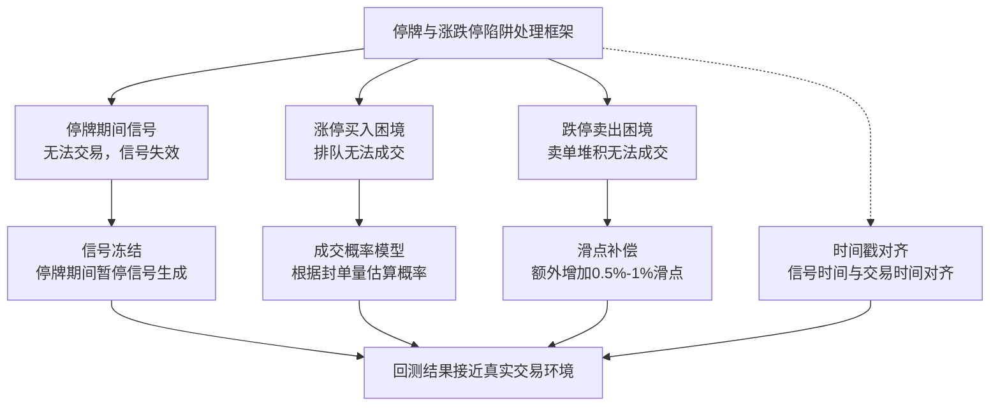

# 第二十二章：停牌与涨跌停陷阱——无法交易时的回测失真

做量化回测这么多年，我踩过最深的坑之一，就是停牌和涨跌停。你想想看，策略信号出来了，但实际根本买不进去——回测里却显示你完美成交了。这不就是典型的「纸上富贵」吗？

我个人习惯把这类问题叫做「流动性幻觉」。回测环境里，所有股票都是想买就买、想卖就卖。但真实市场不是这样的。尤其是A股，停牌和涨跌停是家常便饭。如果你不处理这些，回测结果基本就是自欺欺人。

## 停牌期间的回测失真

先说说停牌。股票停牌的原因很多：重大资产重组、财报问题、股东大会等等。停牌期间，你无法进行任何交易。但很多回测框架默认会跳过停牌日，直接在下个交易日开盘价成交。

这里有个大问题：**停牌复牌后，往往伴随着剧烈波动**。我在项目中遇到过一只股票，停牌三个月后复牌，直接一字跌停。回测里我是在停牌前最后一个交易日买入的，复牌后按开盘价卖出——看起来赚了。但实际上，你根本卖不出去，因为跌停板上全是卖单。

> **核心问题：** 停牌期间产生的信号，在复牌后是否还能执行？复牌后的实际成交价格与回测假设价格之间的偏差，就是失真来源。

## 涨跌停时的交易困境

涨跌停的情况更常见。涨停时你想买买不进，跌停时你想卖卖不出。但回测里，系统默认你可以在涨停价买入、跌停价卖出——这完全违背了市场规则。

为什么会这样？因为回测引擎通常只检查价格是否在涨跌停范围内，却不检查**实际可成交性**。涨停时，买单排队，你排在后面可能根本轮不到。跌停时，卖单堆积，你的单子可能到收盘都没成交。

我建议的处理方式是：**在回测中模拟真实的排队机制**。虽然做不到完全精确，但至少可以避免那种「涨停买入、次日高开卖出」的完美操作。

## 如何规避这些陷阱

嗯，这里要注意，处理停牌和涨跌停没有银弹。但有几个实用的方法，我一直在用：

1. **停牌期间信号冻结**：如果股票停牌，暂停所有与该股票相关的信号生成。复牌后第一个交易日，重新评估信号是否有效。
2. **涨跌停成交概率模型**：根据封单量、排队位置、市场情绪等因素，估算实际成交概率。回测时按概率随机成交。
3. **价格滑点补偿**：对于涨停买入或跌停卖出的情况，额外增加滑点成本。我个人习惯加0.5%-1%的滑点。
4. **时间戳对齐**：确保信号生成时间与交易时间严格对齐。盘中涨停的信号，不能在收盘价成交。

> **小技巧：** 我写回测框架时，会单独维护一个「可交易状态」字段。停牌、涨停、跌停时，该字段标记为False。所有交易逻辑都先检查这个字段。这样能避免90%的失真问题。

## 代码实现示例

下面是一个简单的处理逻辑，用Python写的。你可以直接拿去用：

```python
def check_tradable(stock_data, date):
    """
    检查某只股票在指定日期是否可交易
    返回: (是否可交易, 原因)
    """
    # 获取当日数据
    day_data = stock_data.loc[date]

    # 检查停牌
    if day_data['volume'] == 0 or day_data['close'] == 0:
        return (False, '停牌')

    # 检查涨停
    if day_data['close'] >= day_data['upper_limit']:
        # 涨停时，买入不可成交
        return (False, '涨停')

    # 检查跌停
    if day_data['close'] <= day_data['lower_limit']:
        # 跌停时，卖出不可成交
        return (False, '跌停')

    return (True, '正常交易')


def execute_trade(signal, market_data):
    """
    执行交易，考虑停牌和涨跌停
    """
    tradable, reason = check_tradable(market_data, signal.date)

    if not tradable:
        # 记录未成交原因
        log_unfilled_order(signal, reason)
        return None

    # 正常执行交易
    # 这里可以加入滑点模型
    actual_price = market_data.loc[signal.date, 'close'] * (1 + slippage)
    return actual_price
```

> **警告：** 千万不要以为加了涨跌停检查就万事大吉。我见过有人只检查了涨停，没检查跌停——结果回测里跌停卖出全部成交，实际根本卖不掉。两个方向都要处理。

## 知识体系结构图

下面这张图，是我梳理的停牌与涨跌停陷阱处理框架。你可以把它当作一个检查清单：



## 实战中的避坑指南

我曾经犯过一个低级错误：回测时用了复权价格，但停牌期间的复权数据是向后填充的。结果复牌后第一天的收益率被严重高估。后来我改用**不复权数据**做停牌处理，才解决了这个问题。

另外，涨跌停的处理不能一刀切。我建议区分两种情况：

- **开盘即涨停/跌停**：全天无法交易，直接跳过
- **盘中涨停/跌停**：涨停后买入不可成交，但之前买入的可以；跌停同理

这里有个细节：盘中涨停后，如果尾盘打开涨停，那买入信号又可以执行了。所以不能简单用收盘价判断，要用**日内最高价和最低价**来辅助判断。

> **总结一下：** 停牌和涨跌停是回测中最容易被忽视的陷阱。处理它们不需要多复杂的模型，但需要你认真对待每一个细节。我个人的经验是：宁可回测结果保守一点，也不要为了好看而忽略这些真实世界的约束。

记住一句话：**回测里能成交的，实战中不一定能成交。但回测里不能成交的，实战中一定不能成交。** 把这条底线守住，你的回测结果才有参考价值。

---
