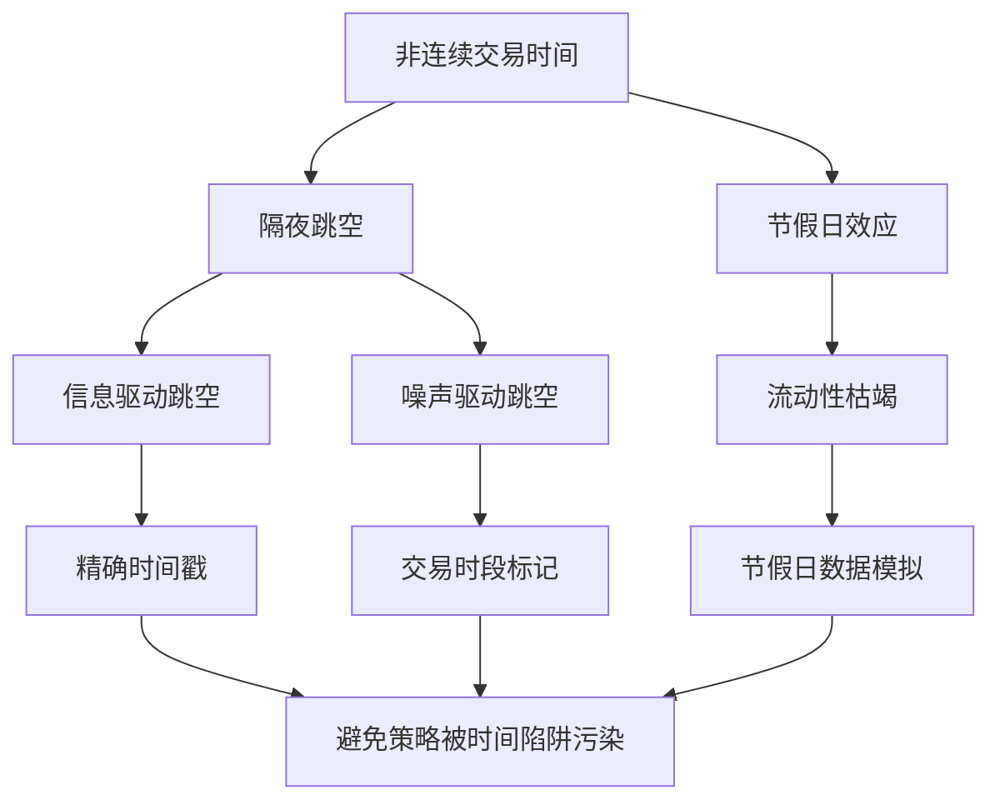

# 23、交易时间陷阱：隔夜跳空、节假日效应——如何正确模拟非连续交易时间

做量化回测这么多年，我踩过最深的坑之一，就是交易时间模拟。说白了，市场不是24小时连续运行的。A股每天就4小时，期货有夜盘但也不是全天，加密货币倒是7×24小时——但不同品种的流动性分布完全不同。

你想想看，如果回测时把收盘价和次日开盘价当成连续数据来处理，那隔夜跳空这一下，就能让你的策略收益曲线变得面目全非。我见过太多人拿着漂亮的回测曲线来找我，结果一查，全是隔夜跳空贡献的"假收益"。

> **核心问题：** 非连续交易时间会导致价格序列出现"断层"，这些断层如果处理不当，会严重扭曲策略的真实表现。

## 隔夜跳空：回测中最隐蔽的利润来源

先说说隔夜跳空。A股下午3点收盘，第二天9点半开盘，中间隔了18.5个小时。这期间外盘在动、政策在出、消息在发酵。第二天开盘价和前一天收盘价之间，经常出现明显的跳空缺口。

我个人习惯把这种跳空分成两类：

- **信息驱动的跳空**：比如财报发布、政策变动、外盘大涨大跌。这类跳空有信息含量，策略如果基于这些信息做决策，那跳空就是策略的一部分。
- **噪声驱动的跳空**：纯粹是流动性不足或随机波动导致的。这类跳空对策略没有预测价值，反而会引入噪声。

我在项目中遇到过最典型的案例：一个简单的均线突破策略，回测年化收益30%。仔细一查，超过60%的收益来自隔夜跳空。策略其实是在收盘前买入，第二天开盘跳空高开卖出。这根本不是策略有效，而是吃到了隔夜的信息溢价。

> **避坑指南：** 我曾经犯过一个低级错误——用日线数据回测，把收盘价和次日开盘价当成连续数据。结果策略在模拟交易中完全失效，因为实盘时根本买不到回测中的那个"开盘价"。

## 节假日效应：被忽视的"时间黑洞"

节假日比隔夜跳空更隐蔽。A股春节休市一周，国庆休市一周，中间还有各种小长假。你想想看，一周的休市时间，外盘可能已经走了好几个来回。

节假日效应主要体现在三个方面：

| 效应类型 | 表现 | 对回测的影响 |
| --- | --- | --- |
| 节前效应 | 投资者倾向于减仓避险 | 策略可能误判为卖出信号 |
| 节后效应 | 积压信息集中释放 | 跳空幅度通常比隔夜更大 |
| 流动性枯竭 | 节前最后一天成交量萎缩 | 滑点成本被严重低估 |

嗯，这里要注意：很多回测框架默认把节假日当成普通交易日来处理。如果你的策略在节前频繁交易，那回测结果基本是废的。因为实盘时，节前的流动性根本支撑不了你的交易量。

## 正确模拟非连续交易时间的方法

说了这么多问题，那到底该怎么处理？我总结了一套自己的方法，分享给你：

### 方法一：使用精确的时间戳

别用日线数据做日内策略的回测。这是最基本的要求。用分钟线甚至tick数据，精确记录每一笔交易的时间。这样隔夜跳空自然就被隔离了——因为收盘和开盘之间没有数据点。

```python
# 错误做法：用日线数据回测日内策略
data['return'] = data['close'].pct_change()

# 正确做法：使用分钟线，明确区分交易日
# 假设数据包含日期和时间戳
data['date'] = data.index.date
data['time'] = data.index.time

# 只计算同一交易日内的收益率
daily_returns = data.groupby('date')['close'].apply(lambda x: x.pct_change())
```

### 方法二：引入"交易时段"标记

我习惯给每个数据点打上交易时段标签。比如A股：

- 上午时段：09:30 - 11:30
- 下午时段：13:00 - 15:00
- 隔夜时段：15:00 - 次日 09:30

这样在计算收益率时，可以明确区分"日内收益"和"隔夜收益"。策略的买卖决策只基于日内数据，隔夜跳空单独分析。

```python
# 标记交易时段
def label_session(time):
    if time <= pd.Timestamp('11:30').time():
        return 'morning'
    elif time <= pd.Timestamp('15:00').time():
        return 'afternoon'
    else:
        return 'overnight'

data['session'] = data['time'].apply(label_session)

# 只使用日内数据生成信号
intraday_data = data[data['session'] != 'overnight']
```

### 方法三：模拟节假日数据

对于节假日，我建议直接剔除这些日期，或者用前一个交易日的收盘价填充。但要注意：填充后的数据不能用于生成交易信号，只能用于计算持仓市值。

> **小技巧：** 我写回测框架时，会单独维护一个"交易日历"。所有交易信号只在交易日历中的日期生成。节假日的数据只用来计算持仓的隔夜收益，不参与信号生成。

## 知识体系：非连续交易时间模拟的核心逻辑

下面这张图是我自己总结的，帮你理清思路：



## 实战建议：如何验证你的回测是否被"时间陷阱"污染

最后给你几个自检方法，我每次回测完都会跑一遍：

1. **拆分收益来源**：把总收益拆成"日内收益"和"隔夜收益"。如果隔夜收益占比超过30%，你的策略大概率有问题。
2. **检查交易时间分布**：统计策略在收盘前最后5分钟的交易次数。如果占比异常高，说明策略在赌隔夜跳空。
3. **模拟节假日剔除**：把节假日数据全部剔除，重新跑一遍回测。如果收益大幅下降，说明策略依赖节假日效应。
4. **滑点压力测试**：在隔夜跳空和节假日前后，把滑点放大到正常值的3-5倍，看策略是否还能盈利。

> **记住一句话：** 回测中看起来太完美的收益，往往藏着你看不见的陷阱。非连续交易时间就是最常见的那个。

好了，这一章的内容就到这里。交易时间陷阱是回测中最容易被忽视的问题之一，但处理好了，你的回测结果会扎实很多。

---

> 公众号：蓝海资料掘金营，微信deep3321
