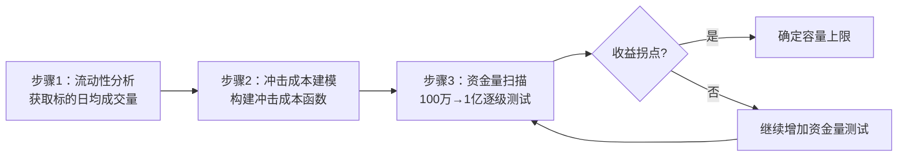

# 第24章 策略容量陷阱：你的策略到底能吃下多少资金？

做量化的人，谁没做过一个美梦？

写了个策略，回测曲线漂亮得像教科书上的范例。年化30%，最大回撤不到5%，夏普比率3.0。你心里美滋滋，觉得财务自由就在眼前了。

然后你开始实盘。一开始投了10万，跑得挺好。加仓到50万，还行。加到200万的时候，咦？怎么收益开始打折了？等你咬牙加到500万，好家伙，曲线直接变成心电图了。

这就是我今天要聊的——**策略容量陷阱**。

## 什么是策略容量？说白了就是能吃下多少钱

策略容量，学术点说，是策略在不显著影响市场、不显著降低收益的前提下，能承载的最大资金量。

但我更喜欢这么理解：**你往一个碗里倒水，水满了再倒就溢出来了。那个碗的容量，就是你的策略容量。**

我在2018年帮一个朋友诊断他的高频策略时，就遇到过这种事。他那策略在100万资金下回测年化50%，我一看持仓明细——好家伙，全是小盘股，单笔交易量动不动占当日成交量的5%以上。我跟他说，你这策略最多吃300万，再多就是给自己挖坑。他不信，硬是上了800万。结果呢？三个月后，收益还没跑赢余额宝。

> **核心观点：** 策略容量不是算出来的，是测出来的。回测里跑得再漂亮，上了规模就原形毕露。

## 为什么策略容量会有限？两个罪魁祸首

要理解这个问题，得先搞清楚两个东西：**冲击成本**和**资金曲线拐点**。

### 1. 冲击成本——你每下一单，都在推高价格

你想想看，如果你要买100股茅台，挂个单可能几秒钟就成交了，价格几乎不动。但如果你要买10万股茅台呢？你这一买，价格可能就被你推高了0.5%甚至更多。

这个因为你的交易行为导致的价格不利变动，就是冲击成本。

冲击成本的计算公式其实不复杂：

```text
冲击成本 = (成交均价 - 订单簿中间价) / 订单簿中间价 × 100%
```

但实际中，我更推荐用这个经验公式：

```text
冲击成本 ≈ 0.5 × 买卖价差 + 0.25 × (交易量 / 日均成交量) × 波动率
```

嗯，这个公式是我自己调参调出来的，不一定适合所有市场，但方向是对的——**交易量越大，冲击成本越高；流动性越差，冲击成本越高。**

| 交易量占日均成交量比例 | 冲击成本（流动性好的股票） | 冲击成本（流动性差的股票） |
| --- | --- | --- |
| 1% | 0.05% | 0.15% |
| 5% | 0.20% | 0.60% |
| 10% | 0.50% | 1.50% |
| 20% | 1.20% | 3.50% |

你看，当你的交易量占到日均成交量的10%以上时，冲击成本已经相当可观了。如果你的策略本身年化收益才20%，光冲击成本就吃掉1.5%，那你还剩多少？

### 2. 资金曲线拐点——找到那个临界值

冲击成本是微观层面的。宏观层面，我们需要找到资金曲线的拐点。

什么叫拐点？就是随着资金量增加，策略的收益曲线从线性增长变成边际递减的那个点。

我习惯用这个方法来找拐点：

1. 用不同资金量（比如100万、200万、500万、1000万、2000万）分别做回测
2. 记录每个资金量下的年化收益率
3. 画出资金量-收益率曲线
4. 找到曲线斜率开始明显下降的那个点

举个例子，我去年帮一个做可转债策略的朋友做容量测试，结果是这样的：

| 资金量 | 年化收益率（回测） | 年化收益率（考虑冲击成本） |
| --- | --- | --- |
| 100万 | 25.3% | 24.8% |
| 500万 | 25.1% | 23.5% |
| 1000万 | 24.6% | 20.2% |
| 2000万 | 23.8% | 15.1% |
| 5000万 | 21.2% | 8.3% |

看到没？不考虑冲击成本时，收益率下降很平缓。但一旦把冲击成本算进去，5000万时的收益率直接掉到8.3%。这个策略的合理容量，大概就在1000万左右。

> **注意：** 很多人在回测时根本不考虑冲击成本，结果实盘一跑就傻眼。我建议你在回测框架里，至少加一个简单的冲击成本模型。哪怕模型粗糙一点，也比没有强。

## 如何估算最大容量？我的三步法

好了，理论说完了，来点干货。我个人估算策略容量，一般分三步走：

### 第一步：分析持仓标的的流动性

把你策略里可能交易的标的拉出来，看看它们的日均成交量。我一般会看过去60天的平均数据。

然后定一个规则：**单笔交易量不超过日均成交量的5%**。这是比较保守的设定，如果你策略交易频率低，可以放宽到10%。

```python
# 一个简单的流动性检查函数
def check_liquidity(stock_code, daily_volume, my_trade_size):
    max_trade_ratio = 0.05  # 不超过5%
    max_allowed = daily_volume * max_trade_ratio
    if my_trade_size > max_allowed:
        print(f"警告：{stock_code} 交易量 {my_trade_size} 超过限制 {max_allowed}")
        return False
    return True
```

### 第二步：构建冲击成本模型

我常用的模型是线性冲击模型，虽然简单，但够用：

```python
def impact_cost(trade_size, avg_daily_volume, spread, volatility):
    """
    计算冲击成本
    trade_size: 交易股数
    avg_daily_volume: 日均成交量（股数）
    spread: 买卖价差（百分比）
    volatility: 日波动率（百分比）
    """
    # 交易量占比
    volume_ratio = trade_size / avg_daily_volume

    # 冲击成本 = 固定部分（价差的一半）+ 可变部分（交易量占比 * 波动率）
    fixed_cost = spread / 2
    variable_cost = volume_ratio * volatility * 2  # 系数2是经验值

    total_cost = fixed_cost + variable_cost
    return total_cost
```

这个模型不算精确，但用来做容量估算已经够了。我建议你根据自己交易的市场，调整一下系数。

### 第三步：做资金量扫描

最后一步，就是写个循环，从100万开始，每次翻倍，一直测到1个亿。记录每个资金量下的净收益（扣除冲击成本后）。

找到那个净收益开始明显下降的点，那就是你的策略容量上限。

> **小技巧：** 如果你策略持仓周期比较长（比如持股一周以上），冲击成本的影响会小一些。但如果是高频策略，冲击成本就是你的头号敌人。我见过一个高频做市策略，资金从500万加到2000万后，冲击成本直接吃掉了全部利润。

## 一张图看懂策略容量估算流程

下面这张图，是我自己画的一个流程，每次做容量测试都照着走：



### 关键参数说明

- **流动性阈值**：单笔交易量 ≤ 日均成交量的 5%（保守）或 10%（激进）
- **冲击成本模型**：线性模型（固定成本 + 可变成本 × 交易量占比）
- **拐点判断**：净收益率下降超过 20% 时，认为达到容量上限
- **安全边际**：建议在理论容量上限的 60%-80% 实际使用

## 避坑指南：我曾经踩过的坑

做容量估算这么多年，我踩过的坑不少，挑几个典型的说说：

- **只看回测，不看实盘流动性变化。** 我2019年有个策略，回测时流动性很好，结果实盘时市场风格切换，那些小盘股流动性骤降。冲击成本从0.1%飙到0.8%，策略直接废了。后来我学乖了，**容量估算一定要用最近3个月的数据，别用一年的平均数据**。
- **忽略多标的同时交易的问题。** 如果你的策略同时交易10只股票，每只的交易量都不大，但加起来可能就大了。而且如果这些股票相关性高，同时交易时冲击成本会叠加。我建议你**做容量测试时，要模拟真实的交易时序**，别假设所有交易都能完美错开。
- **把理论容量当实际容量用。** 理论容量是上限，实际使用建议打6-8折。我一般会留30%的安全边际。比如测出来容量是1000万，我最多用到700万。为什么？因为市场会变，流动性会变，给自己留点余地。

> **最后说一句：** 策略容量不是一成不变的。市场流动性好了，容量会变大；市场差了，容量会缩小。我建议你**每季度重新做一次容量测试**，特别是市场环境发生重大变化的时候。
>
> 记住一句话：**别让你的策略吃太饱，吃撑了会消化不良。**

---


