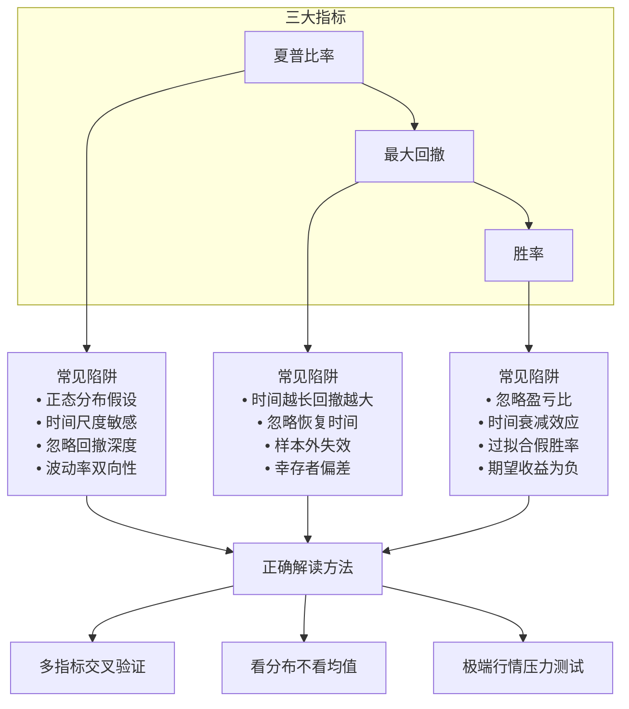

# 第25章 回测统计陷阱：夏普比率、最大回撤、胜率的误导——如何正确解读回测统计指标

做量化的人，谁没被回测数据骗过？

我入行第三年的时候，有个策略回测夏普比率3.8，最大回撤才6%，胜率65%。当时我兴奋得差点直接上实盘。还好团队里一位老大哥拦住了我，让我仔细看看这些数字是怎么算出来的。

结果呢？一拆解，全是坑。

今天我们就聊聊回测统计指标里那些常见的误导。说白了，就是帮你练就一双火眼金睛，不被漂亮数字忽悠。

> **核心观点：** 单一统计指标都有盲区。夏普比率、最大回撤、胜率这三个指标，单独看都是"半瞎"。只有理解它们的局限性，才能正确解读回测结果。

## 25.1 夏普比率：被高估的"性价比"指标

夏普比率，量化圈里最常用的风险调整后收益指标。公式很简单：`(策略收益率 - 无风险利率) / 收益率标准差`。

但问题出在哪？我一个个说。

### 25.1.1 正态分布假设的陷阱

夏普比率假设收益率服从正态分布。你想想看，真实的金融市场哪有那么乖？

我见过一个策略，90%的时间赚小钱，10%的时间亏大钱。算出来的夏普比率居然有2.5。为什么？因为标准差被小赚的交易日拉低了，那几次大亏被"平均"掉了。

> **注意：** 当收益率分布存在厚尾（极端值出现概率高于正态分布）时，夏普比率会系统性高估策略的真实风险调整收益。

### 25.1.2 时间尺度敏感

同一个策略，用日收益率算夏普比率，和用周收益率算，结果可能差一倍。

举个例子：

| 计算频率 | 年化夏普比率 | 实际意义 |
| --- | --- | --- |
| 日收益率 | 2.8 | 看起来很牛 |
| 周收益率 | 1.9 | 还行 |
| 月收益率 | 1.2 | 一般般 |

为什么会这样？因为高频数据有自相关性，会低估真实波动。我个人习惯，至少用周收益率来算夏普比率，更稳妥。

### 25.1.3 忽略回撤深度

夏普比率只关心波动率，不关心回撤有多深。两个策略，一个最大回撤5%，一个最大回撤30%，夏普比率可能一模一样。

嗯，这里要注意：波动率是双向的，回撤是单向的。投资者真正怕的是亏损，不是波动。

> **我的建议：** 别只看夏普比率。搭配 Calmar 比率（年化收益/最大回撤）一起看，能更全面评估风险。

## 25.2 最大回撤：最被低估的"幸存者偏差"指标

最大回撤，听起来很直观——从最高点到最低点的最大跌幅。但这里面的门道，比你想的多。

### 25.2.1 回测期越长，最大回撤越大

这是个数学事实。你回测10年，最大回撤大概率比回测3年要大。因为时间越长，遇到极端行情的概率越高。

我见过有人拿3个月的回测数据，说最大回撤只有2%，然后信心满满地实盘。结果呢？第一个月就亏了8%。

### 25.2.2 回撤的"时间维度"被忽略

最大回撤只告诉你亏了多少，没告诉你亏了多久。

两个策略：

- 策略A：最大回撤15%，持续了5天就回来了
- 策略B：最大回撤15%，持续了180天才回来

你选哪个？明显是A。但只看最大回撤数值，两者一模一样。

> **关键点：** 一定要看回撤恢复时间（Recovery Time）。回撤深不可怕，回撤后起不来才可怕。

### 25.2.3 样本外回撤才是真考验

回测里的最大回撤，是"已知"的。实盘里的最大回撤，是"未知"的。

我曾经有个策略，回测5年最大回撤8%，实盘第一年就干到了12%。为什么？因为回测数据里没有包含2020年3月的流动性危机。

> **避坑指南：** 回测的最大回撤，至少要乘以1.5倍，才是你心理上应该准备的真实回撤。

## 25.3 胜率：最危险的"安慰剂"指标

胜率65%！听起来很爽对吧？

但胜率可能是三个指标里最误导人的一个。

### 25.3.1 胜率与盈亏比的跷跷板

高胜率往往意味着低盈亏比。你想想看，如果每笔交易都赚一点点，但亏一次就亏大的，胜率再高有什么用？

看个对比：

| 策略 | 胜率 | 平均盈利 | 平均亏损 | 盈亏比 | 期望收益 |
| --- | --- | --- | --- | --- | --- |
| 策略A | 70% | 1% | -5% | 0.2 | -0.8% |
| 策略B | 35% | 5% | -2% | 2.5 | +0.45% |

策略A胜率70%，但每笔交易期望收益是负的。策略B胜率只有35%，但长期赚钱。你说哪个好？

### 25.3.2 胜率的时间衰减

很多策略的胜率，在回测初期很高，越往后越低。为什么？因为市场在进化，策略在退化。

我做过一个统计：把回测期分成前后两半，前半段胜率60%以上的策略，后半段能维持60%的不到30%。

### 25.3.3 样本内过拟合的"假胜率"

这个最要命。你反复调整参数，让回测胜率达到80%。但实盘呢？可能直接腰斩到40%。

说白了，过拟合就是在"记忆"历史数据，不是在"学习"市场规律。

> **我的经验：** 回测胜率超过70%的策略，我反而会特别警惕。要么是过拟合，要么是盈亏比极差。真正稳健的策略，胜率通常在40%-60%之间。

## 25.4 如何正确解读回测统计指标？

说了这么多问题，那到底该怎么看？我总结了一套自己的方法。

### 25.4.1 多指标交叉验证

别只看一个指标。至少要看：

- 夏普比率 + Calmar 比率
- 最大回撤 + 回撤恢复时间
- 胜率 + 盈亏比 + 期望收益

三个维度都过关，策略才值得进一步研究。

### 25.4.2 看分布，不看均值

不要只看夏普比率这个"平均数"。要看收益率的分布图——有没有厚尾？有没有偏态？

我习惯画一个收益率直方图，一眼就能看出问题。

### 25.4.3 做压力测试

把策略放到极端行情里测试：2008年金融危机、2020年疫情、2015年股灾。如果回撤可控，那才是真本事。

> **一句话总结：** 回测统计指标是工具，不是结论。工具用对了，能帮你发现机会；用错了，能让你亏得底朝天。

## 25.5 本章知识体系

下面这张图，帮你理清回测统计指标的核心逻辑：

这张图把三个核心指标的陷阱和正确解读方法串起来了。你每次看回测报告时，可以对照着检查一遍。

> **最后说一句：** 回测统计指标是"后视镜"，不是"导航仪"。它能告诉你过去发生了什么，但不能保证未来会重复。保持怀疑，持续验证，这才是量化交易者的生存之道。

---

