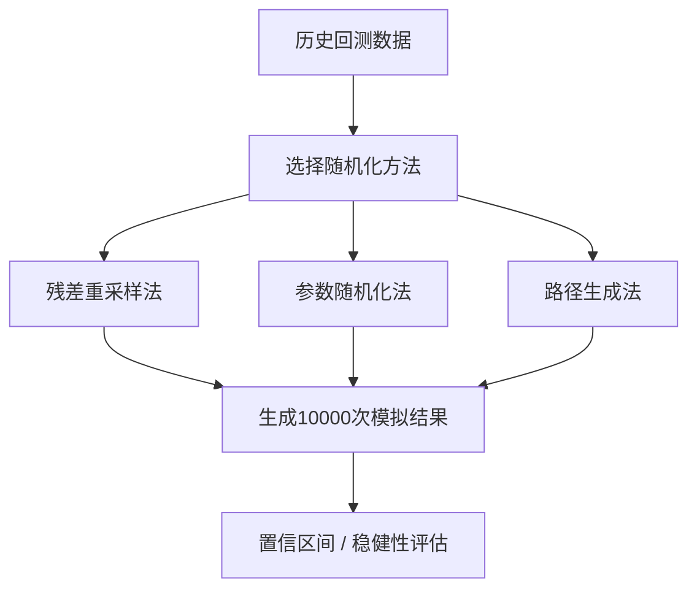

# 蒙特卡洛模拟在回测中的应用：通过随机模拟评估策略的稳健性和置信区间

做量化策略回测这么多年，我踩过最大的坑是什么？

就是看着回测曲线漂亮得不行，实盘一跑就崩。后来我明白了——回测结果只是一个样本点，你根本不知道它是不是运气好撞上的。

这时候，蒙特卡洛模拟就派上用场了。

## 什么是蒙特卡洛模拟？

说白了，就是让计算机帮你做无数次「假设实验」。你想想看，历史只有一条路径，但未来有无数种可能。蒙特卡洛模拟就是通过随机生成大量可能的路径，来评估你的策略在各种场景下的表现。

我个人习惯把它叫做「压力测试的升级版」。普通回测只测一次，蒙特卡洛模拟测一万次。

> **核心思想：** 用大量随机模拟来逼近真实世界的概率分布，从而评估策略的稳健性。

## 蒙特卡洛模拟的三种常见应用

### 1. 残差重采样法

这个方法我在项目中用过很多次。具体做法是：

- 先跑一遍标准回测，得到每天的收益率序列
- 把这些收益率打乱顺序，重新组合成新的序列
- 每个新序列都跑一遍策略，记录结果
- 重复几千次，看结果分布

为什么要打乱顺序？因为真实市场存在序列相关性，但我们的策略可能恰好利用了某种偶然的模式。打乱后如果策略还能赚钱，那才是真本事。

> **我的经验：** 残差重采样法特别适合检测「过拟合」。我曾经有个策略，原始回测年化收益30%，重采样后中位数只有5%——嗯，果断放弃。

### 2. 参数随机化法

这个方法更暴力。你把策略参数当成随机变量，每次模拟都随机抽取一组参数跑回测。

比如一个双均线策略，有快线周期和慢线周期两个参数。你可以让快线在5-20之间随机，慢线在20-60之间随机。跑一万次，看结果分布。

```python
import numpy as np

def monte_carlo_params(strategy, param_ranges, n_simulations=10000):
    results = []
    for _ in range(n_simulations):
        # 随机抽取参数
        params = {
            'fast': np.random.randint(param_ranges['fast'][0],
                                      param_ranges['fast'][1]),
            'slow': np.random.randint(param_ranges['slow'][0],
                                      param_ranges['slow'][1])
        }
        # 跑回测
        result = run_backtest(strategy, params)
        results.append(result)
    return results
```

> **注意：** 参数随机化法不能用来「选参数」！它的目的是评估策略在参数空间中的稳定性，而不是帮你找到最优参数。我曾经见过有人用这个方法找参数，结果过拟合得更严重。

### 3. 路径生成法

这个方法更接近金融工程的思路。用历史数据的统计特征（均值、方差、相关性等）来生成新的价格路径。

常用的模型有：

- 几何布朗运动（GBM）
- GARCH 模型
- Bootstrap 重抽样

我个人比较喜欢用 Bootstrap，因为它不需要假设数据服从某种分布。直接从历史数据中有放回地抽样，生成新的序列。

## 如何解读蒙特卡洛结果？

跑完一万次模拟，你会得到一个结果分布。这时候要关注三个指标：

| 指标 | 含义 | 理想值 |
| --- | --- | --- |
| 中位数收益 | 模拟结果的中位数 | 大于0 |
| 95% 置信区间 | 去掉两端 2.5% 后的区间 | 下界大于0 |
| 亏损概率 | 收益为负的模拟次数占比 | 小于 20% |

> **判断标准：** 如果 95% 置信区间的下界大于0，说明策略有 95% 的概率赚钱。这才是真正的稳健策略。

## 避坑指南

我曾经犯过一个低级错误：用蒙特卡洛模拟来「优化」策略参数。结果呢？模拟出来的参数在实盘上一塌糊涂。

为什么？因为蒙特卡洛模拟的随机性会放大过拟合。你越优化，策略就越适应模拟中的噪声，而不是真实的市场规律。

正确的做法是：

- 先用历史数据做标准回测
- 再用蒙特卡洛模拟评估稳健性
- 如果结果不理想，重新设计策略逻辑
- 绝对不要用蒙特卡洛结果来调整参数

> **一个小技巧：** 我习惯把蒙特卡洛结果画成直方图，然后在图上标出原始回测结果的位置。如果原始结果在分布的尾部（比如前 5%），那就要小心了——你的策略可能只是运气好。

## 蒙特卡洛模拟的局限性

任何方法都有局限，蒙特卡洛也不例外：

- 它假设历史会重演，但黑天鹅事件往往不会
- 计算量很大，特别是路径生成法
- 不能完全消除过拟合，只能帮你发现它

说白了，蒙特卡洛模拟是一个「否定工具」，而不是「肯定工具」。它不能证明你的策略一定赚钱，但可以帮你排除那些纯粹靠运气的策略。

## 蒙特卡洛模拟应用流程



这张图展示了蒙特卡洛模拟的完整流程。从历史数据出发，经过三种不同的随机化方法，最终得到策略的置信区间和稳健性评估。

记住一句话：回测只能告诉你过去发生了什么，蒙特卡洛模拟能告诉你未来可能发生什么。两者结合，才是完整的策略评估体系。

---

> 公众号：蓝海资料掘金营，微信deep3321
