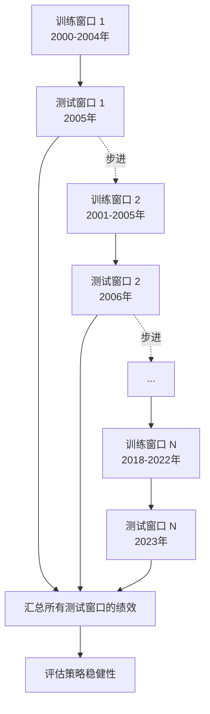

# Walk-Forward分析：动态参数优化的正确方法——如何避免静态参数过拟合

做量化策略的朋友，十有八九都掉进过同一个坑——参数过拟合。

我自己就吃过这个亏。几年前做一个趋势跟踪策略，在历史数据上回测漂亮得不行，夏普比干到3.0以上。结果一上实盘，直接被打回原形。后来复盘才发现，那些参数完全是「对着历史数据画靶子」。

为什么会这样？说白了，静态参数优化有个致命问题：它假设市场规律是永恒不变的。你想想看，这怎么可能？

## 静态参数优化的死穴

传统的参数优化流程是这样的：

1. 选定一段历史数据
2. 暴力搜索最优参数组合
3. 用这段数据验证效果
4. 拍板上线

听起来没毛病对吧？但问题出在第三步——你用同一段数据既做训练又做验证，这不就是考试前先看答案吗？

> **核心问题：** 静态参数优化本质上是「后见之明」。你找到的最优参数，很可能只是恰好拟合了那段历史中的噪声，而不是真正的市场规律。

我记得有一次跟一个同行交流，他特别自豪地说自己的策略在十年数据上回测年化收益40%。我问他：「你做过样本外测试吗？」他愣了一下。结果一测样本外，收益直接腰斩。嗯，这种情况我见得太多了。

## Walk-Forward分析：动态优化的正确姿势

Walk-Forward分析（以下简称WFA）就是来解决这个问题的。它的核心思想很简单：模拟真实交易环境，用滚动窗口的方式不断重新优化参数。

我画了一张图，帮你理解WFA的流程：



### WFA 的核心步骤

具体怎么做？我拆解成四个步骤：

1. **划分窗口**：把历史数据切成多个训练窗口和测试窗口。训练窗口通常占70-80%，测试窗口占20-30%。
2. **滚动优化**：在每个训练窗口内寻找最优参数，然后在对应的测试窗口验证。
3. **记录结果**：保存每个测试窗口的绩效指标。
4. **综合评估**：把所有测试窗口的结果汇总，看策略是否稳定。

> **我的经验：** 训练窗口和测试窗口的比例不是固定的。我个人习惯用 3:1 的比例。比如训练窗口用3年，测试窗口用1年。这样既能保证训练数据充足，又能测试策略在不同市场环境下的表现。

## 代码实现：一个简单的WFA框架

光说不练假把式。我写了一个简化的Python实现，帮你理解WFA的代码逻辑：

```python
import pandas as pd
import numpy as np
from itertools import product

def walk_forward_analysis(data, param_grid, train_len=36, test_len=12):
    """
    简单的Walk-Forward分析实现

    参数:
        data: DataFrame, 包含价格数据
        param_grid: dict, 参数搜索空间
        train_len: int, 训练窗口长度(月)
        test_len: int, 测试窗口长度(月)
    """
    results = []
    total_len = len(data)

    # 滚动窗口
    start = 0
    while start + train_len + test_len <= total_len:
        train_data = data.iloc[start:start + train_len]
        test_data = data.iloc[start + train_len:start + train_len + test_len]

        # 在训练窗口搜索最优参数
        best_params = None
        best_sharpe = -np.inf

        for params in product(*param_grid.values()):
            param_dict = dict(zip(param_grid.keys(), params))
            sharpe = evaluate_strategy(train_data, param_dict)

            if sharpe > best_sharpe:
                best_sharpe = sharpe
                best_params = param_dict

        # 在测试窗口验证
        test_sharpe = evaluate_strategy(test_data, best_params)

        results.append({
            'train_start': data.index[start],
            'train_end': data.index[start + train_len - 1],
            'test_start': data.index[start + train_len],
            'test_end': data.index[start + train_len + test_len - 1],
            'best_params': best_params,
            'train_sharpe': best_sharpe,
            'test_sharpe': test_sharpe
        })

        start += test_len  # 步进一个测试窗口长度

    return pd.DataFrame(results)
```

> **注意：** 上面的代码是简化版，实际使用时需要考虑更多细节，比如参数搜索的效率、过拟合的检测、交易成本等。我曾经在实盘中使用类似的框架，发现如果步进长度设置不当，会导致参数更新过于频繁，反而增加了交易成本。

## 如何解读WFA结果

跑完WFA之后，你会得到一堆数据。怎么判断策略好不好？我一般看三个指标：

| 指标 | 含义 | 合格标准 |
| --- | --- | --- |
| 测试窗口平均夏普比 | 策略在样本外的平均表现 | > 1.0 |
| 夏普比标准差 | 策略表现的稳定性 | < 0.5 |
| 训练/测试夏普比差值 | 过拟合程度 | < 0.5 |

举个例子。我之前做过一个均值回归策略，训练窗口夏普比2.1，测试窗口平均夏普比只有0.6。差值1.5，明显过拟合了。后来我简化了参数空间，把参数从5个减到2个，差值降到了0.3，实盘表现也好了很多。

## 避坑指南

WFA虽然好，但用不对也会踩坑。我总结了几条：

- **窗口长度要合理**：太短会导致训练不充分，太长又跟不上市场变化。我个人习惯训练窗口不少于2年。
- **参数空间别太大**：参数越多，过拟合风险越大。我曾经试过同时优化8个参数，结果WFA结果一片混乱。后来我学乖了，最多同时优化3-4个参数。
- **注意数据泄露**：确保训练窗口和测试窗口没有重叠。这个错误我犯过一次，当时用了滚动平均作为特征，结果不小心把未来的数据泄露到了训练集里。
- **不要只看平均值**：要关注每个测试窗口的单独表现。如果某个窗口表现特别差，说明策略在某些市场环境下可能失效。

> **核心要点：** Walk-Forward分析不是万能药，但它能帮你过滤掉那些「看起来很美」的过拟合策略。记住，一个好的策略应该在不同时间段都能稳定赚钱，而不是只在某一段历史数据上表现优异。

嗯，关于WFA的内容就讲到这里。这个方法我用了好几年，虽然不能保证100%避免过拟合，但至少能让你在实盘之前多一道保险。下次做策略优化的时候，不妨试试看。

---


