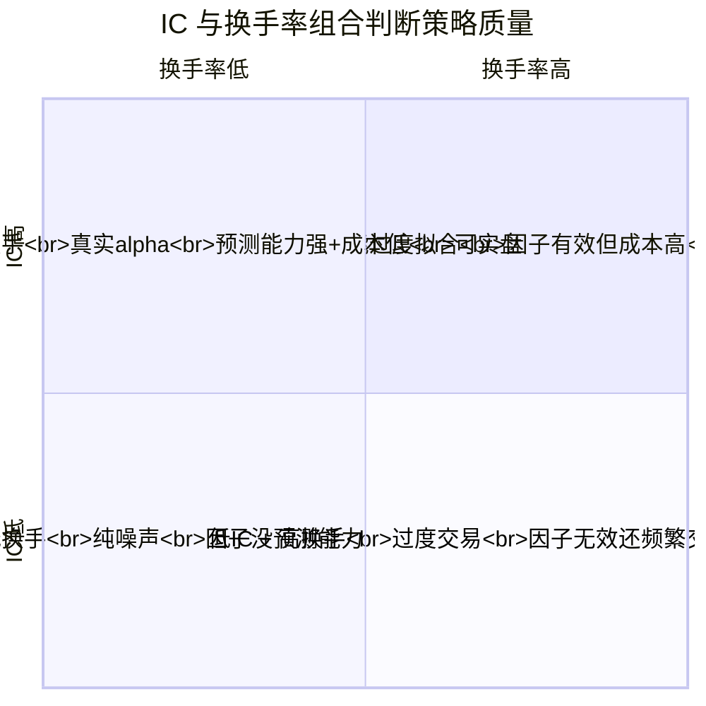

# 第28章：回测报告解读：如何区分真实alpha和统计噪声

做量化最怕什么？

不是亏钱，是以为自己找到了圣杯，结果实盘一跑就现原形。

我见过太多人，拿着回测报告兴奋得睡不着觉——年化50%，夏普3.0，最大回撤不到5%。结果呢？实盘三个月，亏得连手续费都cover不住。为什么？因为回测里的alpha，大部分是统计噪声。

这一章，我就跟你聊聊怎么从回测报告里，把真正的alpha和噪声区分开。核心就两个指标：**信息系数（IC）**和**换手率**。当然，还有几个辅助手段。

## 一、信息系数（IC）：你的预测到底准不准？

信息系数，英文叫 Information Coefficient，简称 IC。说白了，就是你的因子对未来的预测能力有多强。

怎么算？很简单：

- 你有一个因子值，比如"过去5天涨幅"
- 你有一个未来收益，比如"未来5天涨幅"
- 算这两个序列的相关系数——就是 IC

IC 的取值范围是 -1 到 1。正数表示因子和未来收益正相关，负数表示负相关。绝对值越大，预测能力越强。

> **我个人习惯把 IC 分成几个档次：**
>
> - |IC| > 0.1：不错的信号，值得关注
> - |IC| > 0.05：勉强能用，但需要组合使用
> - |IC| < 0.02：基本就是噪声，别当真

但这里有个坑——单期 IC 高不代表什么。你想想看，如果某个月你的 IC 是 0.3，下个月变成 -0.2，再下个月又变成 0.1。这种忽高忽低的 IC，说明什么？说明你的因子不稳定，很可能只是运气好。

**真正靠谱的因子，IC 应该是稳定的。** 我一般看两个指标：

- **IC 均值**：长期来看，IC 的平均值是多少
- **IC 标准差**：IC 的波动有多大

一个经典的判断标准是 **ICIR（信息系数比率）**，等于 IC 均值除以 IC 标准差。ICIR 大于 0.5，算及格；大于 1.0，算优秀。

> **避坑指南：** 我曾经遇到一个策略，IC 均值 0.08，看起来不错。但仔细一看，IC 标准差是 0.15，ICIR 只有 0.53。实盘跑了半年，果然不行。后来我把因子拆开分析，发现它的预测能力只在特定市场环境下有效，其他时候就是噪声。

## 二、换手率：你的策略到底在交易什么？

换手率，就是你的策略每天要换多少仓。

为什么换手率重要？因为**高换手率会吃掉你的收益**。佣金、印花税、滑点——这些成本在回测里往往被低估，但实盘里它们真实存在。

我见过一个策略，回测年化收益 30%，换手率每天 50%。什么意思？就是每天有一半的持仓要换掉。你算算，单边万三的佣金，双边就是万六，再加上印花税和滑点，一年下来成本至少 10% 以上。30% 的收益，扣掉成本还剩多少？

**我个人建议：**

- 日频策略：换手率控制在 20% 以内
- 周频策略：换手率控制在 50% 以内
- 月频策略：换手率控制在 100% 以内

当然，这不是绝对的。高频策略换手率可能更高，但你要确保收益能覆盖成本。

> **注意：** 换手率高的策略，往往对交易成本极其敏感。回测时一定要加上合理的成本假设。我一般用"双边千分之二"作为基准，如果策略还能赚钱，那实盘才有希望。

## 三、IC 和换手率怎么配合使用？

这两个指标不是孤立的。它们结合起来，能帮你判断策略的"真实度"。

我画了一张图，帮你理清思路：

这张图怎么用？很简单：

- **右上角（高 IC + 高换手）**：看起来不错，但小心。高换手意味着成本高，你要确认收益能不能覆盖。我一般会做"成本压力测试"——把交易成本提高一倍，看策略还能不能赚钱。
- **左上角（高 IC + 低换手）**：这是最理想的情况。因子预测能力强，交易成本低。这种策略，实盘成功率很高。
- **右下角（低 IC + 高换手）**：最危险。因子没预测能力，还频繁交易。这种策略，回测收益基本都是运气，实盘必亏。
- **左下角（低 IC + 低换手）**：纯噪声。因子没用，但至少没乱交易。这种策略，直接放弃就好。

## 四、其他辅助判断指标

除了 IC 和换手率，还有几个指标我经常用：

### 1. 策略收益的稳定性

看净值曲线。如果曲线是平滑向上的，说明策略稳定。如果曲线像过山车，忽上忽下，那就要小心了——可能是运气，也可能是过度拟合。

### 2. 不同市场环境下的表现

把回测期分成几个阶段：牛市、熊市、震荡市。看看策略在每个阶段的表现。如果只在牛市赚钱，熊市就亏，那这个策略的 alpha 可能只是市场 beta。

### 3. 样本外测试

这是最直接的方法。把数据分成两部分：训练集和测试集。在训练集上开发策略，在测试集上验证。如果测试集上的表现和训练集差不多，那说明策略有泛化能力。如果差很多，那就是过度拟合。

> **一个小技巧：** 我习惯把数据按时间分成三段：前 60% 做训练，中间 20% 做验证，最后 20% 做测试。这样能避免"数据窥探"的问题。

## 五、实战案例：一个真实的回测报告

给你看一个我处理过的案例：

| 指标 | 策略A | 策略B |
| --- | --- | --- |
| 年化收益 | 35% | 22% |
| 夏普比率 | 2.1 | 1.8 |
| 最大回撤 | 8% | 6% |
| IC 均值 | 0.12 | 0.06 |
| IC 标准差 | 0.18 | 0.04 |
| ICIR | 0.67 | 1.50 |
| 换手率（日均） | 45% | 12% |

你看，策略 A 的收益更高，夏普也更好。但仔细看 IC 和换手率：

- 策略 A 的 IC 均值 0.12，但标准差 0.18，ICIR 只有 0.67。说明它的预测能力不稳定。
- 策略 A 的换手率 45%，成本很高。
- 策略 B 的 IC 均值只有 0.06，但标准差 0.04，ICIR 高达 1.50。说明它的预测能力虽然弱，但很稳定。
- 策略 B 的换手率只有 12%，成本低。

结果呢？实盘跑了半年，策略 A 亏了 5%，策略 B 赚了 8%。为什么？因为策略 A 的收益被高换手成本吃掉了，而且它的 IC 不稳定，实盘里运气成分消失了。

> **教训：** 别被高收益、高夏普迷惑。IC 的稳定性和换手率，才是判断策略真实 alpha 的关键。

## 六、总结

区分真实 alpha 和统计噪声，其实就三步：

1. **看 IC**：IC 均值要高，IC 标准差要低，ICIR 要大于 0.5
2. **看换手率**：换手率要合理，确保收益能覆盖成本
3. **做压力测试**：提高交易成本、分市场环境测试、做样本外验证

嗯，说白了就是一句话：**别信回测报告里的数字，信逻辑和稳定性。**

我做了这么多年量化，见过太多漂亮的回测报告，最后能实盘赚钱的，都是那些 IC 稳定、换手率低的策略。其他的，基本都是噪声。

---

