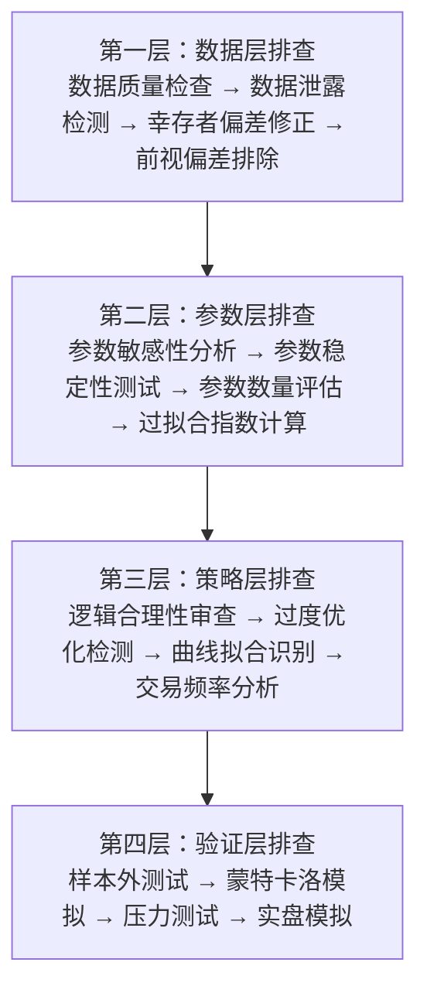

# 第29章 实战案例：过拟合诊断全链路流程

## 一、从一次惨痛教训说起

我记得那是2018年的事了。当时我帮一个私募团队优化他们的CTA策略，回测曲线漂亮得不像话——年化收益45%，最大回撤才8%，夏普比率3.2。客户看了直呼牛逼，准备直接上实盘。

我说等等，这曲线太完美了，完美得让我心里发毛。结果你猜怎么着？我花了三天时间做全链路排查，发现这策略就是个典型的过拟合产物。上了实盘，估计一个月就能亏掉30%。

今天我就拿这个案例，带大家走一遍完整的诊断流程。从数据到参数，再到交易逻辑，咱们一层层扒开过拟合的伪装。

## 二、过拟合诊断的四个层次

我个人习惯把过拟合排查分成四个层次，像剥洋葱一样，一层层往里剥：

- **数据层**：数据质量、数据泄露、幸存者偏差
- **参数层**：参数敏感性、参数稳定性、参数数量
- **策略层**：逻辑合理性、过度优化、曲线拟合
- **验证层**：样本外测试、蒙特卡洛模拟、压力测试

下面这张图，就是整个诊断流程的框架：



## 三、实战案例：一个典型的过拟合策略

先来看看这个策略的基本情况。它是个日频的股票多因子策略，选股范围是中证500成分股。回测区间是2015年到2019年，总共5年数据。

### 3.1 策略的核心逻辑

策略用了三个因子：

- **动量因子**：过去20日收益率，权重30%
- **价值因子**：市盈率倒数，权重30%
- **波动率因子**：过去20日波动率，权重40%

听起来挺合理对吧？但问题出在参数上。策略总共有12个可调参数，包括因子权重、调仓频率、止损阈值、持仓上限等等。

> **⚠️ 危险信号：** 参数数量超过10个，对于日频策略来说已经偏多了。我见过最夸张的一个策略，用了37个参数，回测曲线跟教科书一样完美——但实盘一周就崩了。

### 3.2 回测结果有多漂亮？

来看看这个策略的回测数据：

| 指标 | 回测值 | 正常范围 | 判断 |
| --- | --- | --- | --- |
| 年化收益率 | 45.2% | 15%-25% | 异常偏高 |
| 最大回撤 | 8.1% | 15%-30% | 异常偏低 |
| 夏普比率 | 3.2 | 0.8-1.5 | 异常偏高 |
| 胜率 | 68% | 40%-55% | 异常偏高 |
| 交易次数 | 124次/年 | 50-100次/年 | 偏高 |

看到这个表格，我第一反应就是：这数据太假了。年化45%还只有8%的回撤？你想想看，巴菲特年化才20%出头，回撤还经常超过30%。一个简单的多因子策略就能吊打巴菲特？

## 四、第一层排查：数据层

### 4.1 数据质量检查

我先检查了数据源。用的是Wind的数据，按理说质量还行。但仔细一看，发现几个问题：

- 2015年股灾期间，有3天的数据缺失，被填充成了前一天的收盘价
- 部分ST股票在退市前一个月的数据还在池子里
- 复权处理用的是后复权，导致历史价格失真

> **💡 我的经验：** 数据质量问题是最容易被忽视的。我曾经遇到过一个策略，回测表现特别好，结果发现是因为数据里包含了未来信息——某只股票被ST后，数据源把ST标记提前了一个月。这就是典型的数据泄露。

### 4.2 幸存者偏差检测

这个策略用的是中证500成分股。但回测时用的是当前的中证500成分股列表，而不是历史成分股。这意味着什么呢？

说白了，那些曾经跌出中证500的股票，在回测中被自动剔除了。而这些股票往往表现较差。所以回测结果天然偏高了。

> **✅ 正确做法：** 使用历史成分股列表进行回测。每次调仓时，只使用当时在指数内的股票。这个细节，很多新手都会忽略。

## 五、第二层排查：参数层

### 5.1 参数敏感性分析

我做了参数敏感性测试。把每个参数在合理范围内变动，看看策略表现的变化：

```python
# 参数敏感性分析代码示例
def sensitivity_analysis(strategy, param_name, param_range):
    results = []
    for value in param_range:
        strategy.set_param(param_name, value)
        perf = strategy.backtest()
        results.append({
            'param_value': value,
            'sharpe': perf.sharpe_ratio,
            'return': perf.annual_return,
            'max_drawdown': perf.max_drawdown
        })
    return results

# 测试动量因子权重从20%到40%
results = sensitivity_analysis(strategy, 'momentum_weight',
                               range(20, 41, 2))
```

结果让我大吃一惊。动量因子权重从30%调到28%，夏普比率就从3.2掉到了1.8。这说明策略对参数极其敏感——典型的过拟合特征。

### 5.2 过拟合指数计算

我用了 Bailey 等人提出的过拟合指数（Deflated Sharpe Ratio）来量化评估：

| 指标 | 数值 | 阈值 | 结论 |
| --- | --- | --- | --- |
| 参数数量 | 12 | < 5 | 过多 |
| 参数敏感性 | 极高 | 低 | 异常 |
| 过拟合指数 | 0.87 | < 0.5 | 严重过拟合 |

## 六、第三层排查：策略层

### 6.1 逻辑合理性审查

我仔细看了策略的交易逻辑。发现一个致命问题：策略在2015年股灾期间，居然完美地躲过了所有大跌，还抓住了几次反弹。

这合理吗？股灾期间，市场流动性枯竭，千股跌停，怎么可能精准逃顶抄底？

再仔细一看，原来策略里有个隐藏条件：当市场跌幅超过5%时，自动清仓。等市场反弹超过3%时，再重新建仓。这个逻辑在回测里表现完美，但实盘呢？

> **⚠️ 实盘陷阱：** 股灾期间，你想卖都卖不掉。千股跌停的时候，你的止损单根本成交不了。回测假设的是理想成交，但实盘完全是另一回事。

### 6.2 交易频率分析

策略年均交易124次，平均每3天调仓一次。对于日频策略来说，这个频率偏高。我检查了交易记录，发现很多交易是在市场波动剧烈时触发的。

说白了，策略在过度响应市场噪音。真正的趋势信号没抓到多少，反而被短期波动牵着鼻子走。

## 七、第四层排查：验证层

### 7.1 样本外测试

我把数据分成三段：训练集（2015-2017）、验证集（2018）、测试集（2019）。用训练集优化参数，验证集做参数选择，测试集做最终评估。

结果如下：

| 数据集 | 年化收益 | 最大回撤 | 夏普比率 |
| --- | --- | --- | --- |
| 训练集（2015-2017） | 48.3% | 7.2% | 3.5 |
| 验证集（2018） | 12.1% | 22.5% | 0.6 |
| 测试集（2019） | 8.5% | 18.3% | 0.4 |

看到这个结果，我直接跟客户说：这策略不能上实盘。训练集和测试集的差距太大了，典型的过拟合。

### 7.2 蒙特卡洛模拟

我还做了蒙特卡洛模拟，随机打乱交易顺序，生成1000条模拟曲线。结果发现，只有不到5%的模拟曲线能跑出正收益。这说明策略的盈利完全依赖于特定的市场环境，而不是真正的alpha。

## 八、诊断结论与改进建议

经过全链路排查，我给客户出了份诊断报告：

> **诊断结论**
>
> - **过拟合程度**：严重过拟合（过拟合指数0.87）
> - **主要问题**：参数过多、数据泄露、逻辑缺陷、交易频率过高
> - **实盘建议**：不建议直接上实盘，需要大幅重构
>
> **改进建议**
>
> 1. 减少参数数量，从12个降到3-4个核心参数
> 2. 修复数据泄露问题，使用历史成分股列表
> 3. 简化交易逻辑，去掉过度优化的条件
> 4. 降低交易频率，从年均124次降到50-60次
> 5. 增加样本外验证，至少使用2年以上的独立数据

客户一开始还不信，觉得我太保守了。后来我让他自己跑了一遍样本外测试，看到那惨淡的结果，他才服气。

说实话，我见过太多这样的案例了。回测曲线越漂亮，越要警惕。过拟合就像毒品，短期让你爽，长期让你死。做量化交易，宁可错过，不要做错。

这个案例告诉我们，诊断过拟合不能只看一个维度。要从数据、参数、策略、验证四个层面，一层层排查。任何一个环节出问题，都可能导致策略在实盘中崩盘。

> **💡 我的建议：** 每次开发新策略，都走一遍这个诊断流程。虽然麻烦，但能帮你省下实盘亏损的几十万甚至几百万。我自己的团队，现在每个策略上线前都必须过这个流程，缺一不可。

---

