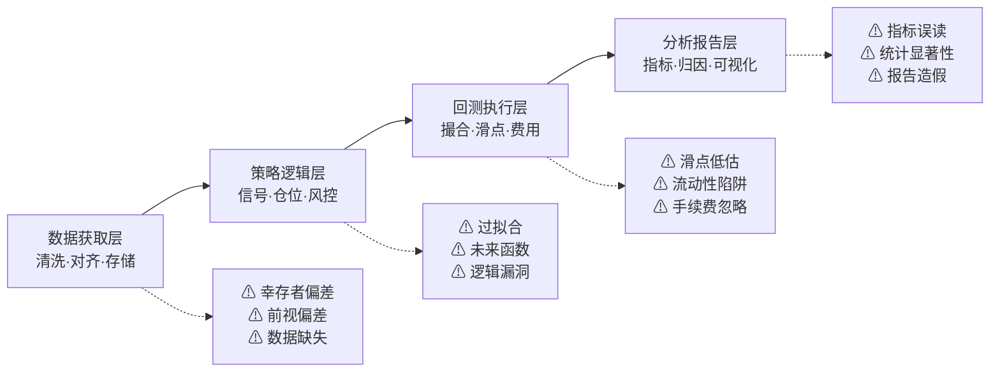

# 第三十课：构建稳健回测框架——从数据获取到报告生成的最佳实践

好，终于到了最后一课。

说实话，写这个系列的过程中，我一直在想一个问题：**我们学了这么多陷阱，到底怎么才能一次性避开它们？**

答案其实很简单——**把避坑逻辑固化到框架里**。别靠人脑记，靠系统管。

这一章，我就把前面29课的所有陷阱，浓缩成一张检查清单。再配上自动化工具的思路。你拿去就能用。

## 一、回测框架的核心架构

先看整体结构。我个人习惯把回测框架拆成四个模块：

> **数据层 → 策略层 → 执行层 → 分析层**

每个模块都有对应的陷阱。我画了张图，你看一眼就明白了。



> **核心原则：每一层都要有"防呆设计"——让错误无法通过**

嗯，这张图我反复改了三版。你仔细看，每个模块下面都列了对应的陷阱。这就是我们这30课的核心脉络。

## 二、全陷阱检查清单

下面这张表，是我从实战中一条条抠出来的。你打印出来贴在工位上，每次跑回测前过一遍。

| 模块 | 陷阱编号 | 陷阱名称 | 检查方法 | 自动化工具 |
| --- | --- | --- | --- | --- |
| 数据层 | D01 | 幸存者偏差 | 对比退市股票列表 | 数据源校验脚本 |
| 数据层 | D02 | 前视偏差 | 检查时间戳是否严格对齐 | 时间戳排序检测 |
| 数据层 | D03 | 数据缺失 | 统计连续缺失天数 | 缺失值报告生成器 |
| 数据层 | D04 | 复权错误 | 对比复权前后收益率 | 复权一致性测试 |
| 策略层 | S01 | 过拟合 | 交叉验证 + 夏普比衰减 | 参数敏感性分析 |
| 策略层 | S02 | 未来函数 | 逐行检查数据引用 | 未来函数检测器 |
| 策略层 | S03 | 逻辑漏洞 | 单元测试覆盖 | pytest 自动化测试 |
| 执行层 | E01 | 滑点低估 | 模拟不同滑点水平 | 滑点敏感性测试 |
| 执行层 | E02 | 流动性陷阱 | 检查成交量和持仓量 | 流动性过滤器 |
| 执行层 | E03 | 手续费忽略 | 对比净收益与毛收益 | 费用计算模块 |
| 分析层 | A01 | 指标误读 | 计算多个互补指标 | 多指标仪表盘 |
| 分析层 | A02 | 统计显著性不足 | Bootstrap 检验 | 显著性测试脚本 |
| 分析层 | A03 | 报告造假 | 核对原始交易记录 | 交易流水审计 |

> **💡 我的习惯：** 每次跑回测前，先跑一遍这个清单的自动化脚本。大概30秒出结果。如果任何一项标红，我就停下来修，绝不硬跑。

## 三、自动化工具链搭建

光有清单还不够。你想想看，如果每次都要手动检查，迟早会漏掉。

所以我把这些检查全部写成了自动化脚本。核心思路就一句话：**让机器替你做那些重复的、容易出错的事**。

### 3.1 数据质量检查器

```python
# 伪代码示例：数据质量检查器
def check_data_quality(df):
    issues = []

    # 检查幸存者偏差
    if 'delisted' not in df.columns:
        issues.append('⚠ 缺少退市标记，可能存在幸存者偏差')

    # 检查前视偏差
    if df['timestamp'].is_monotonic_increasing == False:
        issues.append('⚠ 时间戳未严格递增，可能存在前视偏差')

    # 检查缺失值
    missing_pct = df.isnull().mean()
    if missing_pct.max() > 0.05:
        issues.append(f'⚠ 缺失率最高达 {missing_pct.max():.2%}')

    return issues
```

这段代码我用了三年了。每次换数据源，第一件事就是跑它。有一次它帮我抓到了一个数据商提供的「假复权」数据——那批数据里居然有未来价格信息。要不是这个检查器，我可能就拿着错误数据跑出个「完美策略」了。

### 3.2 回测结果验证器

```python
# 伪代码示例：回测结果验证
def validate_backtest(result):
    checks = []

    # 检查夏普比是否异常高
    if result['sharpe'] > 3.0:
        checks.append('⚠ 夏普比超过3，请检查是否存在未来函数')

    # 检查最大回撤是否合理
    if result['max_drawdown'] < 0.02:
        checks.append('⚠ 最大回撤小于2%，可能数据有问题')

    # 检查交易次数
    if result['trade_count'] < 10:
        checks.append('⚠ 交易次数过少，统计意义不足')

    return checks
```

> **⚠ 注意：** 这些检查不是万能的。它们只能帮你拦住「明显有问题」的情况。真正的逻辑漏洞，还得靠人脑判断。我见过有人把检查器全关了，就为了跑出一个漂亮的回测曲线——那是在骗自己。

## 四、报告生成的最佳实践

报告不是写给别人看的，是写给自己复盘用的。我见过太多人只关注「收益率」三个字，其他指标一概不看。

我个人习惯，一份合格的报告至少包含以下内容：

1. **基础指标**：年化收益率、夏普比、最大回撤、胜率
2. **风险指标**：VaR、CVaR、下行标准差
3. **归因分析**：收益来源拆解（择时 vs 选股）
4. **敏感性分析**：参数变化对结果的影响
5. **对比基准**：与基准指数的超额收益
6. **交易记录**：每一笔交易的详细流水

我曾经犯过一个错：只看夏普比，觉得策略很牛。结果后来发现，那点收益全靠几次运气好的交易撑起来的。剩下的几百笔交易全是亏的。从那以后，我强制自己在报告里加上「收益分布图」和「逐笔交易盈亏表」。

## 五、最后的建议

好了，30课的内容，到这里就全部结束了。

说实话，量化交易这条路，坑比机会多。但只要你把框架搭稳了，把检查做全了，那些坑就伤不到你。

记住一句话：**回测的唯一目的，是发现策略的弱点，而不是证明策略的完美**。

嗯，就这些。祝你在实盘里，也能像回测一样稳健。

---

> **📋 行动清单：**
>
> 1. 把本章的检查清单打印出来，贴在工位上
> 2. 花一天时间，把自动化检查脚本写出来
> 3. 每次跑回测前，强制自己先跑一遍检查
> 4. 报告里必须包含「风险指标」和「归因分析」
> 5. 永远保留原始交易记录，方便审计

---


