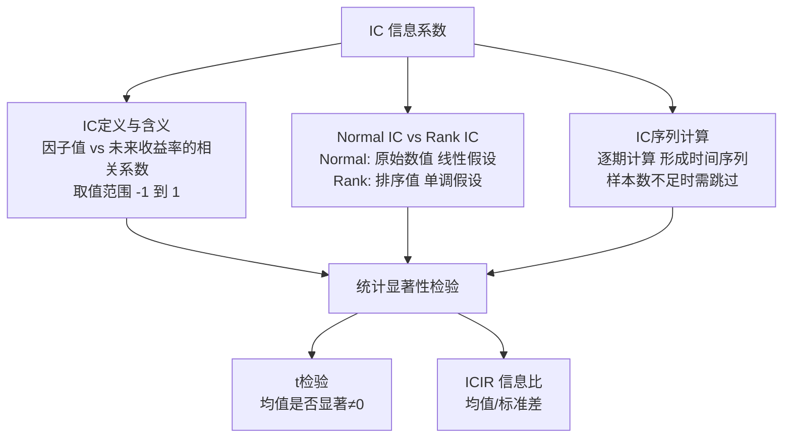

# 第四课：单因子分析基础——IC（信息系数）定义、Rank IC与Normal IC、IC序列计算、IC的统计显著性检验

各位同学，欢迎来到因子挖掘实战的第四课。

前几节课我们聊了因子数据的预处理，那都是「做饭前的洗菜切菜」。今天这堂课，咱们要正式开火了——怎么判断一个因子到底有没有用？

说白了，就是看这个因子跟未来的收益率有没有关系。而衡量这个关系的核心指标，就是 **IC（信息系数）**。

我个人习惯把 IC 叫做「因子的照妖镜」。一个因子好不好，拉出来溜溜，IC 值一算，心里就有数了。

## 1. IC的定义：到底在衡量什么？

IC，全称 Information Coefficient，信息系数。

它的数学定义很简单：**因子值 与 未来一期收益率 之间的相关系数**。

你想想看，如果因子值高的股票，未来涨得也好；因子值低的股票，未来跌得也多。那这个因子就是正向有效的。反之，如果因子值高的股票反而跌，那就是反向有效。

IC 值就在 [-1, 1] 之间波动：

- **IC > 0**：正向预测能力。因子值越大，未来收益越高。
- **IC < 0**：反向预测能力。因子值越小，未来收益越高（可以取反使用）。
- **IC = 0**：纯纯的随机噪声，跟抛硬币没区别。

> **重要经验：** 我见过很多新手看到 IC=0.05 就觉得因子不错。其实在 A 股市场，IC 绝对值超过 0.03 就算有微弱信号了。但别高兴太早，单期 IC 高不代表稳定，后面我们会讲 IC 序列。

## 2. Rank IC 与 Normal IC：两种不同的视角

这里有个坑，很多初学者会踩。IC 其实分两种：**Normal IC（皮尔逊相关系数）** 和 **Rank IC（斯皮尔曼秩相关系数）**。

**Normal IC**：直接用因子值和收益率的原始数值算相关系数。它假设两者是线性关系，而且对异常值非常敏感。

我在项目中遇到过，一个因子本来挺好的，结果某天有个股票因为停牌复牌，收益率爆了个100%，Normal IC 直接被打到负数。你说冤不冤？

**Rank IC**：先把因子值和收益率都排个名，然后用排名去算相关系数。它不关心具体数值，只关心「排序」对不对。

| 对比维度 | Normal IC | Rank IC |
| --- | --- | --- |
| 计算方式 | 原始数值的皮尔逊相关系数 | 排序后的斯皮尔曼相关系数 |
| 对异常值敏感度 | 非常敏感 | 不敏感 |
| 假设条件 | 线性关系 | 单调关系（不要求线性） |
| 实际应用 | 较少使用 | 业界主流标准 |

> **我的建议：** 做因子分析时，优先看 Rank IC。它更稳健，也更符合量化选股的逻辑——我们做多因子选股，本质上就是在做「排序」。

## 3. IC序列的计算：从单期到多期

单期的 IC 值就像一张照片，只能看到某个时刻的样子。但因子是否稳定，得看一段时间的「视频」——也就是 **IC 序列**。

IC 序列的计算步骤很简单：

1. 确定回测区间（比如2020年1月到2024年12月）
2. 在每个调仓日（比如每月末），计算当期的因子值
3. 计算未来一期（比如下个月）的收益率
4. 计算这两者的 Rank IC
5. 重复步骤2-4，得到一串 IC 值，就是 IC 序列

下面我给大家展示一段 Python 代码，这是我在实际项目中常用的计算方式：

```python
import pandas as pd
import numpy as np
from scipy.stats import spearmanr

def calc_rank_ic_series(factor_df, return_df, freq='M'):
    """
    计算Rank IC序列
    factor_df: 因子值DataFrame，index为日期，columns为股票代码
    return_df: 未来一期收益率DataFrame，格式同上
    """
    ic_list = []
    dates = factor_df.index

    for i, date in enumerate(dates):
        # 获取当期因子值和未来收益率
        factor_values = factor_df.loc[date].dropna()
        future_returns = return_df.loc[date].dropna()

        # 取交集
        common_stocks = factor_values.index.intersection(future_returns.index)
        if len(common_stocks) < 30:  # 样本太少时跳过
            continue

        fv = factor_values[common_stocks]
        fr = future_returns[common_stocks]

        # 计算Rank IC
        rank_ic, p_value = spearmanr(fv, fr)
        ic_list.append({
            'date': date,
            'rank_ic': rank_ic,
            'p_value': p_value
        })

    ic_series = pd.DataFrame(ic_list).set_index('date')
    return ic_series

# 使用示例
# ic_series = calc_rank_ic_series(factor_data, forward_returns)
# print(ic_series.head())
```

> **注意：** 代码中我加了一个判断——样本数少于30只股票时跳过。为什么？因为样本太少算出来的相关系数没有统计意义，纯粹是噪声。我曾经吃过这个亏，回测时某个月只有20只股票有数据，算出来的 IC 高达0.8，结果下个月直接打回原形。

## 4. IC的统计显著性检验：别被运气骗了

算出了 IC 序列，接下来要问一个问题：**这个 IC 是真实有效的，还是纯属巧合？**

这就涉及到统计显著性检验了。常用的方法有两种：

### 4.1 t检验法

把 IC 序列当成一组样本，检验它的均值是否显著不为0。

- 原假设 H0：IC 的均值 = 0（因子无效）
- 备择假设 H1：IC 的均值 ≠ 0（因子有效）

如果 p 值小于0.05，我们就说因子在统计上显著有效。

### 4.2 ICIR（信息比）

ICIR = IC 的均值 / IC 的标准差

这个指标衡量的是「单位风险下的超额收益」。ICIR 越高，说明因子越稳定。

我个人习惯把 ICIR 大于0.5的因子称为「靠谱因子」，大于1.0的称为「明星因子」。

```python
def ic_significance_test(ic_series):
    """
    IC显著性检验
    """
    from scipy import stats

    ic_values = ic_series['rank_ic'].dropna()

    # t检验
    t_stat, p_value = stats.ttest_1samp(ic_values, 0)

    # ICIR
    ic_mean = ic_values.mean()
    ic_std = ic_values.std()
    icir = ic_mean / ic_std if ic_std != 0 else 0

    # 胜率
    win_rate = (ic_values > 0).mean()

    results = {
        'IC均值': round(ic_mean, 4),
        'IC标准差': round(ic_std, 4),
        'ICIR': round(icir, 4),
        't统计量': round(t_stat, 4),
        'p值': round(p_value, 6),
        '胜率': round(win_rate, 4),
        '样本数': len(ic_values)
    }

    return results

# 输出示例
# {
#     'IC均值': 0.0421,
#     'IC标准差': 0.0853,
#     'ICIR': 0.4936,
#     't统计量': 4.2156,
#     'p值': 0.000032,
#     '胜率': 0.6250,
#     '样本数': 120
# }
```

> **解读示例：** 上面这个因子，IC 均值0.042，ICIR 接近0.5，p 值远小于0.05，胜率62.5%。这说明因子在统计上显著有效，而且稳定性还不错。嗯，这样的因子值得进一步研究。

## 5. 本章知识体系总览

为了让大家更直观地理解本章的知识结构，我画了一张流程图：



## 6. 实战中的几个坑

最后，分享几个我在实战中踩过的坑，希望能帮大家少走弯路：

- **幸存者偏差：** 计算 IC 时一定要用全市场数据，包括退市的股票。否则算出来的 IC 会虚高。
- **未来函数：** 确保因子值和收益率在时间上严格错开。因子值用的是 t 时刻的数据，收益率必须是 t+1 时刻的。
- **行业中性化：** 有些因子在特定行业天然有效（比如银行股的市净率），算 IC 时最好做行业中性化处理。
- **不要只看均值：** IC 均值高但波动大，说明因子不稳定。ICIR 比 IC 均值更能反映因子的真实质量。

> **一个小技巧：** 我习惯把 IC 序列画成折线图，再叠加一个累积 IC 曲线。如果累积 IC 曲线能稳定向上，说明因子有持续预测能力。如果像过山车一样上上下下，那就要小心了。

好了，关于 IC 的基础知识就讲到这里。记住一句话：**IC 是因子分析的起点，不是终点**。一个因子 IC 好，不代表它就能赚钱，后面我们还要做分组回测、多因子组合等等。

大家先把今天的内容消化一下，动手算算自己手上的因子 IC。
