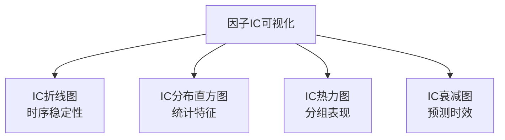

# 第五章 因子IC可视化：让数据自己说话

做因子挖掘，最怕什么？

最怕你辛辛苦苦算出一堆因子，结果不知道它到底有没有预测能力。我刚开始做量化那会儿，就吃过这个亏——算了几十个因子，回测曲线漂亮得不行，结果实盘一跑，直接翻车。

后来我才明白，**因子 IC 可视化**才是检验因子质量的照妖镜。今天咱们就把这四张图讲透：IC 折线图、IC 分布直方图、IC 热力图、IC 衰减图。

> **核心观点：** IC（Information Coefficient）就是因子值和未来收益的相关系数。正 IC 意味着因子值越大，未来收益越高；负 IC 则相反。可视化就是把这些数字变成你能一眼看懂的图形。

## 知识体系总览



## 5.1 IC折线图：看因子是否稳定

IC 折线图，说白了就是把每个时间点的 IC 值连成一条线。我习惯按月频来算，这样一年也就12个点，看起来清爽。

**怎么读这张图？**

- 如果线条大部分在0轴上方，说明因子有正向预测能力
- 如果线条上下乱窜，像心电图一样，那这因子基本废了
- 理想状态：稳定在0.05以上，偶尔负值但很快回正

> **我的经验：** 别只看均值。我曾经遇到一个因子，平均 IC 有0.08，但折线图一看，前两年都是正的，第三年突然变成负的。这种因子你敢用吗？反正我不敢。

```python
import pandas as pd
import numpy as np
import matplotlib.pyplot as plt

# 假设 factor_values 是因子值，forward_returns 是未来N日收益
def calc_ic_series(factor_values, forward_returns, dates):
    """
    计算每个时间点的截面IC
    """
    ic_list = []
    for date in dates:
        # 取当天的因子值和未来收益
        fv = factor_values.loc[date]
        ret = forward_returns.loc[date]
        # 去掉缺失值
        mask = fv.notna() & ret.notna()
        if mask.sum() < 30:  # 样本太少就不算
            continue
        ic = fv[mask].corr(ret[mask], method='spearman')
        ic_list.append({'date': date, 'IC': ic})

    ic_df = pd.DataFrame(ic_list)

    # 画图
    plt.figure(figsize=(12, 5))
    plt.plot(ic_df['date'], ic_df['IC'], color='#4a90d9', linewidth=2)
    plt.axhline(y=0, color='red', linestyle='--', alpha=0.5)
    plt.axhline(y=ic_df['IC'].mean(), color='green', linestyle='--',
                label=f'Mean IC: {ic_df["IC"].mean():.4f}')
    plt.title('IC Time Series')
    plt.legend()
    plt.show()

    return ic_df
```

## 5.2 IC分布直方图：看IC的统计特征

折线图看趋势，直方图看分布。我个人觉得，直方图能告诉你更多隐藏信息。

**重点关注三个指标：**

| 指标 | 含义 | 理想值 |
| --- | --- | --- |
| 均值 | IC 的平均水平 | 绝对值 > 0.02 |
| 标准差 | IC 的波动程度 | 越小越好 |
| IR | IC 均值 / IC 标准差 | > 0.5 |

> **注意：** IR（Information Ratio）比 IC 均值更重要。我曾经见过一个因子 IC 均值0.06，但标准差0.15，IR 只有0.4。这种因子在实盘中基本就是随机游走。

```python
def plot_ic_distribution(ic_series):
    """
    绘制IC分布直方图
    """
    ic_mean = ic_series.mean()
    ic_std = ic_series.std()
    ic_ir = ic_mean / ic_std if ic_std != 0 else 0

    plt.figure(figsize=(10, 6))
    plt.hist(ic_series, bins=30, color='#4a90d9', edgecolor='white', alpha=0.7)
    plt.axvline(x=ic_mean, color='red', linestyle='--',
                label=f'Mean: {ic_mean:.4f}')
    plt.axvline(x=0, color='gray', linestyle='-', alpha=0.5)
    plt.title(f'IC Distribution (IR={ic_ir:.3f})')
    plt.legend()
    plt.show()

    return {'mean': ic_mean, 'std': ic_std, 'ir': ic_ir}
```

## 5.3 IC热力图（分组）：看因子是否单调

这个图是我最看重的。它把股票按因子值分成 N 组（通常5组或10组），然后看每组未来的平均收益。

**理想情况：** 第1组收益最低，第5组收益最高，中间组依次排列。这就是所谓的**单调性**。

> **记住：** 单调性比 IC 绝对值更重要。一个 IC 只有0.03但单调性完美的因子，比一个 IC 有0.08但单调性混乱的因子靠谱得多。

```python
import seaborn as sns

def plot_ic_heatmap(factor_values, forward_returns, n_groups=5):
    """
    分组IC热力图
    """
    # 按因子值分组
    factor_values['group'] = pd.qcut(factor_values['factor'],
                                     q=n_groups, labels=False)

    # 计算每组平均收益
    group_returns = factor_values.groupby('group')['forward_return'].mean()

    # 画热力图
    plt.figure(figsize=(8, 6))
    sns.heatmap(group_returns.values.reshape(1, -1),
                annot=True, fmt='.4f', cmap='RdYlGn',
                xticklabels=[f'G{i+1}' for i in range(n_groups)],
                yticklabels=['Return'])
    plt.title('Group-wise Forward Returns')
    plt.show()

    # 检查单调性
    diffs = np.diff(group_returns.values)
    monotonic = all(diffs > 0) or all(diffs < 0)
    print(f'单调性: {"完美" if monotonic else "有问题"}')

    return group_returns
```

## 5.4 IC衰减图：看因子的预测时效

这个图很多人会忽略，但它特别重要。它回答一个问题：**你的因子能预测多久？**

做法很简单：算 T 日的因子值，分别和 T+1、T+2、...、T+N 日的收益算 IC，然后画成一条线。

**怎么读？**

- **快速衰减**：IC 在第1天很高，第2天就掉一半，第3天接近0。说明因子只能做短线
- **缓慢衰减**：IC 能维持5天以上。这种因子适合做中长线
- **先升后降**：有时候 IC 在第2天反而比第1天高。嗯，这种情况我遇到过，通常是数据泄露了

> **避坑指南：** 我曾经遇到一个因子，衰减图显示 IC 在第10天突然又变高了。一开始我还以为发现了什么神奇规律，后来一查，原来是未来函数没处理好。所以看到异常衰减曲线，先检查数据。

```python
def plot_ic_decay(factor_values, forward_returns_dict, max_lag=20):
    """
    IC衰减图
    forward_returns_dict: {lag: forward_returns_df}
    """
    ic_decay = []
    for lag in range(1, max_lag + 1):
        if lag not in forward_returns_dict:
            continue
        ret = forward_returns_dict[lag]
        # 计算截面IC
        ic = factor_values.corrwith(ret, axis=1).mean()
        ic_decay.append({'lag': lag, 'IC': ic})

    decay_df = pd.DataFrame(ic_decay)

    plt.figure(figsize=(10, 5))
    plt.plot(decay_df['lag'], decay_df['IC'], 'o-', color='#4a90d9')
    plt.axhline(y=0, color='red', linestyle='--', alpha=0.5)
    plt.xlabel('Prediction Horizon (days)')
    plt.ylabel('IC')
    plt.title('IC Decay Curve')
    plt.grid(True, alpha=0.3)
    plt.show()

    # 计算半衰期
    half_life = None
    initial_ic = decay_df['IC'].iloc[0]
    for _, row in decay_df.iterrows():
        if row['IC'] <= initial_ic / 2:
            half_life = row['lag']
            break

    print(f'IC半衰期: {half_life} 天')
    return decay_df
```

## 5.5 实战中的组合拳

这四张图，我建议你每次挖因子都跑一遍。顺序也很重要：

1. **先看 IC 折线图**——因子有没有持续预测能力？
2. **再看 IC 分布直方图**——IR 够不够高？
3. **然后看 IC 热力图**——单调性好不好？
4. **最后看 IC 衰减图**——能预测多久？

四张图都过关的因子，才值得你花时间去做回测。否则，趁早放弃，别浪费时间。

> **我的经验总结：** 挖了这么多年因子，我发现一个规律——好的因子往往在四张图上都表现不错，但不会在某一项上特别突出。那些 IC 均值0.15以上的因子，要么是过拟合，要么是数据泄露。记住，稳健比惊艳更重要。

好了，IC 可视化的内容就这些。你想想看，如果每次挖因子都按这个流程走一遍，是不是能少踩很多坑？至少我是这么过来的。
