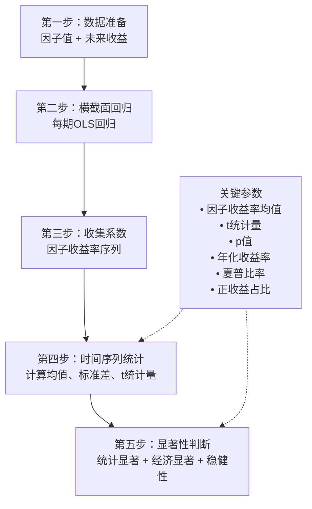

# 第七章 因子收益率：Fama-MacBeth回归入门

因子挖掘做到一定程度，你一定会问一个问题：**我挖出来的这个因子，到底能不能赚钱？**

嗯，这个问题很关键。光看 IC、IR 这些指标还不够，我们需要一个更直接的验证方式——**因子收益率**。说白了，就是看看这个因子在市场上实际能产生多少收益。

我个人习惯用 Fama-MacBeth 回归来做这件事。这个方法在学术圈用了快50年，实战中也非常靠谱。今天我们就把它讲透。

> **核心概念**：因子收益率 ≠ 因子值本身。因子收益率是因子值对未来收益的预测能力，通过回归系数来度量。

## 7.1 为什么需要Fama-MacBeth回归？

你可能会想：直接算因子值和未来收益的相关性不就行了？

我在项目中遇到过这个问题。简单相关性有两个硬伤：

- **截面相关性**：不同股票之间不是独立的，简单相关会高估显著性
- **时间序列自相关**：因子值本身有时间序列上的相关性，会干扰结果

Fama-MacBeth 回归就是来解决这两个问题的。它分两步走：

1. **第一步**：在每个时间截面上做横截面回归，得到每期的因子收益率
2. **第二步**：对多期的因子收益率做时间序列统计，计算均值和 t 统计量

这样做的好处是：先处理截面相关性，再处理时间序列自相关。说白了，就是把一个复杂问题拆成两个简单问题。

> **我的经验**：Fama-MacBeth 回归对异常值比较敏感。我一般会在回归前做 MAD 去极值，效果会好很多。

## 7.2 因子收益率计算：手把手实战

我们直接上代码。假设你已经有了因子数据和未来收益数据：

```python
import pandas as pd
import numpy as np
import statsmodels.api as sm
from scipy import stats

def fama_macbeth_regression(factor_df, return_df):
    """
    Fama-MacBeth回归计算因子收益率

    参数:
    factor_df: DataFrame, 因子值 (index=日期, columns=股票代码)
    return_df: DataFrame, 未来收益 (index=日期, columns=股票代码)

    返回:
    factor_returns: Series, 每期因子收益率
    t_stat: float, t统计量
    """

    # 第一步：每期横截面回归
    factor_returns = []

    for date in factor_df.index:
        # 获取当期数据
        x = factor_df.loc[date].values.reshape(-1, 1)
        y = return_df.loc[date].values

        # 去除缺失值
        mask = ~(np.isnan(x.flatten()) | np.isnan(y))
        x_clean = x[mask]
        y_clean = y[mask]

        if len(x_clean) < 30:  # 样本太少就跳过
            continue

        # 添加截距项
        X = sm.add_constant(x_clean)

        # OLS回归
        model = sm.OLS(y_clean, X).fit()

        # 保存因子收益率（回归系数）
        factor_returns.append(model.params[1])

    # 第二步：时间序列统计
    factor_returns = pd.Series(factor_returns, index=factor_df.index[:len(factor_returns)])

    # 计算t统计量
    mean_return = factor_returns.mean()
    std_return = factor_returns.std()
    n = len(factor_returns)
    t_stat = mean_return / (std_return / np.sqrt(n))

    return factor_returns, t_stat

# 使用示例
# factor_returns, t_stat = fama_macbeth_regression(factor_data, future_returns)
# print(f"因子收益率均值: {factor_returns.mean():.4f}")
# print(f"t统计量: {t_stat:.4f}")
```

这段代码的核心逻辑其实很简单：

- 对每个时间点，用因子值去预测未来收益
- 把每个时间点的回归系数收集起来
- 最后对这些系数做统计检验

> **注意**：回归前一定要做标准化处理。我见过有人直接用原始因子值做回归，结果系数小到没法看。标准化后，因子收益率才有可比性。

## 7.3 t统计量解读：到底多高才算高？

t 统计量是判断因子是否显著的关键指标。你想想看，它本质上是在问：**这个因子收益率，是真实存在的，还是随机波动造成的？**

实战中，我一般这样判断：

| t统计量范围 | 显著性水平 | 我的判断 |
| --- | --- | --- |
| \|t\| < 1.0 | 不显著 | 这个因子基本没用，放弃吧 |
| 1.0 ≤ \|t\| < 1.96 | 弱显著 | 可以继续观察，但别太当真 |
| 1.96 ≤ \|t\| < 3.0 | 显著 | 不错，这个因子有戏 |
| \|t\| ≥ 3.0 | 非常显著 | 恭喜，挖到宝了 |

为什么会用1.96这个阈值？因为对应的是95%置信水平。说白了，就是如果 t 统计量超过1.96，那么因子收益率有95%的概率不是随机产生的。

> **避坑指南**：我曾经遇到一个因子，t 统计量高达4.5，兴奋得不行。结果回测一看，原来是数据泄露了——我用到了未来信息。所以，t 统计量高不一定代表因子好，还要检查数据是否干净。

## 7.4 因子显著性判断：多维度验证

光看 t 统计量还不够。我建议从三个维度综合判断：

1. **统计显著性**：t 统计量是否超过阈值
2. **经济显著性**：因子收益率的大小是否有实际意义
3. **稳健性**：在不同子样本、不同时间段是否都显著

举个例子：

```python
def factor_significance_check(factor_returns, t_stat):
    """
    多维度因子显著性判断
    """
    # 1. 统计显著性
    stat_sig = abs(t_stat) > 1.96

    # 2. 经济显著性（年化因子收益率 > 2%）
    annual_return = factor_returns.mean() * 252
    econ_sig = annual_return > 0.02

    # 3. 稳健性（正收益月份占比 > 60%）
    positive_ratio = (factor_returns > 0).mean()
    robust_sig = positive_ratio > 0.6

    # 综合判断
    score = sum([stat_sig, econ_sig, robust_sig])

    if score == 3:
        result = "强烈推荐"
    elif score == 2:
        result = "可以考虑"
    else:
        result = "建议放弃"

    return {
        '统计显著': stat_sig,
        '经济显著': econ_sig,
        '稳健性': robust_sig,
        '综合评级': result
    }
```

我个人习惯用这个函数做快速筛选。三个维度都满足的因子，才值得投入更多精力去优化。

> **核心要点**：因子显著性判断不是非黑即白的。一个 t 统计量2.0的因子，如果经济意义很大，可能比 t 统计量3.0但收益微薄的因子更有价值。

## 7.5 本章知识体系

下面这张图展示了 Fama-MacBeth 回归的完整流程：



这张图把整个流程串起来了。从数据准备到最终判断，每一步都有明确的输入输出。我个人习惯在做因子研究时，把这张图贴在工位旁边，时刻提醒自己不要跳步。

> **我的建议**：刚开始做 Fama-MacBeth 回归时，先用模拟数据跑一遍。确保你理解每一步在做什么，再上真实数据。我曾经因为数据对齐问题，浪费了整整一周时间。

好了，这一章的内容就到这里。因子收益率计算和显著性判断是因子挖掘中最核心的技能之一。掌握了它，你就能科学地评估每个因子的价值，而不是凭感觉拍脑袋。
