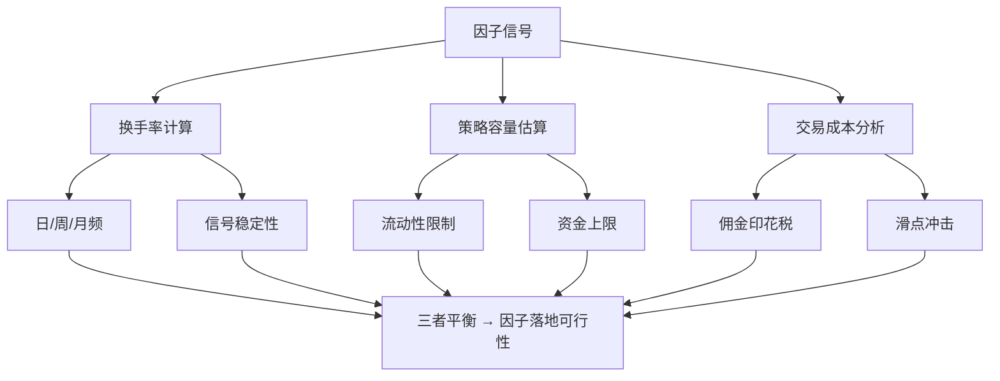

# 第八讲：换手率与容量——因子落地的最后一道坎

各位同学，今天咱们聊一个特别"现实"的话题。你挖出了一个夏普比2.5的因子，兴奋得睡不着觉。但一上实盘，收益曲线直接"躺平"。为什么？

说白了，你忽略了两个关键指标：**换手率**和**策略容量**。因子再漂亮，如果换手率太高、容量太小，那就是实验室里的花瓶，中看不中用。

我个人习惯，在因子挖掘的早期阶段，就会把这两个指标纳入评估体系。别等到回测跑完了才发现"哎呀，交易成本把收益吃光了"。

## 一、因子换手率计算

先问个问题：你的因子信号，多久变一次？

换手率，衡量的是因子持仓的变动频率。公式很简单：

```text
因子换手率 = (每日调仓股票数量) / (持仓股票总数) × 100%
```

举个例子。你选了100只股票，今天信号变了，有20只要换掉。那今天的换手率就是20%。

我在项目中遇到过一种情况：某个高频因子，日换手率高达80%。回测收益确实漂亮，年化30%。但一算交易成本，年化直接掉到5%。嗯，这就是典型的"纸上富贵"。

计算换手率时，我建议你按周或月统计平均值。因为单日换手率波动太大，容易误导人。

> **核心要点：** 因子换手率越低，对交易成本的容忍度越高。低频因子（月换手率 < 20%）通常更适合大资金。

## 二、策略容量估算

策略容量，说白了就是：你这套因子，最多能容纳多少钱？

容量估算的核心逻辑是：**你的交易量不能超过市场流动性的某个比例**。一般建议单日交易量不超过该股票日均成交量的5%。

公式长这样：

```text
策略容量 = Σ(持仓股票日均成交量 × 5%) / 换手率
```

举个例子。你持仓10只股票，每只日均成交量1亿。按5%算，每天最多能交易500万。如果因子月换手率是50%（即每月换一半仓位），那策略容量大约是：

```text
容量 = (10 × 1亿 × 5%) / (50% / 20个交易日) ≈ 20亿
```

你想想看，如果资金量超过20亿，你的交易就会开始影响市场价格，滑点会急剧上升。

> **避坑指南：** 我曾经犯过一个错误——只算了持仓股票的流动性，没算市场冲击成本。结果实盘时，大单直接把价格打飞了，成交均价远高于预期。记住：流动性是动态的，不是静态的。

## 三、交易成本对因子的影响

交易成本是因子收益的"隐形杀手"。它包括：

- **佣金**：券商收的，一般万分之一到万分之三
- **印花税**：国家收的，卖出时千分之一
- **滑点**：实际成交价和预期价的差异，这是大头
- **冲击成本**：大单交易导致的价格变动

我习惯用这个公式来估算净收益：

```text
净收益 = 因子收益 - 换手率 × 单边交易成本
```

假设你的因子年化收益20%，换手率200%（即每年换两遍仓），单边交易成本0.3%。那交易成本就吃掉：200% × 0.3% = 0.6%。看起来不多？但如果是高频因子，换手率2000%，那成本就是6%，收益直接打七折。

为什么会这样？因为高频因子赚的就是微小的价差，交易成本一高，利润全没了。

> **我的经验：** 在因子筛选阶段，我会先扣掉0.5%的单边交易成本做压力测试。如果扣完还能跑赢基准，这个因子才值得继续优化。

## 四、实际案例分析

讲个真实的案例。去年我帮一个私募朋友诊断因子库，发现有个因子叫"日内动量反转"。回测夏普比1.8，看起来很香。

但我一算换手率——日均换手率45%！也就是说，每天几乎一半的股票要换掉。策略容量呢？按5%流动性限制算，最多只能容纳3亿。

朋友说："我准备上10亿。"我直接摇头。

咱们来算笔账：

| 指标 | 回测值 | 实盘预估 |
| --- | --- | --- |
| 年化收益 | 25% | 15% |
| 换手率 | 45%/日 | 45%/日 |
| 单边成本 | 0.1% | 0.5%（含冲击） |
| 年化成本 | 22.5% | 112.5% |
| 净收益 | 2.5% | -97.5% |

看到没？回测里成本算低了，实盘冲击成本一上来，收益直接变负数。这就是为什么很多量化团队"回测猛如虎，实盘像只鼠"。

后来我建议他把因子改成周频调仓，换手率降到10%/周。虽然夏普比降到1.2，但容量扩大到20亿，净收益反而更稳定。

你想想看，是不是这个道理？有时候"降频"反而是最优解。

## 五、知识体系总览

下面这张图，是我自己梳理的因子落地评估框架。你可以把它当作一个检查清单：



这张图的核心逻辑是：**换手率、策略容量、交易成本三者相互制约**。你不可能同时做到"高收益、低换手、大容量"。必须根据资金规模和风险偏好，找到那个平衡点。

> 核心结论：低换手 + 大容量 + 低成本 = 实盘友好

好了，这一讲的内容就到这里。记住：因子挖掘不只是找信号，更是找"能落地"的信号。下次你挖到一个新因子，先问自己三个问题：换手率多少？容量多大？成本吃得消吗？
