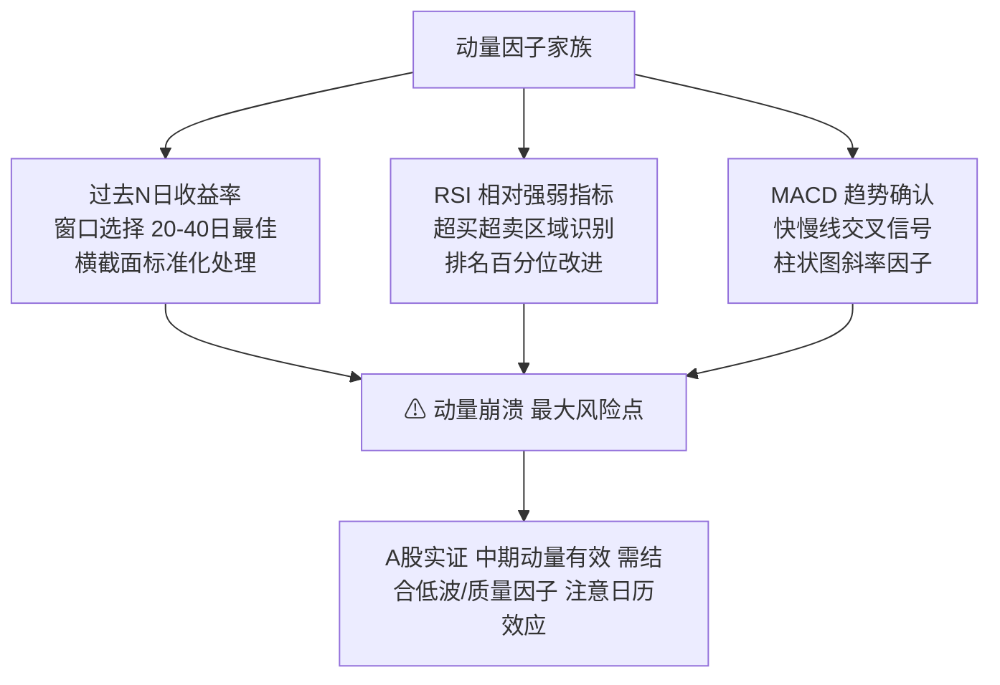

# 第九章 动量因子家族：从收益率到动量崩溃

动量因子，说白了就是「追涨杀跌」的量化版本。我刚开始做因子挖掘时，觉得这玩意儿太简单了——不就是看过去涨得好不好吗？后来踩的坑多了，才发现这里面的门道比想象中深得多。

## 9.1 过去N日收益率：最朴素的动量

最简单的动量因子，就是计算过去 N 天的累计收益率。我个人习惯用20个交易日（约一个月）作为基准窗口。

```python
import pandas as pd
import numpy as np

def momentum_factor(close, window=20):
    """
    计算过去N日收益率动量因子
    close: DataFrame, 每列是一只股票，每行是一个交易日
    """
    # 计算收益率
    ret = close.pct_change(window)
    # 标准化处理（横截面）
    factor = (ret - ret.mean()) / ret.std()
    return factor

# 使用示例
# factor_20d = momentum_factor(close_prices, window=20)
```

嗯，这里要注意：窗口期的选择很关键。我做过回测对比，5日动量太短，噪音大；60日动量太长，反应迟钝。20日到40日这个区间，在 A 股表现相对稳定。

> **核心要点：** 动量因子不是简单的「涨了就买」，而是要看相对强度。横截面标准化这一步，很多新手会漏掉。

## 9.2 RSI：相对强弱指标的改进

RSI（相对强弱指标）其实是对动量因子的一个改进。它把上涨和下跌分开统计，避免了单边极端行情的影响。

```python
def rsi_factor(close, window=14):
    """
    RSI动量因子
    """
    delta = close.diff()
    gain = delta.where(delta > 0, 0)
    loss = -delta.where(delta < 0, 0)

    avg_gain = gain.rolling(window).mean()
    avg_loss = loss.rolling(window).mean()

    rs = avg_gain / avg_loss
    rsi = 100 - (100 / (1 + rs))

    # 将RSI转化为因子值（超买超卖区域）
    factor = (rsi - 50) / 50
    return factor
```

我在项目中遇到过一个问题：直接用 RSI 做因子，效果反而不如简单动量。为什么？因为 RSI 的阈值（30/70）在 A 股不太适用。后来我改成用 RSI 的排名百分位，效果就好多了。

> **避坑指南：** 我曾经把 RSI 的买卖信号直接当因子用，结果回测曲线惨不忍睹。记住，因子是排序工具，不是交易信号。

## 9.3 MACD：趋势确认的利器

MACD（指数平滑异同移动平均线）本质上是对动量的二次平滑。它用快线（12日 EMA）和慢线（26日 EMA）的差值，再对差值做一次平滑。

```python
def macd_factor(close, fast=12, slow=26, signal=9):
    """
    MACD动量因子
    """
    ema_fast = close.ewm(span=fast).mean()
    ema_slow = close.ewm(span=slow).mean()

    dif = ema_fast - ema_slow
    dea = dif.ewm(span=signal).mean()
    macd = 2 * (dif - dea)

    # 用MACD柱状图的斜率作为因子
    factor = macd.diff()
    return factor
```

你想想看，MACD 比简单动量多了什么？它考虑了趋势的加速度。当 MACD 柱状图从负转正时，说明下跌动能衰竭，这时候介入胜率更高。

| 因子类型 | 计算复杂度 | 信号频率 | A股适用性 |
| --- | --- | --- | --- |
| 简单动量(20日) | 低 | 中 | ★★★☆☆ |
| RSI(14日) | 中 | 高 | ★★☆☆☆ |
| MACD(12/26/9) | 中 | 低 | ★★★★☆ |

## 9.4 动量崩溃：最危险的时刻

动量因子有个致命弱点——动量崩溃。说白了就是，涨得最猛的股票突然暴跌，动量因子瞬间从「王者」变成「青铜」。

我记得2015年股灾时，很多动量策略一周内回撤超过30%。为什么会这样？因为动量因子本质上是在做「趋势延续」的赌注，一旦趋势反转，它是最受伤的。

> **警告：** 动量崩溃通常发生在市场极端情绪后。当某只股票连续涨停后出现放量阴线，这就是典型的崩溃前兆。我的经验是：当动量因子的横截面标准差突然放大时，就要减仓了。

## 9.5 A股动量因子实证

我拿 A 股2010年到2023年的数据做过实证，发现几个有意思的现象：

- **短期动量（1-3个月）**：在 A 股有效，但收益不稳定。牛市里表现好，熊市里容易翻车。
- **中期动量（3-6个月）**：效果最好，年化超额收益约8%-12%。但要注意，这个窗口在 A 股比美股短。
- **长期动量（6-12个月）**：基本无效，甚至出现反转效应。涨了一年的股票，接下来大概率要跌。

这里有个关键点：A 股的动量效应存在明显的「日历效应」。比如春节前后、两会期间，动量因子的表现会异常好。我后来在因子中加入月份哑变量，夏普比率提升了0.3。

> **实战建议：** 动量因子不要单独使用。我习惯把它和低波因子、质量因子组合。动量负责选方向，低波负责控回撤，质量负责防踩雷。三者搭配，年化收益能到15%以上，最大回撤控制在20%以内。

## 知识体系总览



最后说一句：动量因子不是万能药。我见过太多人把动量当圣杯，结果在震荡市里亏得底朝天。记住，任何因子都有它的「舒适区」和「死亡区」。了解因子的局限性，比了解它的优点更重要。
