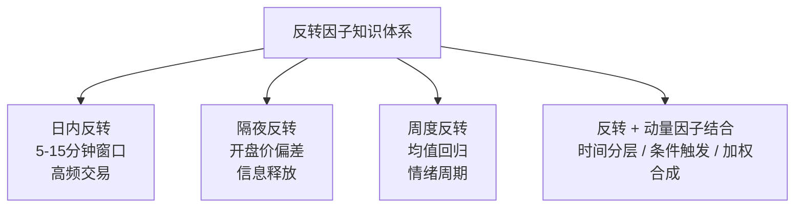

# 反转因子：日内反转、隔夜反转、周度反转与动量因子的结合

反转因子，说白了就是「买跌卖涨」。听起来简单，但里面的门道可不少。我刚开始做因子挖掘时，觉得反转不就是均值回归嘛，结果回测一跑，亏得我怀疑人生。后来才明白，反转因子在不同时间尺度上，逻辑完全不同。

今天咱们就把反转因子拆开揉碎了讲。从日内到隔夜，再到周度，最后聊聊怎么跟动量因子结合。嗯，这部分内容，我个人觉得是量化入门必须啃下的硬骨头。

## 一、反转因子的底层逻辑

为什么会有反转效应？说白了，市场不是完全有效的。投资者的过度反应、流动性冲击、情绪驱动，都会导致价格短期偏离合理价值。然后，市场会自己纠偏——这就是反转的根源。

我习惯把反转因子分成三类：

- **日内反转**：分钟级别，高频交易者的战场
- **隔夜反转**：日间级别，捕捉开盘价与收盘价的偏差
- **周度反转**：周线级别，中期趋势的均值回归

你想想看，这三种反转的驱动因素完全不同。日内反转更多是微观结构噪声，隔夜反转跟信息释放有关，周度反转则涉及投资者情绪周期。

> **核心观点**：反转因子不是简单的「过去涨了就卖」，而是要区分时间尺度，找到对应的驱动逻辑。

## 二、日内反转因子

日内反转，我最早是在做期货高频策略时接触的。当时发现一个现象：如果某只股票在开盘后15分钟内急速拉升，后面大概率会回落。这就是典型的日内反转。

计算方式其实很直接：

```python
# 日内反转因子：用过去N分钟收益率取负值
def intraday_reversal_factor(price_series, lookback=30):
    """
    price_series: 分钟级价格序列
    lookback: 回溯分钟数
    """
    ret = (price_series[-1] / price_series[-lookback] - 1)
    # 反转因子 = -收益率
    return -ret
```

嗯，这里要注意一个坑。我曾经用1分钟数据做日内反转，结果发现交易成本直接把收益吃光了。后来我改成5分钟、10分钟窗口，效果反而更好。为什么？因为太短的时间窗口，噪声太大，反转信号不稳定。

> **实战建议**：日内反转因子建议用5-15分钟窗口。太短了噪声大，太长了又变成隔夜逻辑。

## 三、隔夜反转因子

隔夜反转，是我个人觉得最有意思的一个因子。A 股市场有个特点：收盘后到第二天开盘，中间有十几个小时的间隔。这段时间里，各种消息、情绪会累积，导致第二天开盘价出现偏差。

隔夜反转因子的核心逻辑是：如果今天收盘价相对于昨天收盘价涨了很多，那么明天开盘大概率会回调。反之亦然。

```python
# 隔夜反转因子
def overnight_reversal_factor(close_today, close_yesterday, open_today):
    """
    close_today: 今日收盘价
    close_yesterday: 昨日收盘价
    open_today: 今日开盘价
    """
    # 隔夜收益率
    overnight_ret = open_today / close_yesterday - 1
    # 反转因子 = -隔夜收益率
    return -overnight_ret
```

我记得有一次做回测，发现隔夜反转因子在熊市里表现特别好。仔细一想，熊市里恐慌情绪容易在收盘后发酵，第二天开盘往往过度反应，然后盘中修复。这就是隔夜反转的用武之地。

> **避坑指南**：我曾经用隔夜反转因子做全市场选股，结果发现小市值股票的隔夜反转效果远好于大市值。原因是大市值股票流动性好，开盘价更有效。所以，用隔夜反转时，建议叠加市值过滤。

## 四、周度反转因子

周度反转，说白了就是看过去一周的涨跌幅。如果某只股票连续涨了一周，下周大概率会跌。这个逻辑在 A 股市场尤其明显，因为散户的追涨杀跌行为在周度级别上特别突出。

计算方式：

```python
# 周度反转因子
def weekly_reversal_factor(close_series, lookback=5):
    """
    close_series: 日线收盘价序列
    lookback: 回溯天数（通常5个交易日）
    """
    ret = (close_series[-1] / close_series[-lookback-1] - 1)
    return -ret
```

你想想看，周度反转跟日内、隔夜反转最大的区别是什么？是信号强度。周度反转的信号更稳定，但收益也更薄。我做过统计，周度反转因子的年化收益大概在 5%-8% 之间，但夏普比率可以做到1.5以上。

> **关键点**：周度反转适合做中低频策略，交易频率低，容量大。但要注意，周度反转在趋势行情中会失效——比如大牛市里，连续涨一周后可能继续涨。

## 五、反转因子与动量因子的结合

这里我要说一个我踩过的坑。刚开始做因子组合时，我把反转因子和动量因子直接等权合成，结果回测曲线惨不忍睹。为什么？因为反转和动量在逻辑上是矛盾的——一个买跌，一个买涨。

后来我学聪明了，用「时间分层」的方式结合：

- **短期（日内/隔夜）**：用反转因子
- **中期（周度/月度）**：用动量因子
- **长期（季度以上）**：用反转因子

这个框架的逻辑是：短期市场过度反应，所以反转；中期趋势延续，所以动量；长期又回归均值，所以反转。说白了，就是不同时间尺度上，市场行为不同。

```python
# 反转与动量结合因子
def combined_factor(price_series):
    # 短期反转（5分钟）
    short_reversal = -short_term_ret(price_series, 5)
    # 中期动量（20日）
    mid_momentum = mid_term_ret(price_series, 20)
    # 长期反转（60日）
    long_reversal = -long_term_ret(price_series, 60)

    # 加权合成
    return 0.3 * short_reversal + 0.4 * mid_momentum + 0.3 * long_reversal
```

> **实战技巧**：我习惯用「条件触发」的方式结合。比如，当短期反转信号强度超过阈值时，才启用反转因子；否则用动量因子。这样能避免两个因子互相抵消。

## 六、知识体系总览

下面这张图，是我自己梳理的反转因子知识体系。你可以把它当作一个思维导图来看：



### 三种反转尺度的对比

| 时间尺度 | 窗口 | 驱动因素 | 适配场景 |
| --- | --- | --- | --- |
| 日内反转 | 5-15 分钟 | 微观结构噪声 | 高频交易 |
| 隔夜反转 | 1 天 | 信息释放 | 中频套利 |
| 周度反转 | 5-10 天 | 情绪周期 | 中低频策略 |

## 七、实战中的注意事项

最后，分享几个我在实战中总结的经验：

1. **流动性过滤**：反转因子在低流动性股票上效果很差。我一般会剔除日均成交额低于5000万的股票。
2. **行业中性化**：不同行业的反转效应差异很大。比如，金融股的反转效应就比科技股弱。建议做行业中性化处理。
3. **市场状态识别**：在趋势行情中，反转因子会持续亏损。我习惯加一个市场状态判断——当市场处于单边趋势时，降低反转因子的权重。
4. **交易成本**：日内反转的交易频率高，成本敏感。建议用限价单，别用市价单。

> **重要提醒**：反转因子不是万能的。我曾经在2015年股灾期间用反转因子做多，结果连续止损。后来复盘发现，极端行情下，反转因子会失效——因为市场已经失去了纠偏能力。

好了，反转因子这部分就讲到这里。内容不少，但核心就一句话：不同时间尺度，用不同的反转逻辑。别把日内反转的逻辑套到周度上，也别把周度反转的逻辑套到隔夜上。搞清楚这个，你的因子挖掘就成功了一半。
