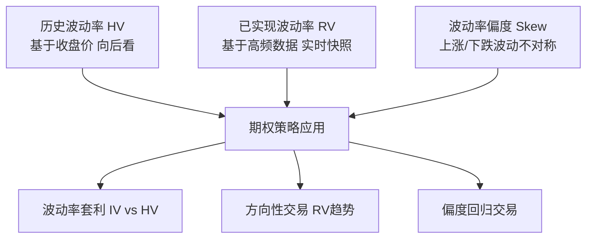

# 第十一章：波动率因子——从历史波动率到期权策略实战

波动率因子，说白了就是衡量资产价格"上蹿下跳"的程度。很多刚入行的朋友以为波动率就是标准差，其实远不止这么简单。我个人习惯把波动率因子分成三类：历史波动率、已实现波动率、波动率偏度。今天咱们就一个一个拆开讲，最后再聊聊怎么用在期权策略里。

## 一、历史波动率：最基础的"事后诸葛亮"

历史波动率（Historical Volatility, HV）是用过去的价格数据算出来的。它反映的是"过去一段时间，价格波动有多剧烈"。

计算公式很简单：

```text
HV = std(ln(P_t / P_{t-1})) * sqrt(252)
```

其中 `P_t` 是当日收盘价，`P_{t-1}` 是前一日收盘价。乘以 `sqrt(252)` 是为了年化——一年大概252个交易日。

> **核心要点：** 历史波动率是向后看的。它告诉你过去发生了什么，但没法预测未来。不过，很多量化策略正是利用"波动率聚集效应"——高波动之后往往跟着高波动，低波动之后往往跟着低波动。

我在项目中遇到过一个问题：用20日窗口算 HV，结果某只股票突然停牌复牌后跳空，HV 瞬间飙升。嗯，这里要注意——跳空缺口会导致对数收益率异常大，最好做一下异常值处理，比如用中位数替代法。

## 二、已实现波动率：高频数据的"实时快照"

已实现波动率（Realized Volatility, RV）跟 HV 不同，它用的是日内高频数据。比如每5分钟、每1分钟甚至每笔交易的收益率。

公式长这样：

```text
RV = sum(r_i^2)
```

其中 `r_i` 是第 i 个时间段的收益率。注意，这里用的是平方和，不是标准差。因为高频数据下，均值接近0，平方和直接近似于方差。

> **我的经验：** RV 比 HV 更敏感。如果你做的是日内交易策略，RV 是更好的选择。但要注意微观结构噪声——比如买卖价差、交易不活跃导致的零收益。我曾经用1分钟数据算 RV，结果发现很多股票在开盘和收盘时噪声特别大，后来改用5分钟数据就好多了。

你想想看，为什么 RV 比 HV 更"实时"？因为 HV 只用了每天的收盘价，而 RV 用了全天所有价格信息。说白了，RV 是"全息照片"，HV 是"每天拍一张照片"。

## 三、波动率偏度：捕捉"不对称"的波动

波动率偏度（Volatility Skew）这个概念，很多新手容易忽略。它衡量的是：上涨时的波动和下跌时的波动，是不是一样大？

计算方式：

```text
Skew = (RV_up - RV_down) / (RV_up + RV_down)
```

其中 `RV_up` 是上涨时段内的已实现波动率，`RV_down` 是下跌时段内的。

如果 Skew > 0，说明上涨时波动更大；Skew < 0，说明下跌时波动更大。大多数股票在熊市里 Skew 为负——跌起来比涨起来更猛。

> **避坑指南：** 我曾经用日线数据算偏度，结果发现效果很差。后来才意识到，偏度需要高频数据才能捕捉到。用日线算偏度，相当于用年历看天气——太粗糙了。

## 四、波动率因子在期权策略中的应用

期权交易里，波动率因子是核心中的核心。我把它总结成三个实战场景：

### 场景1：波动率套利

当隐含波动率（IV）显著高于历史波动率（HV）时，卖出期权；当 IV 显著低于 HV 时，买入期权。这个策略的核心假设是：IV 最终会向 HV 回归。

举个例子：某股票 HV=20%，但期权 IV=35%。这说明市场过度恐慌。你可以卖出跨式期权（Straddle），赚取波动率溢价。但要注意——如果股票突然暴涨或暴跌，IV 可能继续飙升，导致亏损。

### 场景2：波动率方向性交易

如果你预测未来波动率会上升，买入跨式期权；预测会下降，卖出跨式期权。这里的关键是预测波动率的方向，而不是价格方向。

我个人习惯用 RV 的移动平均线来判断趋势。比如 RV 的5日均线上穿20日均线，说明波动率在上升，可以考虑买入跨式。

### 场景3：波动率偏度交易

当偏度绝对值过大时，意味着市场对上涨和下跌的定价严重不对称。比如偏度-0.3，说明市场极度恐慌。这时可以卖出虚值看跌期权，买入虚值看涨期权——做多偏度回归。

> **实战要点：** 波动率因子不是孤立使用的。我一般会结合动量因子和市值因子一起看。比如小盘股在高波动环境下表现更好，大盘股在低波动环境下更稳。你想想看，这背后其实是资金流动的逻辑。

## 五、知识体系总览

下面这张图是我自己整理的波动率因子知识框架，建议你收藏起来：



> 核心逻辑：波动率具有聚集效应、均值回归特性、不对称性

## 六、实战代码片段

最后，给你一个 Python 代码片段，计算 HV、RV 和 Skew。这是我常用的模板：

```python
import numpy as np
import pandas as pd

def calc_hv(close, window=20):
    log_ret = np.log(close / close.shift(1))
    hv = log_ret.rolling(window).std() * np.sqrt(252)
    return hv

def calc_rv(high, low, close, window=20):
    # 使用Parkinson公式估算日内波动
    log_hl = np.log(high / low)
    rv = (log_hl ** 2) / (4 * np.log(2))
    rv = rv.rolling(window).mean() * np.sqrt(252)
    return rv

def calc_skew(returns, window=20):
    up_vol = returns[returns > 0].rolling(window).std()
    down_vol = returns[returns < 0].rolling(window).std()
    skew = (up_vol - down_vol) / (up_vol + down_vol)
    return skew
```

> **小提示：** 实际使用时，记得对极端值做截断处理。我一般用3倍中位数绝对偏差（MAD）来剔除异常点。另外，窗口大小的选择也很关键——短窗口敏感但噪声大，长窗口平滑但滞后。我个人习惯用20日和60日两个窗口做对比。

好了，波动率因子这块就聊到这儿。记住一句话：波动率不是风险本身，而是风险的"价格"。理解了这一点，你就能在期权市场里游刃有余。
