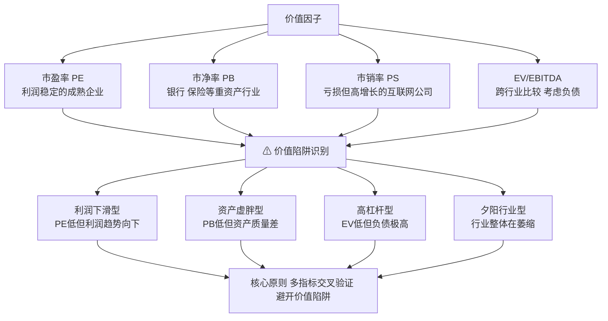

# 第十二章：价值因子——市盈率、市净率、市销率、企业价值倍数与价值陷阱识别

价值因子，说白了就是「捡便宜货」的策略。我刚开始做量化那会儿，觉得这玩意儿太简单了——找便宜的股票买不就完了？后来被市场狠狠教育了几次，才发现这里面的门道深着呢。

今天咱们就把市盈率、市净率、市销率、企业价值倍数这几个核心指标掰开揉碎，再聊聊怎么避开那些看似便宜、实则要命的价值陷阱。

## 12.1 市盈率（PE）——最常用的估值指标

市盈率是大家最熟悉的指标了。公式很简单：`PE = 股价 / 每股收益`。但你真的会用吗？

我个人习惯把市盈率分成三类：

- **静态市盈率**：用去年年报的利润算。优点是确定性强，缺点是滞后。
- **滚动市盈率（TTM）**：用最近四个季度的利润算。我一般用这个，时效性更好。
- **动态市盈率**：用预测的未来利润算。嗯，这个要小心，预测这东西...你懂的。

> **核心要点：** 市盈率低不代表就便宜。你得看利润质量。我在项目中遇到过一家公司，PE 只有5倍，看着便宜得离谱。结果一查，利润全是卖资产得来的，主营业务亏得一塌糊涂。这种「便宜」你敢捡吗？

用 Python 算市盈率其实很简单：

```python
import yfinance as yf

# 获取股票数据
stock = yf.Ticker('600519.SS')
info = stock.info

# 计算市盈率
pe_ttm = info['trailingPE']
pe_forward = info['forwardPE']

print(f'滚动市盈率: {pe_ttm:.2f}')
print(f'前瞻市盈率: {pe_forward:.2f}')
```

## 12.2 市净率（PB）——看家底的指标

市净率看的是净资产：`PB = 股价 / 每股净资产`。这个指标特别适合银行、保险这类重资产行业。

为什么？因为这些公司的资产容易估值。你想想看，银行的贷款、债券，账面价值基本能反映真实价值。但如果是互联网公司，净资产里主要是服务器和办公桌椅，那 PB 就没啥参考意义了。

我曾经踩过一个坑：某钢铁公司 PB 只有0.3倍，我以为是黄金坑。结果发现它的资产全是老旧高炉，按重置成本算根本不值钱。这就是典型的「账面价值虚高」问题。

> **实战技巧：** 用 PB 时，一定要看资产质量。我一般会结合 `ROE` 一起看——高 ROE + 低 PB，才是真正的便宜货。

## 12.3 市销率（PS）——利润为负时的救命稻草

有些公司利润是负的，PE 没法用。这时候 PS 就派上用场了：`PS = 股价 / 每股营业收入`。

我记得2019年看拼多多，利润还是负的，但 PS 一直在涨。很多人看不懂，觉得这公司要完。但如果你看 PS，会发现它的营收增速极快，PS 虽然高但趋势在下降。后来果然扭亏为盈，股价翻了好几倍。

PS 的局限性也很明显：它完全不考虑成本。营收再高，成本控制不好照样亏钱。所以 PS 更适合用在：

- 高速成长的互联网公司
- 零售、批发等薄利多销的行业
- 暂时亏损但市场份额在扩大的公司

## 12.4 企业价值倍数（EV/EBITDA）——最全面的估值指标

这个指标是我个人最喜欢的。它比 PE 更全面，因为它考虑了公司的负债和现金。

公式：`EV/EBITDA`

- **EV（企业价值）** = 市值 + 总负债 - 现金及等价物
- **EBITDA** = 息税折旧摊销前利润

为什么说它更全面？举个例子：两家公司 PE 都是10倍，但 A 公司负债率80%，B 公司负债率20%。你觉得哪个更便宜？

用 EV/EBITDA 一算就清楚了：A 公司的 EV 更高，因为要还债，所以实际估值比 B 公司贵。这个指标能帮你避开「高杠杆的假便宜」。

> **我的经验：** EV/EBITDA 在5-10倍之间，通常是比较合理的。低于3倍要小心——要么是行业周期底部，要么是公司有隐藏问题。高于15倍，除非是高速成长股，否则就偏贵了。

## 12.5 价值陷阱识别——别被「便宜」骗了

这部分是我最想讲的。我早期做因子挖掘时，最大的亏损就来自价值陷阱。你以为捡到了便宜货，结果是个无底洞。

常见的价值陷阱有这几种：

| 陷阱类型 | 特征 | 识别方法 |
| --- | --- | --- |
| 利润下滑型 | PE 低，但利润在快速下滑 | 看连续3年利润趋势，别只看当期 |
| 资产虚胖型 | PB 低，但资产质量差 | 看资产构成，关注商誉占比 |
| 高杠杆型 | EV/EBITDA 低，但负债极高 | 看资产负债率、利息覆盖倍数 |
| 夕阳行业型 | 所有指标都便宜，但行业在萎缩 | 看行业增速、技术替代风险 |

我曾经踩过最惨的一次：2015年买入某煤炭股，PE 只有4倍，PB 0.6倍，怎么看都便宜。结果呢？煤炭价格一路下跌，公司利润从盈利变成巨亏，股价腰斩再腰斩。这就是典型的「夕阳行业+利润下滑」双重陷阱。

> **避坑指南：** 遇到「便宜货」，先问自己三个问题：
>
> 1. 利润能持续吗？——看现金流，利润有没有真金白银支撑
> 2. 资产值这个价吗？——看资产质量，有没有大量应收账款或商誉
> 3. 行业还有未来吗？——看行业趋势，是不是在走下坡路
>
> 三个问题只要有一个答案是否定的，就别碰。

## 12.6 知识体系总览

下面这张图是我自己整理的，把价值因子的核心逻辑串起来了。你仔细看看，应该能一目了然。



嗯，这张图把今天讲的内容都串起来了。你想想看，从 PE、PB、PS 到 EV/EBITDA，每个指标都有自己的适用场景和局限性。真正的高手，从来不会只看一个指标就下结论。

我个人习惯是：先用 EV/EBITDA 做初步筛选，再用 PE 和 PB 做二次验证，最后用 PS 判断成长性。四个指标交叉验证，能过滤掉大部分价值陷阱。

好了，这一章的内容就到这儿。记住一句话：便宜没好货，好货不便宜。但在股市里，有时候好货也会被错杀——这才是价值投资的超额收益来源。
