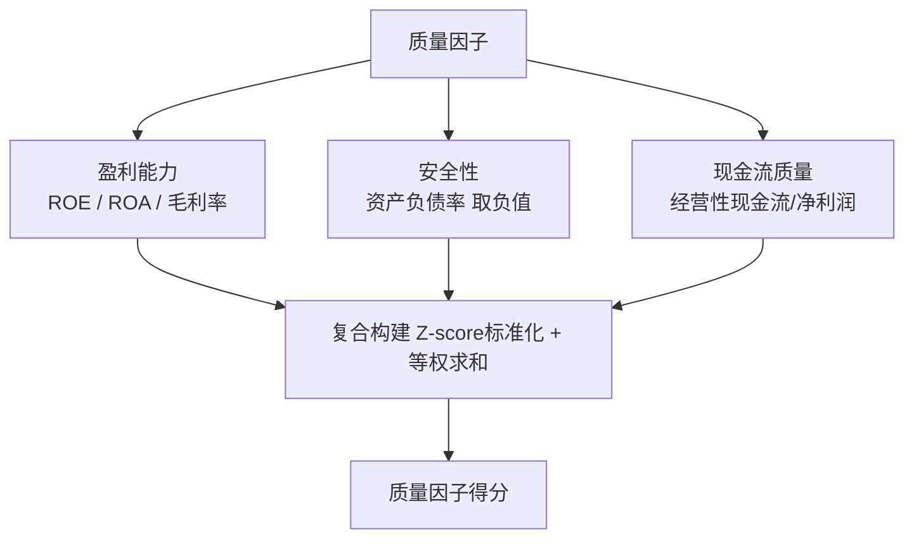

# 第十三章：质量因子——ROE、ROA、毛利率、资产负债率、现金流质量与复合构建

质量因子，说白了就是看一家公司「底子好不好」。

我刚开始做量化的时候，总喜欢追那些涨得猛的股票。结果呢？追进去就套牢。后来我反思，发现一个关键问题——我忽略了公司的基本面质量。一家公司如果赚钱能力不行、负债又高、现金流还差，股价涨得再欢，也迟早要还回去。

所以这一章，咱们就来聊聊质量因子。我会把 ROE、ROA、毛利率、资产负债率、现金流质量这几个核心指标拆开讲，最后再教你怎么把它们组合成一个复合因子。

## 13.1 为什么质量因子这么重要？

你想想看，买股票本质上就是买公司的一部分。如果公司本身质量差，你凭什么指望它给你赚钱？

质量因子的核心逻辑很简单：**好公司 = 高盈利 + 低负债 + 强现金流**。这三个维度缺一不可。

我在项目中遇到过一只股票，ROE 高达30%，看起来漂亮极了。但仔细一看，资产负债率超过80%，经营性现金流还是负的。这种公司，说白了就是「虚胖」。后来果然暴雷了。

> **核心观点：** 质量因子不是看单一指标，而是看多个维度的综合表现。单一指标再漂亮，也可能有陷阱。

## 13.2 ROE——股东回报的「照妖镜」

ROE（净资产收益率）是巴菲特最看重的指标之一。它的公式很简单：

```text
ROE = 净利润 / 净资产
```

ROE 衡量的是：每投入1块钱的股东权益，能赚回多少钱。一般来说，ROE 长期高于15%的公司，就算不错了。高于20%的，那就是优等生。

但这里有个坑——ROE 可以被杠杆放大。什么意思？

假设两家公司净利润都是1个亿。A 公司净资产10个亿，ROE=10%。B 公司净资产5个亿，但借了5个亿的债，ROE=20%。看起来 B 公司更厉害，但它的负债率更高，风险也更大。

所以，我一般会结合资产负债率一起看 ROE。如果 ROE 很高但负债率也高，那就要小心了。

> **我的习惯：** 用过去3-5年的平均 ROE，而不是只看一年。因为有些公司可能某一年靠卖资产把 ROE 做高了，这种不可持续。

## 13.3 ROA——资产利用效率的「试金石」

ROA（总资产收益率）和 ROE 有点像，但分母不同：

```text
ROA = 净利润 / 总资产
```

ROA 衡量的是：公司用所有资产（包括借来的钱）赚钱的能力。这个指标不受资本结构影响，更能反映公司真实的经营效率。

举个例子。两家公司净利润都是1个亿。A 公司总资产20个亿，ROA=5%。B 公司总资产10个亿，ROA=10%。很明显，B 公司的资产利用效率更高。

我个人习惯把 ROA 和 ROE 放在一起看。如果 ROE 很高但 ROA 很低，说明公司主要靠杠杆赚钱，风险较大。如果两者都高，那才是真正的好公司。

## 13.4 毛利率——护城河的「温度计」

毛利率是衡量公司产品竞争力的核心指标：

```text
毛利率 = (营业收入 - 营业成本) / 营业收入
```

毛利率越高，说明公司产品的定价权越强，护城河越深。比如茅台，毛利率常年90%以上，这就是品牌溢价。

但要注意，不同行业的毛利率差异很大。科技公司毛利率可能70%以上，零售公司可能只有20%。所以比较毛利率时，一定要在同行业里比。

我曾经踩过一个坑：看到一家公司的毛利率从30%突然涨到50%，以为是利好。结果仔细一看，是因为它把研发费用资本化了，导致成本降低。这种「假毛利率」很快就被打回原形了。

> **避坑指南：** 毛利率突然大幅提升，一定要查原因。如果是靠压缩成本或会计手段，那不可持续。如果是产品提价或结构升级，那才是真利好。

## 13.5 资产负债率——风险的「警报器」

资产负债率衡量的是公司的财务杠杆水平：

```text
资产负债率 = 总负债 / 总资产
```

这个指标越低，说明公司越安全。但也不是越低越好。如果一家公司完全没有负债，可能说明它过于保守，错失了发展机会。

一般来说，制造业的资产负债率在40%-60%比较合理。金融行业因为业务特性，负债率会更高。房地产行业则普遍在70%以上，但风险也大。

我个人的经验是：**资产负债率超过70%的公司，除非是行业特性，否则尽量避开**。尤其是那些负债率突然飙升的公司，很可能是在借新还旧，资金链随时可能断裂。

## 13.6 现金流质量——利润的「验钞机」

利润是纸面上的，现金流才是真金白银。很多公司账面利润很好看，但经营性现金流是负的，这种公司迟早要出问题。

现金流质量的核心指标是：

```text
经营性现金流 / 净利润
```

这个比值如果大于1，说明赚到的利润都变成了真金白银。如果小于1，说明利润可能只是应收账款或存货，并没有真正到账。

我记得有一次，一家公司净利润增长了50%，股价大涨。但我一看经营性现金流，居然是负的。后来发现，它为了冲业绩，大量赊销给客户，钱根本没回来。半年后，坏账爆发，股价腰斩。

> **我的原则：** 经营性现金流/净利润连续3年小于0.8的公司，直接排除。利润可以造假，现金流很难。

## 13.7 质量因子的复合构建

单一指标都有局限性，所以我们需要把多个指标组合起来，构建一个复合质量因子。

下面是我常用的构建方法：

### 13.7.1 数据准备

首先，我们需要获取以下数据：

- ROE（过去3年平均）
- ROA（过去3年平均）
- 毛利率（最新年报）
- 资产负债率（最新年报，取负值，因为越低越好）
- 经营性现金流/净利润（过去3年平均）

### 13.7.2 标准化处理

不同指标的量纲不同，需要先做标准化。我习惯用 Z-score 标准化：

```text
Z = (X - μ) / σ
```

其中 μ 是行业均值，σ 是行业标准差。这样处理后，每个指标都变成了相对位置，可以在不同行业间比较。

### 13.7.3 复合打分

标准化后，把五个指标的 Z-score 加起来，就得到了复合质量因子得分：

```text
质量因子得分 = Z(ROE) + Z(ROA) + Z(毛利率) + Z(-资产负债率) + Z(现金流质量)
```

得分越高，说明公司质量越好。

> **我的经验：** 权重可以调整。如果更看重盈利能力，可以把 ROE 和 ROA 的权重调高。如果更看重安全性，可以把资产负债率的权重调高。我一般用等权，简单有效。

### 13.7.4 代码实现

下面是一个简单的 Python 实现：

```python
import pandas as pd
import numpy as np

def calculate_quality_factor(df):
    """
    df: 包含以下列的DataFrame
        - roe: ROE
        - roa: ROA
        - gross_margin: 毛利率
        - debt_ratio: 资产负债率
        - cash_flow_quality: 经营性现金流/净利润
    """
    # 对资产负债率取负值
    df['debt_ratio_neg'] = -df['debt_ratio']

    # 定义需要标准化的列
    cols = ['roe', 'roa', 'gross_margin', 'debt_ratio_neg', 'cash_flow_quality']

    # Z-score标准化
    for col in cols:
        mean = df[col].mean()
        std = df[col].std()
        df[col + '_z'] = (df[col] - mean) / std

    # 复合得分
    df['quality_score'] = df[[col + '_z' for col in cols]].sum(axis=1)

    return df
```

## 13.8 质量因子的知识体系

为了让你更直观地理解质量因子的构建逻辑，我画了一张图：



### 三大维度与子指标

| 维度 | 子指标 | 方向 |
| --- | --- | --- |
| 盈利能力 | ROE（3年平均）| 越高越好 |
| 盈利能力 | ROA（3年平均）| 越高越好 |
| 盈利能力 | 毛利率（最新）| 越高越好 |
| 安全性 | 资产负债率（最新）| 取负值，越低越好 |
| 现金流 | 经营现金流/净利润（3年平均）| 越高越好 |

## 13.9 实战中的注意事项

最后，分享几个我在实战中总结的经验：

1. **行业中性化很重要。** 不同行业的质量因子分布差异很大。比如银行股资产负债率普遍高，但你不能因此就说它质量差。所以一定要做行业中性化处理。
2. **时间窗口要选对。** 我一般用过去3年的数据，太短容易受偶然因素影响，太长又可能包含过时信息。
3. **警惕财务造假。** 有些公司会通过会计手段美化质量指标。比如把费用资本化来提高毛利率，或者通过关联交易虚增利润。遇到异常值，一定要深挖原因。
4. **复合因子不是万能的。** 质量因子选出来的公司，往往是大盘蓝筹股，成长性可能一般。如果你追求高成长，可能需要结合其他因子。

> **我曾经犯过的错：** 有一年我用质量因子选股，选出来的全是银行和白酒。结果那年市场风格是炒小盘股，我的组合跑输了基准。后来我学会了——质量因子适合做底仓，但不能全仓押注。

好了，质量因子就聊到这里。记住，好公司不等于好股票，但好公司至少让你睡得安稳。下一章，我们会聊另一个重要的基本面因子——成长因子。到时候见。
