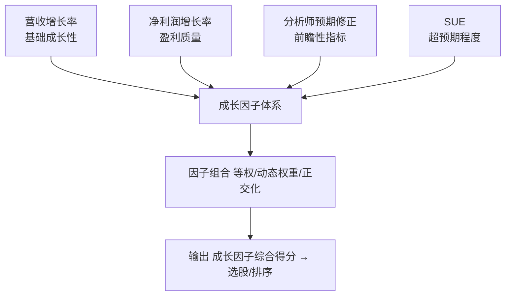

# 第十四章 成长因子：营收增长率、净利润增长率、分析师预期修正、SUE

成长因子，说白了就是找那些"正在变好"的公司。

我刚开始做量化那会儿，总觉得成长因子太简单——不就是看增速吗？后来踩过坑才明白，这里面的门道深着呢。今天咱们就把营收增长率、净利润增长率、分析师预期修正、SUE 这四个核心指标掰开揉碎讲清楚。

## 14.1 营收增长率：最朴素的成长信号

营收增长是公司成长的"原动力"。没有营收增长，其他都是空中楼阁。

**计算公式：**

```text
营收增长率 = (本期营收 - 上期营收) / |上期营收|
```

我个人习惯用同比数据，也就是和去年同一季度比。为什么？因为环比受季节性影响太大。你想想看，一家零售公司四季度营收肯定比一季度高，但这不代表它成长了。

> **实战技巧：** 我一般会同时看三个时间窗口——单季度、TTM（滚动12个月）、以及3年复合增长率。单季度看短期爆发力，TTM 看趋势，3年复合看稳定性。
>
> **避坑指南：** 我曾经遇到过一个案例，某公司营收增长率连续5个季度超过50%，结果第六季度突然暴雷。后来一查，原来是靠收购并表撑起来的。所以啊，**一定要区分内生增长和外延增长**。

## 14.2 净利润增长率：盈利质量才是王道

营收增长是面子，净利润增长才是里子。

**计算公式：**

```text
净利润增长率 = (本期净利润 - 上期净利润) / |上期净利润|
```

这里有个坑——当上期净利润为负时，增长率会变得毫无意义。比如上期亏100万，本期亏50万，按公式算出来是50%的增长，但公司其实还在亏损。所以我会额外加一个条件：**只有当上期净利润为正时，才使用这个指标**。

> **核心观点：** 净利润增长率要和营收增长率配合着看。如果营收增长20%，净利润增长50%，说明利润率在提升，这是好现象。反过来，营收增长20%，净利润只增长5%，那就要警惕了——是不是成本失控了？

我记得有一次做因子回测，发现单纯用净利润增长率选股，效果并不理想。后来把营收增长率和净利润增长率做个差值，反而得到了一个不错的 alpha 因子。这个思路大家可以试试。

## 14.3 分析师预期修正：市场预期的"风向标"

这个因子很有意思。它不看你过去赚了多少，而是看**分析师们怎么调整对未来的预期**。

**核心逻辑：** 分析师上调盈利预测，通常意味着公司基本面在改善。而且这种调整往往具有"惯性"——上调之后还会继续上调。

**常见的量化方式：**

```text
# 分析师预期修正因子
# 计算最近3个月分析师上调/下调的比例
upgrade_ratio = 上调次数 / (上调次数 + 下调次数)

# 或者用预期盈利的变化率
eps_revision = (最新一致预期 - 3个月前一致预期) / |3个月前一致预期|
```

> **注意：** 分析师预期数据有滞后性。我做过统计，从分析师发布报告到数据入库，平均有3-5天的延迟。所以用这个因子时，最好做一下"新鲜度"处理——越新的报告权重越高。

我曾经用这个因子做过一个策略，效果出奇的好。但后来发现一个问题——小市值股票的分析师覆盖太少，数据质量很差。所以建议**只用在市值前50%的股票上**。

## 14.4 SUE（标准化意外盈利）：超预期的力量

SUE，全称是 Standardized Unexpected Earnings。它衡量的是**实际盈利超出预期的程度**。

**计算公式：**

```text
SUE = (实际EPS - 预期EPS) / 预期EPS的标准差
```

为什么要除以标准差？因为不同股票的预期误差范围不一样。有的股票分析师预测很准，偏差0.01元就算超预期；有的股票预测误差大，偏差0.1元可能也只是正常波动。标准化之后，大家就在同一个尺度上比较了。

**SUE 的经典用法：**

1. **事件驱动策略：** 财报发布后，买入 SUE 最高的股票，持有5-20个交易日
2. **截面选股：** 在每个财报季，选择 SUE 排名前20%的股票构建组合
3. **结合其他因子：** SUE + 低波动，SUE + 动量，效果往往更好

> **我的经验：** SUE 因子在 A 股的有效性比美股更强。原因可能是 A 股散户占比高，对财报信息的反应不够充分，给了我们更多的套利空间。但要注意，**SUE 的衰减速度很快**，一般持有超过一个月，超额收益就基本消失了。

## 14.5 四个因子的组合使用

单独用任何一个因子，效果都有限。真正的威力在于组合。

**我常用的组合方式：**

| 因子 | 权重 | 说明 |
| --- | --- | --- |
| 营收增长率 | 25% | 基础成长性，门槛指标 |
| 净利润增长率 | 25% | 盈利质量，排除"增收不增利" |
| 分析师预期修正 | 20% | 市场预期变化，前瞻性指标 |
| SUE | 30% | 超预期程度，事件驱动 |

嗯，这里要注意一点——**因子之间可能有共线性**。比如净利润增长率和 SUE，它们都包含了盈利信息。所以组合之前，最好做个相关性分析，把相关性过高的因子做正交化处理。

> **一个简单的正交化方法：** 先用净利润增长率对 SUE 做回归，取残差作为"纯净的 SUE 因子"。这样既能保留 SUE 的信息，又去掉了和净利润增长率重叠的部分。

## 14.6 成长因子的知识体系

下面这张图，是我自己梳理的成长因子知识框架。你看一眼就能明白这四个因子之间的关系。



### 注意事项

- 内生增长 vs 外延增长
- 因子衰减速度
- 数据新鲜度
- 小市值覆盖不足
- 共线性处理

从这张图你能看到，四个因子从不同角度刻画成长性。营收和净利润是"过去式"，分析师预期修正是"现在进行时"，SUE 则是"超预期程度"。把它们组合起来，就能得到一个比较完整的成长因子画像。

好了，成长因子这部分就讲到这里。记住一句话：**成长因子不是万能的，但没有成长因子是万万不能的**。在 A 股这个以成长为主旋律的市场里，掌握好这四个因子，你就已经跑赢了大多数人。
