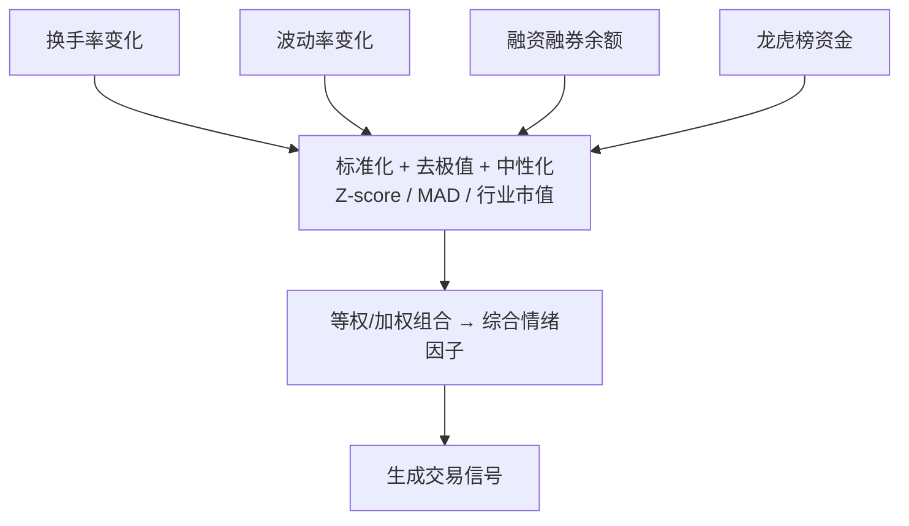

# 第十五章 情绪因子：换手率变化、波动率变化、融资融券余额、龙虎榜资金流向、舆情因子初探

聊到情绪因子，我得先跟你交个底——这玩意儿是我入行第三年才真正重视起来的。以前我总觉得，看 PE、PB、ROE 这些基本面指标就够了，市场情绪嘛，太虚了。直到有一次，我重仓了一只基本面完美的股票，结果连续跌停，原因就是市场恐慌情绪蔓延。嗯，从那以后，我再也不敢小看情绪的力量了。

说白了，情绪因子就是捕捉市场参与者的心理状态。恐惧、贪婪、犹豫、狂热——这些情绪都会在交易数据里留下痕迹。今天我们就来拆解几个最实用的情绪因子。

> **核心观点：** 情绪因子是量化策略的"催化剂"。基本面决定方向，情绪决定节奏。两者结合，威力翻倍。

## 15.1 换手率变化因子

换手率，就是股票转手的频率。我个人习惯把它看作市场的"体温计"。正常体温是37度，发烧了就是异常。换手率也一样，突然飙升或骤降，都说明有事情发生。

我常用的换手率变化因子有两种：

- **短期换手率变化率**：比如（今日换手率 - 5日均值）/ 5日均值
- **换手率乖离率**：换手率偏离20日均线的程度

为什么会这样？因为换手率突然放大，往往意味着有主力资金在行动。要么是吸筹，要么是出货。你想想看，如果一只股票平时换手率只有1%，突然变成5%，这背后肯定有故事。

```python
import pandas as pd
import numpy as np

def turnover_change_factor(df, window=5):
    """
    df: 包含'turnover'列的DataFrame
    window: 计算均值的窗口
    """
    df['turnover_ma'] = df['turnover'].rolling(window).mean()
    df['turnover_change'] = (df['turnover'] - df['turnover_ma']) / df['turnover_ma']
    return df['turnover_change']

# 使用示例
# factor = turnover_change_factor(stock_data, window=5)
```

> **实战技巧：** 我在项目中遇到过，单纯用换手率绝对值效果很差。因为不同股票的换手率基准不同，茅台换手率0.5%就算高了，但小盘股5%都算正常。所以一定要用变化率，而不是绝对值。

## 15.2 波动率变化因子

波动率，反映的是价格的不确定性。市场越恐慌，波动率越大。我记得2020年疫情刚爆发那会儿，A 股的波动率直接翻了三倍。

波动率变化因子我一般这样构建：

1. 计算每日收益率：`log(close / close.shift(1))`
2. 计算滚动标准差（比如20日）作为历史波动率
3. 计算波动率的变化率：当前波动率 / 过去N日波动率均值 - 1

这里有个坑，我曾经踩过——用日内高频数据算波动率，结果数据量太大，回测跑了一整夜。后来我改用日线数据，效果其实差不多。所以，别为了追求精确而过度复杂化。

```python
def volatility_change_factor(df, window=20, lookback=60):
    """
    波动率变化因子
    window: 计算波动率的窗口
    lookback: 计算波动率均值的回溯期
    """
    df['returns'] = np.log(df['close'] / df['close'].shift(1))
    df['volatility'] = df['returns'].rolling(window).std() * np.sqrt(252)
    df['vol_ma'] = df['volatility'].rolling(lookback).mean()
    df['vol_change'] = df['volatility'] / df['vol_ma'] - 1
    return df['vol_change']
```

> **注意：** 波动率因子在震荡市中表现很好，但在单边趋势市中容易产生假信号。我建议把它和其他趋势因子结合使用，别单打独斗。

## 15.3 融资融券余额因子

融资融券余额，说白了就是杠杆资金的态度。融资余额增加，说明大家看好后市，愿意借钱买股票。融券余额增加，说明有人在赌跌。

我个人比较喜欢用这两个指标：

| 因子名称 | 计算公式 | 含义 |
| --- | --- | --- |
| 融资余额变化率 | (今日融资余额 / 5日均值 - 1) | 杠杆资金短期情绪 |
| 融券余额变化率 | (今日融券余额 / 5日均值 - 1) | 做空情绪变化 |
| 融资融券比 | 融资余额 / 融券余额 | 多空力量对比 |

你想想看，如果融资余额连续三天增长，而融券余额在下降，这说明市场情绪在转暖。反之，就要小心了。

> **避坑指南：** 我曾经直接用融资余额的绝对值做因子，结果发现大盘股和小盘股的融资余额差了几个数量级。后来我改用变化率，问题就解决了。记住，任何因子都要考虑标准化问题。

## 15.4 龙虎榜资金流向因子

龙虎榜数据，是 A 股特有的"情绪探测器"。它记录了每天买卖金额最大的前五名席位。这些席位背后，往往是游资、机构或者北上资金。

我常用的龙虎榜因子：

- **净买入额**：买入金额 - 卖出金额
- **机构参与度**：机构席位买入金额 / 总成交额
- **游资活跃度**：知名游资席位的出现次数

嗯，这里要注意，龙虎榜数据有个天然缺陷——它只披露前五名。有时候真正的"大鳄"藏在后面，你根本看不到。所以，别把龙虎榜数据当成全部真相。

```python
def dragon_tiger_factor(df):
    """
    龙虎榜净买入因子
    df: 包含'buy_amount', 'sell_amount'的DataFrame
    """
    df['net_buy'] = df['buy_amount'] - df['sell_amount']
    # 标准化处理
    df['net_buy_std'] = (df['net_buy'] - df['net_buy'].mean()) / df['net_buy'].std()
    return df['net_buy_std']
```

## 15.5 舆情因子初探

舆情因子，是情绪因子家族里的"新贵"。它试图用自然语言处理技术，从新闻、公告、社交媒体中提取市场情绪。

我刚开始做舆情因子时，走了不少弯路。最早我用的是简单的关键词匹配，比如统计"利好"、"利空"这些词的出现次数。结果发现，效果还不如随机猜。为什么？因为中文太复杂了。"利好出尽是利空"这句话，你让机器怎么理解？

后来我改用预训练模型（比如 BERT），效果才有所提升。但说实话，舆情因子目前还处于"初探"阶段，很难单独使用。我建议把它作为辅助信号，用来过滤或增强其他因子。

> **我的经验：** 舆情因子 + 换手率变化，是我用过最稳定的组合之一。当舆情偏正面且换手率温和放大时，后续上涨概率很高。反之，舆情负面且换手率骤降，就要警惕了。

## 15.6 情绪因子组合框架

单个情绪因子就像一根筷子，容易折断。但把它们组合起来，就是一把筷子。下面是我常用的情绪因子组合框架：



这个框架的核心思路是：先分别计算各个情绪因子，然后做标准化处理，最后按一定权重组合成一个综合情绪因子。我个人习惯用等权组合，简单且不容易过拟合。

> **最后说一句：** 情绪因子是量化策略的"调味料"，不是"主菜"。别指望单靠情绪因子就能稳定盈利。把它和基本面因子、技术面因子结合起来，才是正道。

好了，情绪因子的内容就聊到这儿。记住，市场情绪就像天气，变化无常。我们能做的，就是通过数据去感知它、量化它，然后做出理性的决策。
