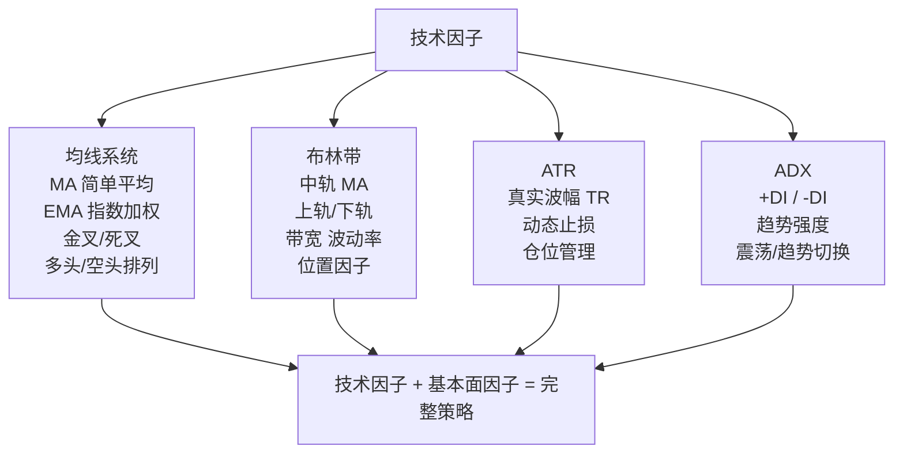

# 第十六章：技术因子——均线系统、布林带、ATR、ADX与基本面因子的融合

各位同学，欢迎来到技术因子专场。

说实话，很多做量化的人一上来就搞深度学习、搞高频，结果连最基础的均线都没吃透。我个人习惯是，先把传统技术指标玩明白，再谈别的。因为技术因子是市场情绪的"心电图"，你连心电图都看不懂，怎么去诊断市场？

## 16.1 均线系统：MA与EMA

均线，说白了就是过去 N 天的平均价格。MA 是简单平均，EMA 是指数加权平均——越近的数据权重越大。

> **核心区别：** MA 反应慢，但信号稳定；EMA 反应快，但容易假突破。

我在项目中遇到过一个问题：用 MA(5,10,20) 做金叉死叉策略，回测收益很漂亮，一上实盘就亏。后来发现，MA 在震荡市里频繁交叉，全是假信号。怎么解决？加一个"过滤条件"——只有价格同时站上60日均线，才执行金叉信号。

```python
import pandas as pd
import numpy as np

def calc_ma(close, window=5):
    return close.rolling(window=window).mean()

def calc_ema(close, window=5):
    return close.ewm(span=window, adjust=False).mean()

# 实战用法：MA多头排列
df['ma5'] = calc_ma(df['close'], 5)
df['ma10'] = calc_ma(df['close'], 10)
df['ma20'] = calc_ma(df['close'], 20)
df['ma60'] = calc_ma(df['close'], 60)

# 多头排列条件：5>10>20>60
df['bullish'] = (df['ma5'] > df['ma10']) & (df['ma10'] > df['ma20']) & (df['ma20'] > df['ma60'])
```

> **我的小技巧：** 不要只用一组均线。试试 (5,13,34) 这种斐波那契数列，或者 (8,21,55)，有时候效果出奇的好。

## 16.2 布林带：波动率的可视化

布林带由三根线组成：中轨（MA）、上轨（中轨+2倍标准差）、下轨（中轨-2倍标准差）。

你想想看，当价格碰到上轨，是不是该卖了？不一定。在强趋势行情里，价格会沿着上轨"爬行"，这时候做空就是找死。

```python
def calc_bollinger(close, window=20, num_std=2):
    ma = close.rolling(window=window).mean()
    std = close.rolling(window=window).std()
    upper = ma + num_std * std
    lower = ma - num_std * std
    return ma, upper, lower

# 布林带宽度因子：衡量波动率变化
df['boll_width'] = (df['upper'] - df['lower']) / df['ma']
# 布林带位置因子：价格在带内的相对位置
df['boll_pos'] = (df['close'] - df['lower']) / (df['upper'] - df['lower'])
```

> **避坑指南：** 我曾经用布林带做"突破上轨买入"的策略，结果在2015年股灾里亏得底裤都不剩。为什么？因为极端行情下，布林带会迅速扩张，上轨追高就是接盘侠。记住：布林带更适合震荡市，趋势市里要配合其他指标。

## 16.3 ATR：真实波动幅度

ATR（Average True Range）衡量的是市场的真实波动幅度。它不告诉你方向，只告诉你"今天波动有多大"。

ATR 的计算有点绕，但核心就三个值：

- 今日最高 - 今日最低
- 今日最高 - 昨日收盘
- 昨日收盘 - 今日最低

取这三个值的最大值，就是 True Range。然后对 TR 做14天平均，就是 ATR。

```python
def calc_atr(df, window=14):
    high, low, close = df['high'], df['low'], df['close']
    tr1 = high - low
    tr2 = abs(high - close.shift(1))
    tr3 = abs(low - close.shift(1))
    tr = pd.concat([tr1, tr2, tr3], axis=1).max(axis=1)
    atr = tr.rolling(window=window).mean()
    return atr

# ATR实战：动态止损
df['atr'] = calc_atr(df)
df['stop_loss'] = df['close'] - 2 * df['atr']  # 2倍ATR止损
```

> **个人经验：** ATR 是我最常用的风控因子。我习惯用 ATR 来设置止盈止损——不是固定百分比，而是动态的。比如买入后，止损设在"入场价 - 1.5倍 ATR"。这样波动大的股票止损宽一点，波动小的窄一点，很合理。

## 16.4 ADX：趋势强度指标

ADX（Average Directional Index）告诉你"现在有没有趋势"，以及"趋势有多强"。它不告诉你方向，只告诉你强度。

ADX 的计算分三步：

1. 计算 +DI 和 -DI（正向/负向方向指标）
2. 计算 DX（方向指标差值）
3. 对 DX 做平滑，得到 ADX

```python
def calc_adx(df, window=14):
    high, low, close = df['high'], df['low'], df['close']

    # 计算方向变动
    up_move = high - high.shift(1)
    down_move = low.shift(1) - low

    # +DM和-DM
    plus_dm = np.where((up_move > down_move) & (up_move > 0), up_move, 0)
    minus_dm = np.where((down_move > up_move) & (down_move > 0), down_move, 0)

    # TR和ATR
    tr = pd.concat([high-low, abs(high-close.shift(1)), abs(low-close.shift(1))], axis=1).max(axis=1)
    atr = tr.rolling(window=window).mean()

    # 平滑+DI和-DI
    plus_di = 100 * pd.Series(plus_dm).rolling(window=window).mean() / atr
    minus_di = 100 * pd.Series(minus_dm).rolling(window=window).mean() / atr

    # DX和ADX
    dx = 100 * abs(plus_di - minus_di) / (plus_di + minus_di)
    adx = dx.rolling(window=window).mean()

    return adx, plus_di, minus_di

# 实战用法：ADX > 25 表示强趋势
df['strong_trend'] = df['adx'] > 25
```

> **我的用法：** ADX 低于20时，市场在震荡，这时候用布林带做高抛低吸。ADX 高于30时，市场在趋势中，这时候用均线系统做趋势跟踪。说白了，ADX 就是"市场状态切换器"。

## 16.5 技术因子与基本面因子结合

这才是今天的重头戏。纯技术因子有个致命缺陷——它只看价格，不看公司基本面。你想想看，一个垃圾股突然放量突破，技术指标全走好了，你敢追吗？

我建议的做法是：用基本面因子做"筛选"，用技术因子做"择时"。

| 因子类型 | 作用 | 具体因子 |
| --- | --- | --- |
| 基本面筛选 | 排除垃圾股 | PE、PB、ROE、营收增速 |
| 技术择时 | 选择入场点 | MA 金叉、布林带突破、ADX > 25 |
| 风控管理 | 控制回撤 | ATR 动态止损、波动率过滤 |

```python
# 技术+基本面结合示例
def combined_factor(df):
    # 基本面筛选：ROE > 15% 且 PE < 30
    fundamental_filter = (df['roe'] > 15) & (df['pe'] < 30)

    # 技术择时：MA5上穿MA20 且 ADX > 25
    technical_signal = (df['ma5'] > df['ma20']) & (df['adx'] > 25)

    # 风控：ATR < 历史80%分位数（排除异常波动）
    atr_threshold = df['atr'].quantile(0.8)
    risk_filter = df['atr'] < atr_threshold

    # 综合信号
    df['combined_signal'] = fundamental_filter & technical_signal & risk_filter
    return df
```

> **曾经踩过的坑：** 我试过把技术因子和基本面因子直接加权求和，结果回测一塌糊涂。为什么？因为两个因子的量纲不同，PE 是几十倍，ATR 是几块钱，直接相加毫无意义。正确的做法是：先分别做标准化（z-score 或分位数），再组合。

## 16.6 知识体系总览

下面这张图，是我自己总结的技术因子知识体系。你可以把它当作"技术因子地图"来用。



嗯，以上就是技术因子的核心内容。记住一句话：技术因子是工具，基本面因子是锚。没有锚的船，风一吹就翻了。

> **最后分享一个心得：** 我做了这么多年量化，发现最赚钱的策略往往不是最复杂的。一个"基本面选股 + 均线择时 + ATR 风控"的简单组合，跑赢了很多花里胡哨的机器学习模型。别把简单的事情搞复杂了。
