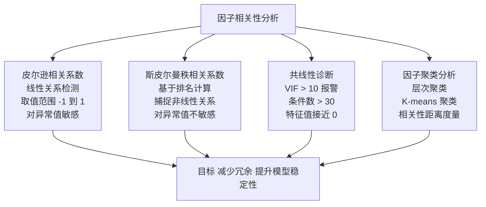

# 第十七章 因子相关性分析

因子挖了一大堆，心里美滋滋？别急。

我见过太多人，挖出几百个因子就往模型里塞。结果呢？回测漂亮得像假的一样，实盘直接翻车。为什么？因为因子之间互相打架，共线性严重，模型根本不稳定。

今天我们就来聊聊因子相关性分析。说白了，就是给你的因子们做个「体检」，看看哪些是好朋友，哪些是死对头。

## 17.1 皮尔逊相关系数

这是最常用的相关性指标。我习惯叫它「线性关系探测器」。

公式长这样：

```text
ρ(X,Y) = cov(X,Y) / (σX * σY)
```

取值范围在 [-1, 1] 之间。1 代表完全正相关，-1 代表完全负相关，0 代表没关系。

> **核心要点：** 皮尔逊只捕捉线性关系。如果两个因子是 U 型关系，它算出来可能接近0，但实际它们有很强的非线性关联。

我在项目中遇到过一件事。有个同事挖了两个因子，皮尔逊系数只有0.03，他以为没问题。结果一跑模型，两个因子在不同市场环境下轮流失效。后来我用散点图一看，好家伙，是抛物线关系。皮尔逊当然算不出来。

实战中，我一般这样用：

- |ρ| > 0.7：高度相关，建议只保留一个
- 0.3 < |ρ| < 0.7：中度相关，需要进一步分析
- |ρ| < 0.3：弱相关，基本可以放心

> **小技巧：** 计算前先做标准化。不然量纲差异大的因子，相关系数会被带偏。我习惯用 Z-score 标准化后再算。

## 17.2 斯皮尔曼秩相关系数

皮尔逊搞不定的非线性关系，斯皮尔曼来救场。

它不关心具体数值，只看排名。你把因子值从小到大排个序，然后算排名的相关性。

```text
ρs = 1 - (6 * Σdi²) / (n * (n² - 1))
```

其中 di 是排名差，n 是样本数。

你想想看，如果两个因子虽然数值不同，但排名顺序几乎一样，那斯皮尔曼系数就会很高。这在实际交易中很有意义——我们做多空组合时，更关心的是排名，而不是具体数值。

我曾经踩过一个坑。有个因子在牛熊市表现差异很大，皮尔逊系数跟斯皮尔曼系数差了0.4。后来发现，是因为极端值把皮尔逊带偏了。斯皮尔曼对异常值不敏感，反而更靠谱。

> **注意：** 斯皮尔曼也不是万能的。如果两个因子是正弦波关系，它也算不出来。但这种情况在量化因子中很少见。

我的建议是：两个都算一遍。如果结果差异很大，说明因子关系不简单，需要深入看看。

## 17.3 因子共线性诊断

共线性是因子模型的大敌。它会让回归系数不稳定，今天正明天负，模型根本没法用。

怎么诊断？我常用三个指标：

1. **方差膨胀因子（VIF）**
   - VIF = 1 / (1 - R²)。R² 是把某个因子对其他因子做回归得到的。
   - 经验法则：VIF > 10，说明共线性严重。我个人习惯更严格，VIF > 5 就报警。
2. **条件数**
   - 计算因子矩阵的条件数。条件数 > 30，说明存在严重共线性。
3. **特征值分析**
   - 看因子相关矩阵的特征值。如果有特征值接近0，说明存在共线性。

```python
import numpy as np
from statsmodels.stats.outliers_influence import variance_inflation_factor

def calculate_vif(factors):
    """计算VIF"""
    vif_data = pd.DataFrame()
    vif_data["factor"] = factors.columns
    vif_data["VIF"] = [variance_inflation_factor(factors.values, i)
                       for i in range(factors.shape[1])]
    return vif_data

# 使用示例
vif_result = calculate_vif(factor_matrix)
print(vif_result[vif_result['VIF'] > 10])  # 找出有问题的因子
```

> **处理共线性的方法：**
> - 删除高 VIF 的因子（最简单粗暴）
> - 用 PCA 降维（保留信息但失去可解释性）
> - 用岭回归或 Lasso（正则化处理）
>
> 我个人偏好先删除，实在删不掉再用正则化。

## 17.4 因子聚类分析

因子太多怎么办？聚类是个好办法。

把相关性高的因子聚成一类，每类选一个代表。这样既保留了信息，又减少了冗余。

我常用的聚类方法：

- **层次聚类**：画个树状图，一目了然
- **K-means**：需要指定类别数，适合大规模因子
- **基于相关性的聚类**：直接用相关系数矩阵做距离度量

```python
from scipy.cluster.hierarchy import dendrogram, linkage
import matplotlib.pyplot as plt

# 计算距离矩阵（1 - 相关系数）
corr_matrix = factor_df.corr()
distance_matrix = 1 - abs(corr_matrix)

# 层次聚类
linked = linkage(distance_matrix, method='ward')

# 画树状图
plt.figure(figsize=(10, 7))
dendrogram(linked, labels=factor_df.columns, leaf_rotation=90)
plt.title('因子层次聚类树状图')
plt.show()
```

嗯，这里要注意。聚类不是越多越好。我一般控制在 5-8 类，每类选一个代表性因子。选代表的标准：跟同类其他因子平均相关性最高，或者 IC 表现最好。

> **实战经验：** 我做过一个项目，初始有 200 多个因子。聚类后分成12类，每类选 1-2 个，最后剩下 20 个。模型稳定性提升了一大截，回撤也小了。

## 知识体系总览

下面这张图，把本章的核心逻辑串起来了：



> 方法：相关性计算 → 共线性诊断 → 聚类降维

这张图把整个流程串起来了。从左到右，先算相关性，再诊断共线性，最后聚类降维。每一步都有对应的工具和方法。

> **最后提醒一句：** 相关性分析不是一次性工作。因子池会不断更新，新因子加入后，旧的相关性结构可能被打破。我习惯每个月重新跑一遍全套流程，确保因子池始终健康。

好了，因子相关性分析就聊到这儿。记住，挖因子容易，管因子难。把相关性分析做好，你的模型就成功了一半。
