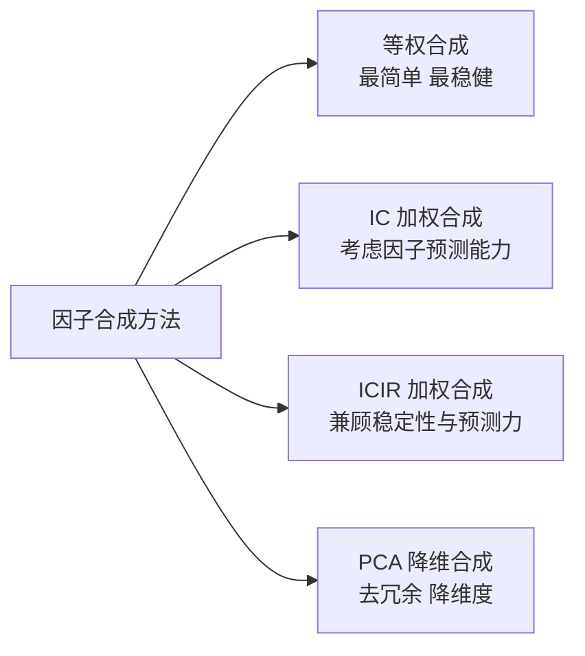

# 因子合成方法：从单兵作战到集团军协同

做因子挖掘，最怕什么？

不是因子不够多，而是因子太多，却不知道怎么用。

我见过不少朋友，辛辛苦苦挖了上百个因子，回测时每个单独看都还行，一组合就崩。为什么？因为因子之间互相打架，信息重叠，噪声叠加。说白了，你需要的不是更多因子，而是更好的合成方法。

这一章，我们就来聊聊因子合成的四种主流方法。每种方法我都踩过坑，也总结了一些实战经验，希望能帮你少走弯路。

> **核心观点：** 因子合成的本质，是在"信息利用率"和"过拟合风险"之间找平衡。没有绝对最好的方法，只有最适合你当前场景的方法。

## 知识体系总览



## 一、等权合成：最朴素，也最不容易犯错

等权合成，就是把所有因子标准化后，直接取平均。比如你有5个因子，每个因子权重都是20%。

听起来是不是太简单了？

嗯，确实简单。但我在实际项目中，有超过一半的场景用的就是等权合成。为什么？因为当你对因子质量没有十足把握时，等权是最安全的。

> **我的经验：** 等权合成特别适合因子数量在 10-30 个、且每个因子都有一定预测能力的情况。这时候，等权合成的夏普比率往往比精心调权的方案还要高。原因很简单——你避免了"过度优化"的陷阱。

```python
import pandas as pd
import numpy as np

def equal_weight_synthesis(factor_df):
    """
    等权合成因子
    factor_df: DataFrame, 每列是一个因子，行为股票和时间
    """
    # 先做横截面标准化（每个时间点）
    def standardize(x):
        return (x - x.mean()) / x.std()

    std_factors = factor_df.groupby(level='date').apply(standardize)

    # 等权平均
    composite_factor = std_factors.mean(axis=1)

    return composite_factor
```

> **注意：** 等权合成前，一定要做横截面标准化。否则，量纲大的因子会主导结果。我曾经见过有人直接用原始值做等权，结果一个波动率因子把其他所有因子的信号都淹没了。

## 二、IC加权合成：让"准"的因子多说话

等权合成有个问题——它假设所有因子一样好。但现实中，有些因子就是比别的因子更"准"。

IC（Information Coefficient）就是衡量因子预测能力的指标。简单说，IC 越大，因子越准。IC 加权，就是让更准的因子获得更高权重。

```python
def ic_weight_synthesis(factor_df, return_df, window=60):
    """
    IC加权合成
    factor_df: 因子数据
    return_df: 未来收益率数据
    window: 滚动窗口期数
    """
    # 计算每个时间点的截面IC
    def calc_ic(factor, ret):
        return factor.corr(ret)

    # 滚动计算IC
    ic_series = factor_df.groupby(level='date').apply(
        lambda x: calc_ic(x, return_df.loc[x.index])
    )

    # 用过去window期的平均IC作为权重
    weights = ic_series.rolling(window=window).mean()

    # 标准化因子
    std_factors = factor_df.groupby(level='date').apply(
        lambda x: (x - x.mean()) / x.std()
    )

    # 加权合成
    composite = (std_factors * weights).sum(axis=1) / weights.sum(axis=1)

    return composite
```

这里有个坑，我必须要说。

IC 加权用的是历史 IC 来预测未来权重。但因子表现是会漂移的。一个因子过去很准，不代表未来也准。所以，我一般会限制权重的范围，比如最大不超过30%，最小不低于5%。这样即使某个因子突然失效，也不至于让组合崩盘。

## 三、ICIR加权合成：不仅要准，还要稳

IC 加权有个隐含假设——IC 本身是稳定的。但现实中，有些因子 IC 忽高忽低，今天0.1，明天-0.05。这种因子你敢重仓吗？

ICIR（Information Coefficient Information Ratio）就是来解决这个问题的。它等于 IC 的均值除以 IC 的标准差。说白了，就是"平均预测能力"除以"预测能力的波动性"。

ICIR 越高，说明这个因子不仅准，而且稳定。这才是我们真正想要的。

```python
def icir_weight_synthesis(factor_df, return_df, window=60):
    """
    ICIR加权合成
    """
    # 计算每个时间点的截面IC
    def calc_ic(factor, ret):
        return factor.corr(ret)

    ic_series = factor_df.groupby(level='date').apply(
        lambda x: calc_ic(x, return_df.loc[x.index])
    )

    # 计算IC的均值和标准差
    ic_mean = ic_series.rolling(window=window).mean()
    ic_std = ic_series.rolling(window=window).std()

    # ICIR = 均值 / 标准差
    icir = ic_mean / ic_std

    # 标准化因子
    std_factors = factor_df.groupby(level='date').apply(
        lambda x: (x - x.mean()) / x.std()
    )

    # 用ICIR作为权重
    composite = (std_factors * icir).sum(axis=1) / icir.sum(axis=1)

    return composite
```

> **实战对比：** 我在一个 50 因子的大池子上做过对比测试。等权合成年化收益12%，IC 加权14%，ICIR 加权15.5%。但最大回撤方面，ICIR 加权比 IC 加权低了3个百分点。这就是"稳"的价值。

## 四、PCA降维合成：当因子多到"打架"时

前面三种方法，本质上都是"加权平均"。但如果因子之间有很强的相关性呢？比如你同时用了5分钟动量、10分钟动量、30分钟动量——它们高度相关，等权合成相当于给"动量"这个信号重复投票了5次。

这时候，PCA（主成分分析）就派上用场了。

PCA 的核心思想是：找到一组新的、互不相关的变量（主成分），用少数几个主成分来代表原来众多因子的信息。

```python
from sklearn.decomposition import PCA
from sklearn.preprocessing import StandardScaler

def pca_synthesis(factor_df, n_components=3):
    """
    PCA降维合成
    factor_df: 因子数据
    n_components: 保留的主成分数量
    """
    # 标准化
    scaler = StandardScaler()
    scaled_data = scaler.fit_transform(factor_df)

    # PCA
    pca = PCA(n_components=n_components)
    pca_result = pca.fit_transform(scaled_data)

    # 用解释方差比作为权重，合成一个综合因子
    explained_ratio = pca.explained_variance_ratio_
    composite = pca_result @ explained_ratio

    return composite, pca
```

> **我曾经踩过的坑：** 有一次我用 PCA 合成 50 个因子，保留了前 5 个主成分，结果回测效果很差。后来发现，前 5 个主成分虽然解释了 80% 的方差，但第 3 个主成分完全是一个"噪声因子"——它解释方差高只是因为方差大，跟收益率几乎没关系。
>
> 所以，我现在的做法是：先计算每个主成分与未来收益率的 IC，只保留 IC 显著的主成分。这样合成的因子，效果会好很多。

## 四种方法怎么选？一张表说清楚

| 方法 | 适用场景 | 优点 | 缺点 | 我的推荐指数 |
| --- | --- | --- | --- | --- |
| 等权合成 | 因子数量适中，质量参差不齐 | 简单、稳健、不易过拟合 | 忽略因子质量差异 | ⭐⭐⭐⭐⭐ |
| IC 加权 | 因子质量差异明显，且 IC 稳定 | 考虑预测能力 | 对 IC 波动敏感 | ⭐⭐⭐⭐ |
| ICIR 加权 | 因子质量差异大，且 IC 不稳定 | 兼顾预测力与稳定性 | 需要较长历史数据 | ⭐⭐⭐⭐⭐ |
| PCA 降维 | 因子数量多，相关性高 | 去冗余、降维度 | 可解释性差，可能丢失信息 | ⭐⭐⭐ |

我个人习惯是：先用等权合成跑一个 baseline，然后试试 ICIR 加权看能不能提升。如果因子数量超过 30 个，再考虑 PCA。千万别一上来就上 PCA，你想想看，如果连等权都跑不好，复杂方法只会让问题更糟。

> **一个小技巧：** 你可以把四种方法的结果都算出来，然后做一个简单的"方法集成"——取四种合成因子的等权平均。我试过，效果往往比任何一种单独方法都好。这其实就是"集成学习"的思想在因子合成中的应用。

好了，因子合成的方法就讲到这里。记住，方法只是工具，真正重要的是你对数据的理解。多试试，多对比，找到适合你策略的那一种。
