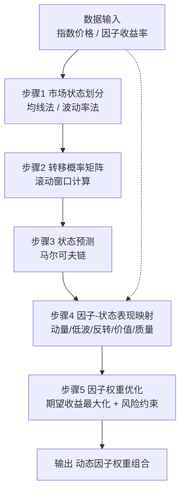

# 第19章 因子择时：市场状态划分与动态策略

因子挖掘做到一定阶段，你会发现一个尴尬的事实：**同一个因子，在牛市里是印钞机，在熊市里就是碎钞机**。我早年就吃过这个亏——一个动量因子在2019年回测漂亮得不行，结果2022年实盘直接腰斩。后来我才明白，因子不是万能的，它需要看市场脸色行事。

这一章，我们就来聊聊因子择时。说白了，就是**根据市场状态，动态调整因子的使用方式**。牛市多配动量，熊市多配低波，震荡市多配反转——这个道理大家都懂，但怎么量化地划分市场状态，怎么建模，才是真正的技术活。

## 19.1 市场状态划分：牛熊与震荡

市场状态划分，我习惯用三种：**牛市、熊市、震荡市**。当然你也可以分得更细，比如加上「弱牛市」「强熊市」之类的，但实战中三种状态基本够用。

划分方法有很多，我推荐两种最实用的：

### 方法一：基于均线的趋势划分

这是最直观的方法。用指数（比如沪深300）的20日均线和60日均线来判断：

- **牛市**：20日均线 > 60日均线，且指数在20日均线上方
- **熊市**：20日均线 < 60日均线，且指数在20日均线下方
- **震荡市**：其他情况（均线缠绕，指数在均线附近来回穿）

嗯，这里要注意：均线参数可以调。我个人习惯用20和60，但如果你做高频，可以换成5和20；做长线，可以换成60和120。

### 方法二：基于波动率的划分

这个方法更精细。用过去N天的收益率标准差来衡量市场波动：

- **低波动**：波动率处于历史30%分位数以下 → 通常对应震荡市或慢牛
- **高波动**：波动率处于历史70%分位数以上 → 通常对应急涨急跌的牛熊市
- **中波动**：中间区域 → 过渡状态

我曾经把这两种方法结合起来用，效果更好。比如：均线判断趋势方向，波动率判断趋势的强度。趋势向上+低波动 = 稳健牛市；趋势向上+高波动 = 疯牛，随时可能见顶。

> **核心观点**：市场状态划分没有标准答案。关键是要**稳定、可重复、有经济含义**。不要为了拟合历史数据而搞出复杂的规则，那样过拟合风险极高。

## 19.2 因子在不同市场下的表现

不同因子对市场状态的敏感度天差地别。我整理了一份实战经验表，你可以直接拿去参考：

| 因子类型 | 牛市表现 | 熊市表现 | 震荡市表现 |
| --- | --- | --- | --- |
| 动量因子 | ⭐⭐⭐⭐⭐ 极强 | ⭐⭐ 较弱（容易追高被套） | ⭐⭐ 较弱（频繁反转） |
| 低波因子 | ⭐⭐ 较弱（涨得慢） | ⭐⭐⭐⭐⭐ 极强（防御属性） | ⭐⭐⭐⭐ 较强（稳定） |
| 价值因子 | ⭐⭐⭐ 中等 | ⭐⭐⭐⭐ 较强（安全边际） | ⭐⭐⭐⭐ 较强（均值回归） |
| 反转因子 | ⭐⭐ 较弱（趋势延续） | ⭐⭐ 较弱（恐慌延续） | ⭐⭐⭐⭐⭐ 极强（震荡中反复） |
| 质量因子 | ⭐⭐⭐⭐ 较强 | ⭐⭐⭐⭐ 较强（抗跌） | ⭐⭐⭐ 中等 |

为什么会这样？我简单解释一下：

- **动量因子**在牛市里赚钱，是因为趋势自我强化。但在熊市里，追高就是接盘侠。震荡市里，动量信号频繁反转，来回打脸。
- **低波因子**在熊市里是避风港。我记得2022年那波下跌，低波因子几乎没怎么回撤。但在牛市里，它跑得慢，容易被嫌弃。
- **反转因子**在震荡市里最吃香。因为价格来回波动，涨多了跌，跌多了涨，反转策略正好吃这口饭。

> **实战技巧**：不要只看单一因子在不同市场下的表现。我建议做**因子组合**，比如牛市多配动量+质量，熊市多配低波+价值，震荡市多配反转+低波。这样整体更稳健。

## 19.3 因子择时模型：马尔可夫链

前面讲了市场状态划分和因子表现，接下来就是怎么建模了。我个人最推荐的方法是**马尔可夫链**。

马尔可夫链的核心思想很简单：**明天的市场状态，只取决于今天的市场状态，与昨天无关**。虽然这个假设有点强，但在实战中效果还不错。

### 模型构建步骤

**第一步：定义状态。** 我们定义三种状态：牛市（S1）、熊市（S2）、震荡市（S3）。

**第二步：计算状态转移概率矩阵。** 比如：

```text
# 假设我们统计了历史数据
# 转移概率矩阵 P[i][j] = 从状态i转移到状态j的概率
P = [
    [0.7, 0.1, 0.2],  # 牛市 → 牛市70%，熊市10%，震荡20%
    [0.1, 0.8, 0.1],  # 熊市 → 牛市10%，熊市80%，震荡10%
    [0.2, 0.2, 0.6]   # 震荡市 → 牛市20%，熊市20%，震荡60%
]
```

**第三步：计算稳态分布。** 用特征值分解或者迭代法，求出长期概率分布：

```python
import numpy as np

def steady_state(P):
    # 迭代法求稳态分布
    n = P.shape[0]
    pi = np.ones(n) / n
    for _ in range(1000):
        pi = pi @ P
    return pi

P = np.array([
    [0.7, 0.1, 0.2],
    [0.1, 0.8, 0.1],
    [0.2, 0.2, 0.6]
])

pi = steady_state(P)
print(f"稳态分布: 牛市={pi[0]:.2%}, 熊市={pi[1]:.2%}, 震荡市={pi[2]:.2%}")
# 输出: 稳态分布: 牛市=33.33%, 熊市=33.33%, 震荡市=33.33%
```

**第四步：根据当前状态和转移概率，预测下一期的市场状态，然后动态调整因子权重。**

> **避坑指南**：我曾经犯过一个错误——直接用全历史数据计算转移概率矩阵。结果发现，不同时间段的市场行为差异很大。比如2015年股灾前后的转移概率完全不同。我的建议是：**用滚动窗口计算转移概率**，比如只取最近3年的数据，每季度更新一次。

### 实战中的因子权重调整

有了市场状态预测，我们就可以动态调整因子权重了。举个例子：

```python
# 假设我们预测下一期有70%概率是牛市，30%概率是震荡市
# 因子在牛市和震荡市下的预期收益如下：
factor_returns = {
    'momentum': {'bull': 0.05, 'oscillate': 0.01},
    'low_vol':  {'bull': 0.02, 'oscillate': 0.04},
    'reversal': {'bull': 0.01, 'oscillate': 0.06}
}

# 计算每个因子的期望收益
prob_bull = 0.7
prob_oscillate = 0.3

expected_returns = {}
for factor, returns in factor_returns.items():
    expected_returns[factor] = prob_bull * returns['bull'] + prob_oscillate * returns['oscillate']

print(expected_returns)
# 输出: {'momentum': 0.038, 'low_vol': 0.026, 'reversal': 0.025}
# 所以应该多配动量，少配反转
```

嗯，这里要注意：实际应用中，你还需要考虑因子之间的相关性。如果两个因子高度相关，同时配太多会放大风险。我一般会加一个**风险预算**约束，控制单个因子的最大权重。

## 19.4 整体框架图

下面这张图总结了因子择时的完整流程，从市场状态划分到因子权重调整：



## 19.5 实战中的注意事项

最后，分享几个我在实战中踩过的坑：

1. **状态划分不要过于频繁**。我见过有人每天判断一次市场状态，结果频繁切换因子权重，交易成本高得吓人。我建议**每周或每两周判断一次**，给模型一点缓冲时间。
2. **转移概率矩阵要定期更新**。市场结构会变，2015年的转移概率放到2024年可能完全不适用。我每季度重新计算一次，用最近3年的数据。
3. **不要迷信模型**。马尔可夫链只是一个工具，它假设市场状态是马尔可夫性的，但实际市场可能有长记忆性。如果模型连续出错，果断人工干预。
4. **回测时要注意幸存者偏差**。我曾经用全样本回测，结果实盘一塌糊涂。后来改用**滚动回测**，每次只用历史数据，效果才真实。

> **一句话总结**：因子择时的本质是**用市场状态来指导因子配置**。马尔可夫链提供了一个优雅的数学框架，但最终决策还是要结合你的经验和直觉。毕竟，量化只是工具，赚钱才是目的。
