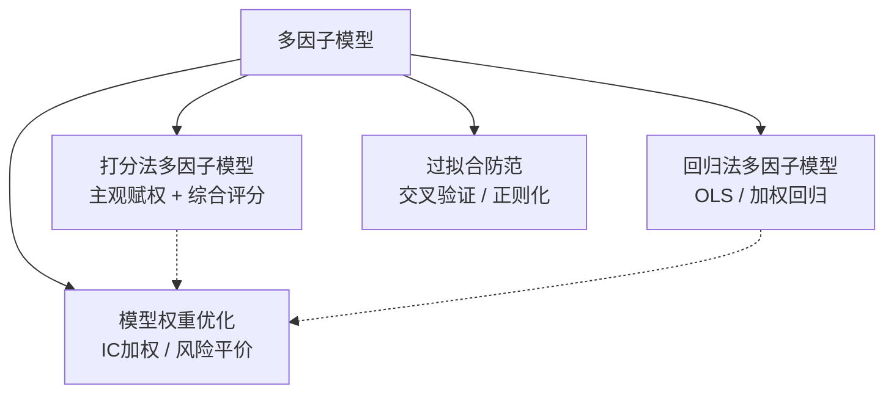

# 第二十课：多因子模型入门

说实话，多因子模型这东西，刚接触时觉得挺玄乎的。一堆因子往模型里塞，然后指望它们预测涨跌？我刚开始做量化那会儿，也觉得这玩意儿不靠谱。直到有一次，我用三个简单因子跑了个回测，年化收益愣是比单因子高出一大截。嗯，从那以后我就信了。

今天咱们聊聊多因子模型的几种主流玩法。打分法、回归法、权重优化，还有那个让人头疼的过拟合问题。我一个一个说。

## 知识体系总览



> 四种核心方法：从简单打分到复杂优化，再到风险控制

## 一、打分法多因子模型

打分法，说白了就是给每个因子打个分，然后加权求和。我最早做多因子时用的就是这招。简单粗暴，但有效。

具体怎么做呢？

1. **因子标准化**：把各个因子统一到同一量纲。比如用 Z-score 或者百分位排名。
2. **设定权重**：给每个因子分配一个权重。可以主观定，也可以用 IC 值来定。
3. **综合打分**：加权求和得到每个股票的总分。
4. **选股**：按总分排序，选前 N 只。

> **核心公式**：`Score = w₁ × Factor₁ + w₂ × Factor₂ + ... + wₙ × Factorₙ`

举个例子。假设我们有两个因子：市盈率（PE）和市净率（PB）。PE 越低越好，PB 越低越好。我们给 PE 权重 0.6，PB 权重 0.4。

```python
import pandas as pd
import numpy as np

# 模拟数据
data = pd.DataFrame({
    'stock': ['A', 'B', 'C', 'D'],
    'pe': [10, 15, 8, 20],
    'pb': [1.2, 1.5, 0.9, 2.0]
})

# 因子标准化（百分位排名，越小越好）
data['pe_score'] = data['pe'].rank(pct=True)  # 越小排名越高
data['pb_score'] = data['pb'].rank(pct=True)

# 综合打分
data['total_score'] = 0.6 * data['pe_score'] + 0.4 * data['pb_score']

print(data.sort_values('total_score', ascending=False))
```

> **我的经验**：打分法最大的优点是透明。你可以清楚地看到每个因子对最终结果的影响。我在做 A 股多因子时，经常先用打分法快速验证因子组合的有效性。

## 二、回归法多因子模型

回归法比打分法更「科学」一点。它用历史数据去拟合因子和收益之间的关系。说白了，就是让数据自己说话。

最常用的是多元线性回归：

```text
Rᵢ = α + β₁ × Factor₁ᵢ + β₂ × Factor₂ᵢ + ... + βₙ × Factorₙᵢ + εᵢ
```

其中 Rᵢ 是股票 i 的收益率，β 是因子暴露系数。

我习惯用 Python 的 statsmodels 库来做回归：

```python
import statsmodels.api as sm

# 假设X是因子矩阵，y是收益率
X = sm.add_constant(data[['pe', 'pb']])  # 加截距项
y = data['return']

model = sm.OLS(y, X).fit()
print(model.summary())
```

> **注意**：回归法有个大坑——多重共线性。如果两个因子高度相关，回归系数会变得很不稳定。我曾经吃过这个亏，两个估值因子一起放进去，结果系数符号都反了。

怎么解决？可以用 VIF（方差膨胀因子）检测，或者直接用岭回归（Ridge Regression）。

## 三、模型权重优化

权重怎么定？这是个好问题。我见过有人拍脑袋定权重，结果回测漂亮实盘拉胯。权重优化，说白了就是让模型更「聪明」地分配因子权重。

几种常见方法：

| 方法 | 原理 | 优点 | 缺点 |
| --- | --- | --- | --- |
| 等权法 | 所有因子权重相同 | 简单、稳健 | 忽略因子差异 |
| IC 加权 | 按因子 IC 值分配权重 | 动态调整 | IC 不稳定时效果差 |
| 风险平价 | 让每个因子贡献相同风险 | 分散风险 | 计算复杂 |
| 最大化 IR | 最大化信息比率 | 收益风险比最优 | 容易过拟合 |

我个人比较喜欢 IC 加权。为什么呢？因为它能动态反映因子的近期表现。比如最近动量因子表现好，它的权重就会自动提高。

```python
# IC加权示例
def ic_weighting(factor_returns, lookback=60):
    """
    factor_returns: 每个因子的历史IC序列
    lookback: 回看窗口
    """
    recent_ic = factor_returns.tail(lookback)
    weights = recent_ic.mean() / recent_ic.mean().sum()
    return weights
```

> **避坑指南**：我曾经用最大化 IR 方法优化权重，结果回测曲线漂亮得不像话。但实盘一跑就崩了。后来发现是过拟合了。所以我现在更倾向于用简单一点的方法，比如 IC 加权或者风险平价。

## 四、模型过拟合防范

过拟合，这是量化人的噩梦。你想想看，回测曲线完美，实盘却一塌糊涂。我刚开始做量化时，就栽过这个跟头。

怎么防范？几个实用技巧：

1. **交叉验证**：别只用一组训练集。把数据分成多份，轮流做训练和验证。
2. **正则化**：L1（Lasso）或 L2（Ridge）正则化，限制系数大小。
3. **降维**：因子太多容易过拟合。用 PCA 或者因子筛选减少维度。
4. **样本外测试**：留出一段数据完全不参与训练，最后用来验证。

```python
from sklearn.linear_model import Ridge

# 岭回归（L2正则化）
ridge = Ridge(alpha=1.0)  # alpha控制正则化强度
ridge.fit(X_train, y_train)

from sklearn.linear_model import Lasso

# Lasso回归（L1正则化）
lasso = Lasso(alpha=0.01)
lasso.fit(X_train, y_train)
```

> **重要提醒**：过拟合的典型症状——训练集表现远好于测试集。如果你发现训练集年化收益30%，测试集只有5%，那基本可以断定过拟合了。别犹豫，赶紧简化模型。

还有一个我常用的技巧：**滚动回测**。不是一次性回测，而是每个月滚动一次，看看模型在不同市场环境下的表现。这样能更真实地评估模型的稳健性。

> **总结一下**：多因子模型的核心就四个字——**「平衡」与「稳健」**。平衡因子之间的权重，稳健地防范过拟合。打分法适合快速验证，回归法适合精细建模，权重优化让模型更聪明，过拟合防范则是保命符。

好了，这一课就到这里。记住，多因子模型不是越复杂越好。有时候，一个简单的等权模型，反而比那些花里胡哨的优化模型更靠谱。嗯，这就是我踩过坑之后的真心话。
