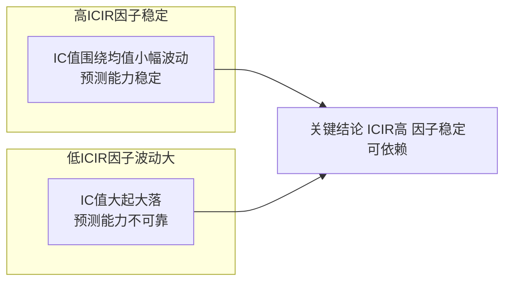

# 第21章 因子ICIR分析：从定义到实战应用

因子 ICIR 分析，说白了就是帮我们判断一个因子到底靠不靠谱。我做了这么多年因子挖掘，见过太多因子在回测里表现亮眼，一上实盘就崩盘。后来我发现，问题往往出在 ICIR 这个指标上。

今天我们就来聊聊 ICIR。我会从定义讲起，然后说说它和因子稳定性的关系，最后聊聊怎么用它来筛选因子。嗯，这些都是我踩过坑之后总结出来的经验。

## ICIR的定义与计算

先说说 IC 是什么。IC 的全称是 Information Coefficient，信息系数。它衡量的是因子值和未来收益率之间的相关性。

具体来说，IC 有两种常见形式：

- **Rank IC**：因子排名和收益排名的 Spearman 相关系数。我个人更常用这个，因为它对极端值不敏感。
- **Normal IC**：因子值和收益率的 Pearson 相关系数。这个对线性关系敏感，但容易受异常值干扰。

那 ICIR 呢？ICIR = IC 的均值 / IC 的标准差。说白了，就是单位风险下你能获得多少信息。

> **核心公式：**
> ICIR = mean(IC_series) / std(IC_series)
> 其中 IC_series 是某个时间段内（比如过去12个月）每个月的 IC 值序列。

举个例子。假设我们计算了某因子过去12个月的月度 IC 值：

| 月份 | IC 值 |
| --- | --- |
| 1月 | 0.05 |
| 2月 | 0.07 |
| 3月 | 0.03 |
| 4月 | 0.06 |
| 5月 | 0.04 |
| 6月 | 0.08 |
| 7月 | 0.02 |
| 8月 | 0.05 |
| 9月 | 0.06 |
| 10月 | 0.04 |
| 11月 | 0.07 |
| 12月 | 0.05 |

计算一下：均值 = 0.052，标准差 ≈ 0.018，ICIR ≈ 2.89。

这个值算高吗？嗯，一般来说 ICIR 大于2就算不错了。大于3就是非常优秀的因子。

下面我用 Python 代码演示一下计算过程：

```python
import numpy as np
import pandas as pd
from scipy.stats import spearmanr, pearsonr

def calculate_icir(factor_values, forward_returns, method='rank'):
    """
    计算因子的ICIR

    参数:
    factor_values: 因子值序列
    forward_returns: 未来收益率序列
    method: 'rank' 或 'normal'

    返回:
    icir值
    """
    if method == 'rank':
        # 计算Rank IC
        ic = spearmanr(factor_values, forward_returns)[0]
    else:
        # 计算Normal IC
        ic = pearsonr(factor_values, forward_returns)[0]

    return ic

# 批量计算月度IC并求ICIR
def batch_icir(factor_df, return_df, window=12):
    """
    滚动计算ICIR

    参数:
    factor_df: 因子数据，行是时间，列是股票
    return_df: 收益率数据，行是时间，列是股票
    window: 滚动窗口长度

    返回:
    icir序列
    """
    ic_series = []

    for date in factor_df.index:
        # 获取该时间点的因子值和收益率
        f = factor_df.loc[date].dropna()
        r = return_df.loc[date].dropna()

        # 取交集
        common = f.index.intersection(r.index)
        if len(common) < 30:  # 样本太少就跳过
            continue

        ic = calculate_icir(f[common], r[common])
        ic_series.append(ic)

    # 计算滚动ICIR
    ic_array = np.array(ic_series)
    icir_values = []

    for i in range(window, len(ic_array)):
        mean_ic = np.mean(ic_array[i-window:i])
        std_ic = np.std(ic_array[i-window:i])
        if std_ic > 0:
            icir_values.append(mean_ic / std_ic)
        else:
            icir_values.append(0)

    return icir_values
```

> **我的经验：** 计算 ICIR 时，窗口长度很关键。太短了（比如3个月）噪声太大，太长了（比如36个月）又反应太慢。我个人习惯用12个月作为滚动窗口，这样既有统计意义，又能及时捕捉因子表现的变化。

## ICIR与因子稳定性的关系

ICIR 为什么重要？因为它衡量的是因子的稳定性。

你想想看，一个因子 IC 均值很高，但波动也很大，说明它时灵时不灵。这种因子你敢用吗？反正我不敢。我曾经就吃过这个亏——一个因子在回测里 IC 均值0.08，看着不错，但 ICIR 只有0.5。结果实盘三个月，前两个月赚钱，第三个月一把亏光。

ICIR 和因子稳定性的关系，可以用下面这张图来理解：



> 关键结论：
>
> - 高 ICIR 因子：IC 值围绕均值小幅波动，预测能力稳定
> - 低 ICIR 因子：IC 值大起大落，预测能力不可靠

从图上可以清楚看到：高 ICIR 的因子，IC 值波动小，走势平稳；低 ICIR 的因子，IC 值上蹿下跳，让人心里没底。

为什么会这样？因为 ICIR 的分母是 IC 的标准差。标准差越大，说明因子表现越不稳定。哪怕均值很高，只要波动大，ICIR 就会被拉低。

> **避坑指南：** 我曾经遇到过一个因子，IC 均值高达0.12，但 ICIR 只有0.8。当时团队里有人觉得均值高就行，我坚持要再看看。结果发现这个因子在牛市中表现极好，但在熊市中完全失效。这种市场依赖型的因子，风险其实很大。

## ICIR在因子筛选中的应用

好了，知道了 ICIR 是什么，也明白了它和稳定性的关系。那在实际工作中，我们怎么用 ICIR 来筛选因子呢？

我总结了一套筛选流程，分享给你：

1. **初步筛选**：ICIR > 1.5 作为入门门槛。低于这个值的因子，我基本不考虑。
2. **重点考察**：ICIR > 2.0 的因子，值得深入研究。
3. **优中选优**：ICIR > 3.0 的因子，如果逻辑也说得通，那就是宝贝了。

但要注意，ICIR 不是万能的。我见过有人只看 ICIR，结果选出来的因子全是过拟合的。所以我的建议是：

- **结合 IC 均值看**：ICIR 高但 IC 均值很低（比如0.01），说明因子虽然稳定但预测能力弱，意义不大。
- **结合逻辑看**：ICIR 再高，如果因子背后没有合理的金融逻辑支撑，我也不敢用。
- **分时段看**：不同市场环境下 ICIR 可能不同。牛市和熊市分开算，能发现更多信息。

下面是一个实际筛选的例子：

| 因子名称 | IC 均值 | IC 标准差 | ICIR | 是否入选 | 备注 |
| --- | --- | --- | --- | --- | --- |
| 动量因子 | 0.06 | 0.025 | 2.40 | ✅ | 稳定，逻辑清晰 |
| 反转因子 | 0.08 | 0.045 | 1.78 | ⚠️ | 均值高但波动大，需谨慎 |
| 波动率因子 | 0.03 | 0.010 | 3.00 | ✅ | 非常稳定，但预测力一般 |
| 市值因子 | 0.02 | 0.040 | 0.50 | ❌ | ICIR 太低，不稳定 |

你看，反转因子 IC 均值最高，但 ICIR 只有1.78，我给它打了个问号。波动率因子 IC 均值不高，但 ICIR 高达3.0，说明它非常稳定，值得进一步研究。

> **我的实战经验：** 在实际的因子库管理中，我会给每个因子打一个综合评分。ICIR 占40%权重，IC 均值占30%，逻辑合理性占20%，其他指标（如换手率、容量等）占10%。这样选出来的因子，整体表现会更稳健。

最后说一句，ICIR 分析不是一劳永逸的。因子会衰减，市场会变化。我建议每季度重新计算一次 ICIR，及时淘汰表现变差的因子。嗯，这就是我这些年做因子筛选的核心思路。
