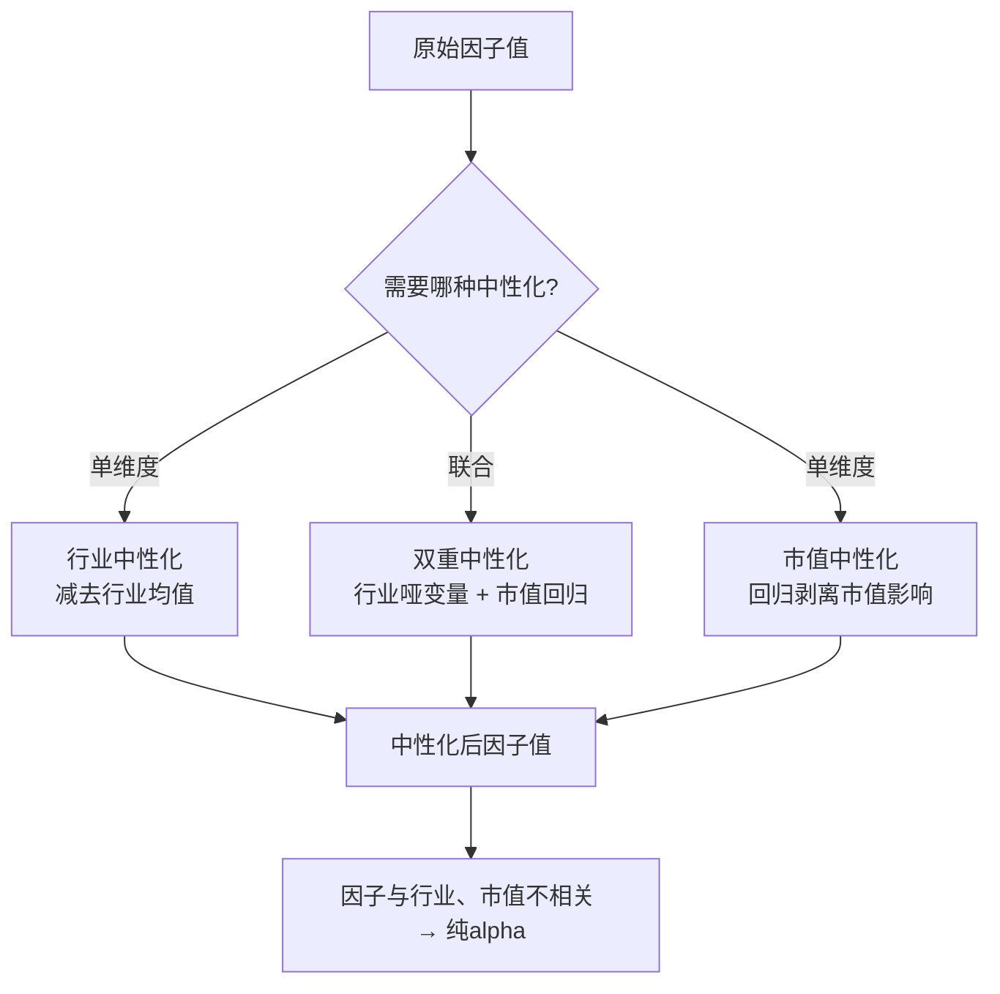

# 第23章：行业中性化——别让行业特征骗了你

做因子挖掘的朋友，十有八九都踩过同一个坑：**辛辛苦苦挖出来的因子，回测曲线漂亮得不行，结果一分析，全是行业暴露带来的收益**。说白了，你的因子不是在选股，是在选行业。

我刚开始做量化那会儿，就犯过这个错。挖了个动量因子，夏普比率干到2.3，兴奋得不行。结果一检查，好家伙，因子重仓了白酒和新能源，纯粹是行业 beta 在贡献收益。去掉行业影响后，因子 alpha 几乎为零。嗯，从那以后，**行业中性化**就成了我因子处理流程里的标配步骤。

## 为什么需要行业中性化？

你想想看，A 股市场有个特点：**行业分化极其严重**。同一天，半导体可能涨5%，银行可能跌2%。如果你的因子恰好偏好半导体，那回测收益里有多少是因子本身的能力，多少是行业运气？

行业中性化的目的，就是**把行业的影响剥离掉**，让因子纯粹反映个股在行业内部的相对强弱。这样我们才能判断：这个因子到底有没有选股能力。

> **核心思想**：在每个行业内对因子做标准化处理，使得因子在行业间的均值为0，方差一致。这样因子得分不再受行业整体水平的影响。

## 行业分类标准：申万 vs 中信

做行业中性化，第一步是选行业分类标准。国内主流就两家：**申万**和**中信**。

| 对比维度 | 申万行业分类 | 中信行业分类 |
| --- | --- | --- |
| 更新频率 | 每年6月/12月调整 | 每年1月/7月调整 |
| 一级行业数量 | 31个（2021版） | 30个 |
| 二级行业数量 | 134个 | 110个 |
| 市场认可度 | 最广泛使用 | 机构使用较多 |
| 数据获取难度 | 容易（Wind/Tushare） | 较容易 |

我个人习惯用**申万一级行业**做中性化。原因很简单：31个行业，数量适中，既不会因为行业太少导致中性化效果差，也不会因为行业太多把样本切得太碎。我在项目中试过用申万二级行业（134个），结果有些小行业里只有三五只股票，中性化后因子方差被严重压缩，效果反而不好。

> **我的建议**：做因子研究时先用申万一级行业。如果因子在行业内选股能力稳定，再尝试用二级行业做更精细的中性化。

## 行业中性化处理：实操代码

行业中性化的数学表达其实很简单：

```text
因子_中性化 = 因子_原始 - 行业均值
```

或者更严谨的做法：`因子_中性化 = (因子_原始 - 行业均值) / 行业标准差`

下面是我常用的 Python 实现：

```python
import pandas as pd
import numpy as np

def industry_neutralize(factor_df, industry_df, method='demean'):
    """
    行业中性化处理

    Parameters:
    -----------
    factor_df : DataFrame, index=date, columns=stock, values=factor
    industry_df : DataFrame, index=date, columns=stock, values=industry_code
    method : str, 'demean' 或 'zscore'

    Returns:
    --------
    neutralized_factor : DataFrame
    """
    result = factor_df.copy()

    for date in factor_df.index:
        # 获取当天的因子值和行业分类
        f = factor_df.loc[date]
        ind = industry_df.loc[date]

        # 合并数据
        df = pd.DataFrame({'factor': f, 'industry': ind})
        df = df.dropna()

        if method == 'demean':
            # 减去行业均值
            industry_mean = df.groupby('industry')['factor'].transform('mean')
            df['neutralized'] = df['factor'] - industry_mean

        elif method == 'zscore':
            # 行业内标准化
            industry_mean = df.groupby('industry')['factor'].transform('mean')
            industry_std = df.groupby('industry')['factor'].transform('std')
            df['neutralized'] = (df['factor'] - industry_mean) / industry_std

        result.loc[date, df.index] = df['neutralized']

    return result
```

> **注意**：做行业中性化时，一定要**按日期逐日处理**。不能把所有日期的数据混在一起算行业均值，因为行业成分股会变，因子分布也会随时间变化。

## 市值中性化：大市值≠好因子

行业中性化搞定了，还有个更隐蔽的干扰因素——**市值**。

A 股市场有个明显的规律：小市值股票长期跑赢大市值。如果你的因子天然偏好小盘股，那回测收益里很大一部分是市值因子贡献的，不是你的因子牛。

市值中性化的做法和行业中性化类似，但处理方式略有不同：

```python
def market_cap_neutralize(factor_df, market_cap_df):
    """
    市值中性化：通过回归剥离市值影响

    我一般用对数市值做回归，因为市值分布太偏了
    """
    from sklearn.linear_model import LinearRegression

    result = factor_df.copy()

    for date in factor_df.index:
        f = factor_df.loc[date].dropna()
        cap = market_cap_df.loc[date, f.index].dropna()

        # 取对数市值
        log_cap = np.log(cap)

        # 回归：因子 ~ 对数市值
        X = log_cap.values.reshape(-1, 1)
        y = f.loc[cap.index].values

        model = LinearRegression()
        model.fit(X, y)

        # 残差就是市值中性化后的因子
        residual = y - model.predict(X)
        result.loc[date, cap.index] = residual

    return result
```

为什么用对数市值？因为市值分布是右偏的，茅台和工商银行市值几千亿，小票才几十亿，直接回归的话大市值股票会主导回归系数。取对数后分布更接近正态，回归结果更稳健。

## 双重中性化：行业+市值一起搞定

实际应用中，我们通常需要**同时剥离行业和市值的影响**。这就是双重中性化。

做法有两种：

1. **分步法**：先做行业中性化，再对结果做市值中性化
2. **联合法**：把行业哑变量和市值一起放进回归模型

我个人更推荐**联合法**，一步到位，逻辑更干净：

```python
def double_neutralize(factor_df, industry_df, market_cap_df):
    """
    双重中性化：行业 + 市值

    用多元回归同时剥离两个因素的影响
    """
    from sklearn.linear_model import LinearRegression
    import pandas as pd

    result = factor_df.copy()

    for date in factor_df.index:
        f = factor_df.loc[date].dropna()
        ind = industry_df.loc[date, f.index].dropna()
        cap = market_cap_df.loc[date, f.index].dropna()

        # 取共同索引
        common_idx = f.index.intersection(ind.index).intersection(cap.index)
        if len(common_idx) < 50:  # 样本太少就跳过
            continue

        f = f[common_idx]
        ind = ind[common_idx]
        cap = cap[common_idx]

        # 构建行业哑变量
        ind_dummies = pd.get_dummies(ind)

        # 构建回归自变量：行业哑变量 + 对数市值
        log_cap = np.log(cap).values.reshape(-1, 1)
        X = np.hstack([ind_dummies.values, log_cap])

        # 回归
        model = LinearRegression()
        model.fit(X, f.values)

        # 残差就是双重中性化后的因子
        residual = f.values - model.predict(X)
        result.loc[date, common_idx] = residual

    return result
```

> **关键点**：双重中性化后的因子，与行业和市值都不相关。这时候因子暴露出来的收益，才是真正的选股 alpha。

## 避坑指南：我踩过的几个坑

做中性化处理，有几个细节不注意，结果就会出问题：

- **我曾经**忘记剔除行业哑变量的共线性问题。31个行业，回归时用了31个哑变量，结果模型报错。记住：**要留一个行业作为基准组**，只放30个哑变量。
- **我曾经**在市值中性化时用了原始市值，结果回归残差里还有市值影响。后来换成对数市值，问题解决。
- **注意**：中性化处理要在**训练集内**进行，不能把未来数据的信息带进来。每次只使用当天的截面数据做中性化。

## 知识体系总览

下面这张图，帮你理清本章的核心逻辑：



做中性化处理，说白了就是**给因子做一次"净化"**。把行业和市值这些干扰因素过滤掉，才能看清因子的真实选股能力。我见过太多人因子回测漂亮，实盘一塌糊涂，十有八九是没做中性化处理。

记住一句话：**因子挖掘的终点不是高收益，而是纯粹的 alpha**。行业中性化和市值中性化，就是你通往这个终点的必经之路。
