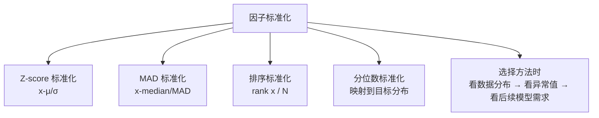

# 因子标准化：让不同量纲的因子站在同一起跑线

做因子挖掘的朋友都知道，原始因子数据往往千奇百怪。有的因子值在0到1之间，有的能跑到几千上万。如果不做标准化，直接拿去选股，结果可想而知——大数值的因子会主导一切。

今天我们就聊聊因子标准化的几种主流方法。我个人在实际项目中，每种方法都踩过坑，也总结了一些经验。

## 为什么需要因子标准化？

先看一个简单例子。假设你有两个因子：

- 因子A：市盈率，范围在5~100之间
- 因子B：ROE，范围在-0.3~0.4之间

如果你直接把它们加起来做综合打分，市盈率的影响会远远大于 ROE。这显然不合理。标准化就是为了解决这个问题——让所有因子在同一个尺度上比较。

> **核心目标：** 消除量纲影响，保留因子本身的排序信息和分布特征。

## 四种主流标准化方法

我常用的标准化方法有四种。每种方法都有自己的适用场景，没有绝对的好坏。

### 1. Z-score 标准化

这是最经典的方法。公式很简单：

```text
z = (x - μ) / σ
```

其中 μ 是均值，σ 是标准差。标准化后的数据均值为0，标准差为1。

**优点：** 保留了原始数据的分布形态。如果数据本身接近正态分布，效果很好。

**缺点：** 对异常值非常敏感。我在项目中遇到过，一个极端值就能把整个标准化结果带偏。

> **我的经验：** 如果因子数据有明显的尖峰厚尾特征，Z-score 要慎用。我曾经在一个动量因子上用 Z-score，结果一个涨停板的极端值让所有正常股票的因子值都缩到了0附近，选股效果一塌糊涂。

### 2. MAD 标准化

MAD 是 Median Absolute Deviation 的缩写。它用中位数代替均值，用 MAD 代替标准差：

```text
MAD = median(|x - median(x)|)
z_mad = (x - median(x)) / MAD
```

说白了，这就是 Z-score 的稳健版本。中位数不受极端值影响，MAD 也比标准差更抗噪。

**适用场景：** 因子数据有较多异常值时，MAD 标准化是更好的选择。

> **注意：** MAD 标准化后的数据，其尺度解释不如 Z-score 直观。它不再保证均值为0、标准差为1，只是让数据更稳健。

### 3. 排序标准化

这个方法最简单粗暴——把所有股票按因子值排序，然后映射到0到1之间：

```text
rank_std = (rank(x) - 1) / (N - 1)
```

其中 N 是股票数量。排名第一的股票得到1，最后一名得到0。

**优点：** 完全不受异常值影响。不管因子值差多少倍，排序后大家公平竞争。

**缺点：** 丢失了因子值之间的差距信息。两个股票因子值差10倍和差1倍，排序标准化后可能只差0.01。

> **我的建议：** 如果你做的是截面选股，排序标准化往往效果不错。它天然适合做多空组合的构建。但如果你需要保留因子值的相对强弱程度，就别用这个。

### 4. 分位数标准化

这个方法把数据映射到某个目标分布上，通常是正态分布或均匀分布。具体做法是：

1. 计算每个数据的百分位排名
2. 用这个排名去查目标分布的分位数

```python
# 映射到标准正态分布
percentile = rank(x) / (N + 1)
z_quantile = norm.ppf(percentile)
```

**优点：** 强制让数据服从你想要的分布形态。如果后续模型假设数据是正态的，这个方法很合适。

**缺点：** 同样丢失了原始数据的间距信息。而且如果股票数量少，分位数估计会不稳定。

## 四种方法对比

| 方法 | 抗异常值 | 保留间距信息 | 分布假设 | 计算速度 |
| --- | --- | --- | --- | --- |
| Z-score | 弱 | 强 | 近似正态 | 快 |
| MAD | 强 | 较强 | 无 | 较快 |
| 排序标准化 | 极强 | 弱 | 无 | 快 |
| 分位数标准化 | 强 | 弱 | 可指定 | 较慢 |

## 标准化对因子表现的影响

这个问题很关键。我见过不少新手，觉得标准化只是预处理步骤，不影响最终结果。其实不然。

### 影响一：因子 IC 的稳定性

Z-score 标准化后，因子 IC 的绝对值可能会变小，但 IC 的稳定性（IR）往往会提高。因为异常值被压缩了，因子和收益之间的关系更干净。

### 影响二：多空组合的收益

排序标准化做出来的多空组合，收益曲线通常更平滑。但如果你用 Z-score，极端值可能会让组合在某期出现巨大回撤。

### 影响三：因子之间的相关性

标准化方法不同，因子之间的相关系数也会变。我做过测试，两个因子用 Z-score 标准化后相关系数是0.3，换成排序标准化后变成了0.45。这会影响后续的因子合成。

> **避坑指南：** 我曾经在一个多因子模型里，同时用了 Z-score 和排序标准化两种方法处理不同因子。结果合成后的因子表现极不稳定。后来统一用 MAD 标准化，问题才解决。记住，同一个模型里尽量用同一种标准化方法。

## 知识体系总览

下面这张图总结了因子标准化的核心逻辑和四种方法的关系：



## 实战中的选择建议

说了这么多，到底该用哪种？我个人的经验是：

- **因子数据干净、接近正态分布** → 用 Z-score，简单高效
- **数据有较多异常值** → 用 MAD 标准化，稳健第一
- **做截面多空组合** → 排序标准化，公平且稳定
- **后续模型需要特定分布** → 分位数标准化，强制对齐

嗯，这里要注意一点。不管你选哪种方法，一定要在回测前做样本内外的验证。我见过太多人，标准化方法选对了，但忘记在样本外也做同样的处理，结果回测曲线漂亮，实盘一塌糊涂。

最后说一句，标准化不是万能的。如果因子本身没有预测能力，再怎么标准化也没用。但如果你已经找到了好因子，选对标准化方法，能让它的表现再上一个台阶。
