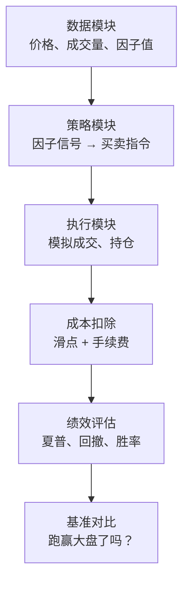

# 第25章 因子回测框架搭建：回测引擎设计、滑点与手续费模拟、基准选择、绩效评估指标

因子挖掘出来之后，最怕什么？

怕它是个「纸上英雄」。实盘一跑，全完蛋。

所以回测框架就是你的照妖镜。我做了这么多年量化，见过太多人在回测上栽跟头——要么过度拟合，要么忽略交易成本，要么基准选错。今天咱们就把这个框架彻底讲透。

### 25.1 回测引擎设计：核心架构

回测引擎说白了就是一个时间机器。你把历史数据喂进去，它模拟你在过去某个时间点买卖，最后告诉你赚了还是亏了。

我个人习惯把引擎拆成三个模块：

- **数据模块**：负责喂价格、成交量、因子值
- **策略模块**：根据因子信号生成买卖指令
- **执行模块**：模拟订单成交、记录持仓

嗯，这里要注意一个坑——**未来函数**。我在项目中遇到过有人用当天的收盘价去判断当天的买入信号，这等于作弊。正确的做法是：用T-1日的因子值，去预测T日的收益。

> **核心原则**：回测中所有信息，必须是你在那个时间点真实能拿到的。

下面是一个极简的回测引擎骨架，我用Python写给你看：

```python
class BacktestEngine:
    def __init__(self, data, factor_col, price_col='close'):
        self.data = data
        self.factor_col = factor_col
        self.price_col = price_col
        self.positions = []
        self.returns = []

    def run(self):
        # 按时间逐日推进
        for i in range(1, len(self.data)):
            # 用前一天的因子值判断
            signal = self.data.iloc[i-1][self.factor_col]
            # 生成持仓信号（这里简化：因子大于0就做多）
            if signal > 0:
                self.positions.append(1)
            else:
                self.positions.append(-1)
            # 计算当日收益
            ret = self.data.iloc[i][self.price_col] / self.data.iloc[i-1][self.price_col] - 1
            self.returns.append(ret * self.positions[-1])
        return self.returns
```

你看，逻辑其实不复杂。但真实场景下，你得处理停牌、涨跌停、分红除权这些细节。我曾经因为没处理除权，回测收益虚高了30%，后来排查了整整两天。

### 25.2 滑点与手续费模拟：别让利润被吃掉

很多新手回测时收益曲线漂亮得不行，一上实盘就亏。为什么？

说白了，就是没考虑交易成本。

**滑点**：你下单的价格和实际成交价格之间的差异。流动性差的股票，滑点可能高达0.5%。

**手续费**：佣金、印花税、过户费。A股目前佣金普遍万2.5，印花税千1（卖出时收）。

我建议你这样模拟：

- 滑点：固定比例，比如0.1%～0.3%
- 手续费：按实际费率计算，双边或单边

> **我的经验**：回测时把滑点设得比实际高一点，比如0.2%。这样跑出来的结果更保守，也更接近实盘。宁可少赚，不能假赚。

代码实现也很直接：

```python
def apply_trading_cost(returns, slippage=0.001, commission=0.00025):
    """
    对每日收益率扣除滑点和手续费
    slippage: 滑点比例，默认0.1%
    commission: 佣金比例，默认万2.5
    """
    # 假设每天换仓一次
    cost = slippage + commission * 2  # 买入卖出各一次佣金
    net_returns = [r - cost for r in returns]
    return net_returns
```

你想想看，如果每天换仓，一年250个交易日，光手续费就能吃掉多少？所以高频因子对成本极其敏感。我见过一个因子，扣除成本前年化20%，扣除后直接变负——这就是典型的「伪因子」。

### 25.3 基准选择：你的对手是谁

回测不能只看绝对收益。你得问自己：我跑赢大盘了吗？

基准选择有几个原则：

- **相关性**：你的股票池是沪深300，基准就用沪深300
- **可投资性**：基准本身要能复制，比如用指数ETF
- **一致性**：回测期间不要换基准

我记得有一次帮朋友看策略，他选的是中证500做基准，但持仓全是银行股。这明显不对——银行股跟大盘蓝筹更相关，应该用沪深300才对。

> **注意**：不要为了美化业绩而选一个弱势基准。比如2018年熊市，你选个债券指数做基准，那股票策略肯定跑赢——但这没有意义。

基准数据怎么拿？一般用万得或聚宽的数据接口。如果你自己搭框架，可以直接下载指数日线数据：

```python
import pandas as pd
# 假设你已经有了基准的每日收益率
benchmark_returns = pd.Series([0.01, -0.005, 0.02, ...])
strategy_returns = pd.Series([0.015, -0.003, 0.025, ...])
```

### 25.4 绩效评估指标：用数字说话

回测跑完了，一堆收益率数据摆在那。怎么判断这个因子好不好？

我一般看四个核心指标：

| 指标 | 含义 | 理想值 |
| --- | --- | --- |
| 夏普比率 | 每承担一单位风险，获得多少超额收益 | > 1.0（优秀），> 2.0（极好） |
| 最大回撤 | 从最高点到最低点的最大亏损幅度 | < 20%（股票策略） |
| 胜率 | 盈利交易次数 / 总交易次数 | > 50% |
| 年化收益率 | 折算成一年的平均收益率 | 看市场环境，一般 > 10% |

**夏普比率**怎么算？公式是：

```text
sharpe = (策略年化收益率 - 无风险利率) / 策略年化波动率
```

无风险利率一般用国债收益率，比如3%。

代码实现：

```python
def calculate_sharpe(returns, risk_free_rate=0.03):
    excess_returns = returns - risk_free_rate / 252  # 日度化
    sharpe = np.sqrt(252) * excess_returns.mean() / excess_returns.std()
    return sharpe

def calculate_max_drawdown(cumulative_returns):
    peak = cumulative_returns.expanding().max()
    drawdown = (cumulative_returns - peak) / peak
    return drawdown.min()

def calculate_win_rate(returns):
    wins = sum(1 for r in returns if r > 0)
    return wins / len(returns)
```

这里有个细节：夏普比率对异常值很敏感。我遇到过因子在大部分时间表现平平，但某一个月突然暴涨，夏普被拉得很高。这种因子你敢用吗？反正我不敢。

> **我的建议**：不要只看夏普。把最大回撤和胜率结合起来看。如果一个因子夏普2.0，但最大回撤40%，那它的风险其实很大。

### 25.5 知识体系总览

下面这张图，我把整个回测框架的核心逻辑画出来了。你一看就明白：



从数据到策略，再到执行，最后扣除成本、评估绩效、对比基准——每一步都不能少。我见过有人跳过成本扣除，直接拿策略收益跟基准比，结果看起来跑赢10个点，实际扣完成本只跑赢2个点。

> **避坑指南**：我曾经在回测中忘记考虑停牌股票。因子信号出来了，但股票停牌买不了，结果回测收益虚高。后来我加了一个「可交易」过滤条件，才把这个问题解决。

好了，这一章的内容就到这里。回测框架是因子挖掘的「质检员」，你花再多时间搭建都不为过。记住：回测不是目的，找到能稳定赚钱的因子才是。


